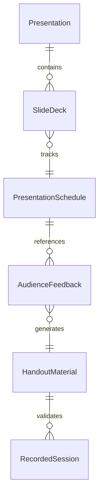
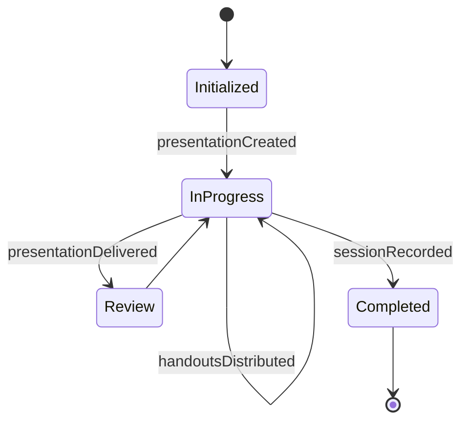
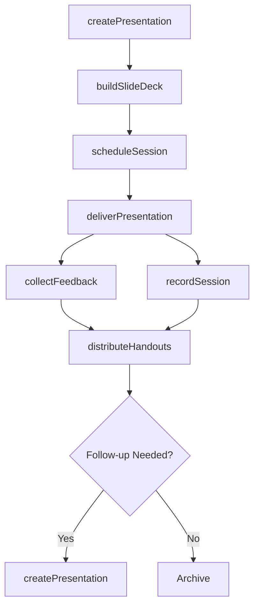
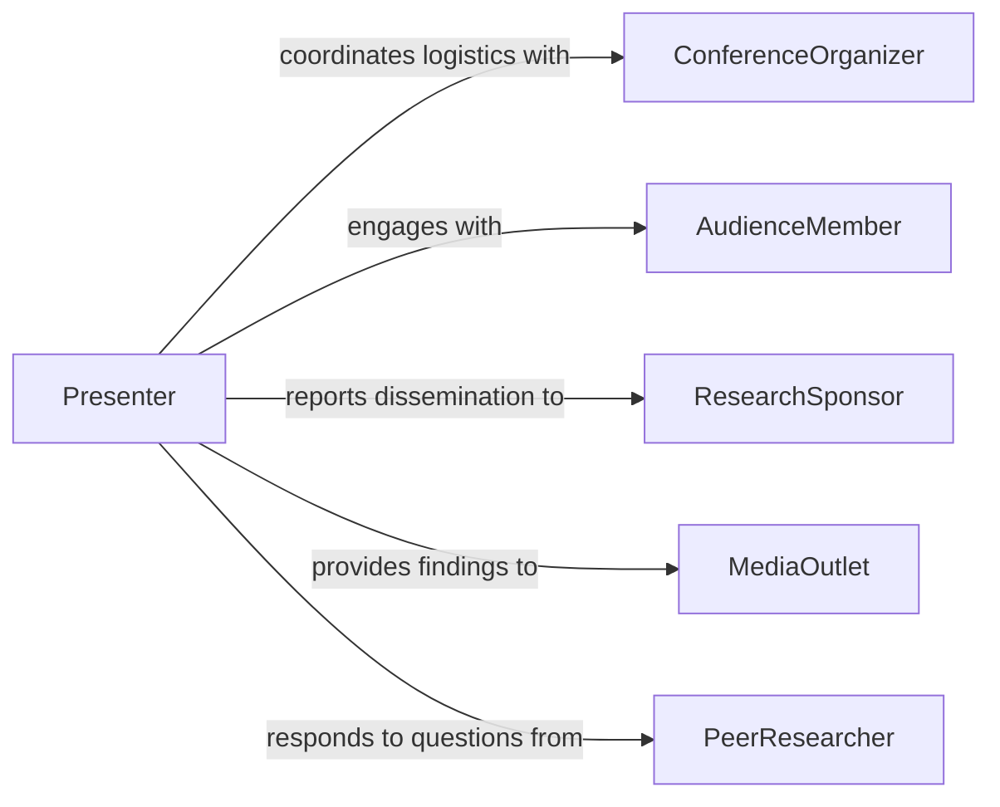

# Present Research Results Others

> Business-as-Code definition for presenting research results to others, covering preparation of presentation materials, delivery scheduling, audience engagement, and post-presentation follow-up.

## Overview

Presenting research results to others involves translating completed research findings into accessible formats for diverse audiences, scheduling and delivering presentations, and capturing audience feedback. This definition exposes actions for creating presentation materials, managing presentation events, delivering findings to stakeholders, and tracking audience engagement. It supports event-driven workflows for follow-up actions and searches for locating presentations by topic, audience, or venue.

## Actors

| Actor | Description |
|-------|-------------|
| ConferenceOrganizer | Manages the venue, schedule, and logistics for presentations |
| AudienceMember | Individual attending the presentation to learn about findings |
| ResearchSponsor | Funding body interested in the dissemination of results |
| MediaOutlet | Press or communications channel that may cover the findings |
| PeerResearcher | Fellow researcher who may ask questions or offer critique |

## Roles

| Role | Description |
|------|-------------|
| Presenter | Delivers the research findings to the audience |
| PresentationDesigner | Creates slides, visuals, and supporting materials |
| SessionModerator | Facilitates the presentation session and manages Q&A |
| CommunicationsLead | Coordinates messaging and post-presentation distribution |

## Entities

| Entity | Description |
|--------|-------------|
| Presentation | A structured delivery of research findings to an audience |
| SlideDeck | The visual materials accompanying the presentation |
| PresentationSchedule | The date, time, venue, and audience details for a session |
| AudienceFeedback | Responses and questions collected from attendees |
| HandoutMaterial | Supplementary documents distributed to attendees |
| RecordedSession | An audio or video recording of the presentation |

## Actions

| Action | Description |
|--------|-------------|
| createPresentation | Initialize a new presentation with title, abstract, and format |
| buildSlideDeck | Compose visual materials from research data and findings |
| scheduleSession | Set the date, venue, and audience for the presentation |
| deliverPresentation | Execute the live or virtual presentation of results |
| collectFeedback | Gather questions and responses from the audience |
| distributeHandouts | Share supplementary materials with attendees |
| recordSession | Capture audio or video of the presentation for archival |

## Events

| Event | Description |
|-------|-------------|
| presentationCreated | A new presentation record has been initialized |
| slideDeckBuilt | Visual materials have been composed and finalized |
| sessionScheduled | The presentation session has been placed on the calendar |
| presentationDelivered | The research results have been presented to the audience |
| feedbackCollected | Audience responses and questions have been gathered |
| handoutsDistributed | Supplementary materials have been shared with attendees |
| sessionRecorded | A recording of the presentation has been captured |

## Searches

| Search | Description |
|--------|-------------|
| findPresentations | Retrieve presentations by topic, presenter, date, or status |
| getUpcomingSessions | List scheduled presentation sessions within a date range |
| getFeedbackByPresentation | Retrieve audience feedback for a specific presentation |
| findRecordedSessions | Locate archived recordings by topic or presenter |
| getPresentationsByVenue | Search for presentations delivered at a specific venue |


## Entity Relationships



## State Diagram


## Workflow



## Actor Relationships



## Usage

### Calling Actions

```typescript
import { presentResearchResultsOthers } from '@headlessly/present-research-results-others'

const presentations = presentResearchResultsOthers()

// Create a new presentation
const pres = await presentations.createPresentation({
  title: 'Novel Findings in Urban Air Quality Monitoring',
  abstract: 'Presents sensor network data from 12 metropolitan areas',
  format: 'conference-talk',
  researchReportId: 'report-air-quality-2026'
})

// Build slides and schedule
await presentations.buildSlideDeck({
  presentationId: pres.id,
  template: 'academic-standard',
  sections: ['introduction', 'methodology', 'results', 'conclusions']
})

await presentations.scheduleSession({
  presentationId: pres.id,
  venue: 'Environmental Science Conference 2026',
  date: '2026-06-15T14:00:00Z',
  duration: 30,
  format: 'in-person'
})
```

### Event-Driven Automation

```typescript
// Auto-distribute handouts after presentation delivery
presentations.presentationDelivered(async ({ presentationId }) => {
  await presentations.distributeHandouts({
    presentationId,
    channels: ['email', 'conference-portal']
  })
})

// Notify sponsor of successful dissemination
presentations.feedbackCollected(async ({ presentationId, responseCount }) => {
  await notify({
    to: 'research-sponsor',
    message: `Presentation ${presentationId} delivered with ${responseCount} audience responses`
  })
})
```
