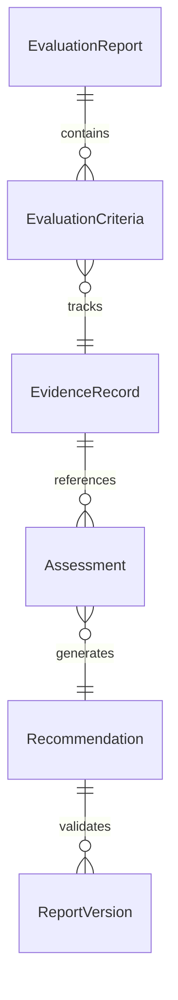
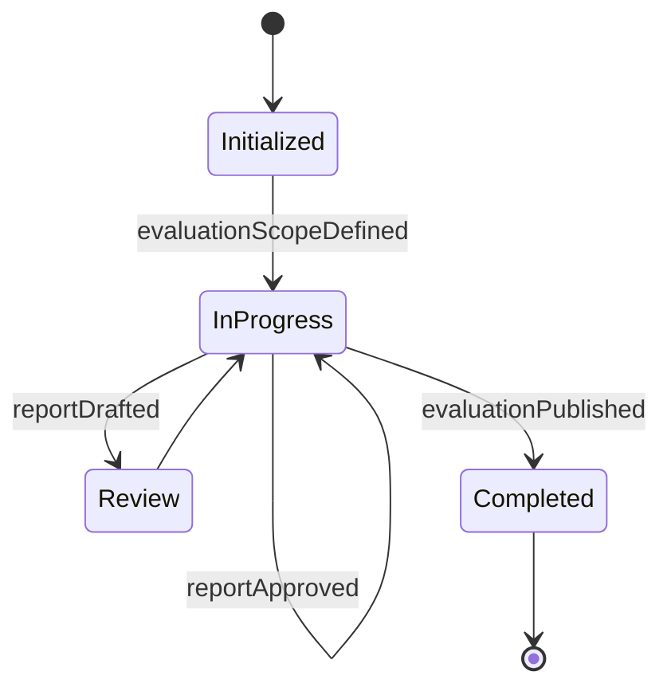
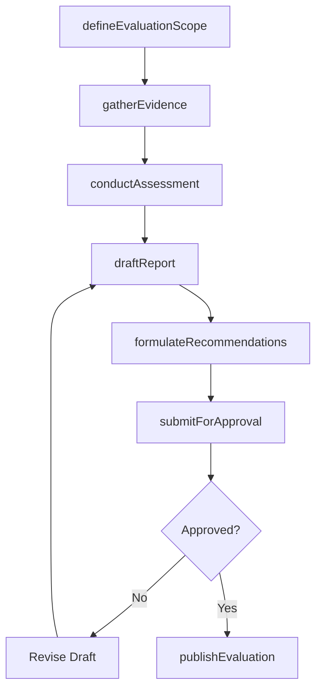
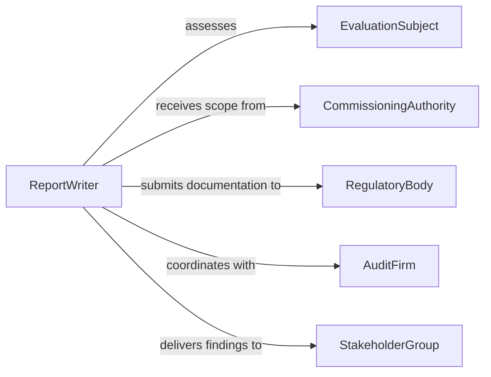

# Write Reports Evaluations

> Business-as-Code definition for writing reports or evaluations, covering assessment documentation, performance analysis, compliance evaluation, and formal written deliverable production.

## Overview

Writing reports or evaluations involves composing formal written documents that assess performance, compliance, program effectiveness, or other operational aspects against defined criteria. This definition exposes actions for scoping evaluations, gathering evidence, drafting assessments, and distributing completed documents. It supports event-driven workflows for review cycles and searches for locating reports by evaluation type, subject, or outcome.

## Actors

| Actor | Description |
|-------|-------------|
| EvaluationSubject | Individual, program, or entity being assessed in the report |
| CommissioningAuthority | Organization or leader requesting the evaluation |
| RegulatoryBody | External authority requiring evaluation documentation |
| AuditFirm | Third-party organization conducting independent assessments |
| StakeholderGroup | Parties with interest in the evaluation outcomes |

## Roles

| Role | Description |
|------|-------------|
| ReportWriter | Authors the report or evaluation document |
| EvaluationLead | Defines criteria and oversees the assessment process |
| SubjectMatterExpert | Provides domain expertise for the evaluation |
| ReviewApprover | Validates findings and approves the final document |
| EditorProofreader | Ensures clarity, consistency, and grammatical accuracy |

## Entities

| Entity | Description |
|--------|-------------|
| EvaluationReport | A formal document assessing a subject against defined criteria |
| EvaluationCriteria | The standards or benchmarks used to assess performance |
| EvidenceRecord | Supporting documentation or data referenced in the evaluation |
| Assessment | A scored or qualitative judgment on a specific criterion |
| Recommendation | A suggested action based on evaluation findings |
| ReportVersion | A tracked revision of the report document |

## Actions

| Action | Description |
|--------|-------------|
| defineEvaluationScope | Establish the subject, criteria, and objectives for the evaluation |
| gatherEvidence | Collect data, documents, and observations supporting the assessment |
| conductAssessment | Evaluate the subject against each defined criterion |
| draftReport | Write the evaluation report narrative with findings and scores |
| formulateRecommendations | Develop actionable suggestions based on assessment results |
| submitForApproval | Send the draft to reviewers for validation and sign-off |
| publishEvaluation | Distribute the approved evaluation report to stakeholders |

## Events

| Event | Description |
|-------|-------------|
| evaluationScopeDefined | The subject, criteria, and objectives have been established |
| evidenceGathered | Supporting data and documentation have been collected |
| assessmentConducted | The subject has been evaluated against criteria |
| reportDrafted | The evaluation narrative has been written |
| recommendationsFormulated | Actionable suggestions have been developed |
| reportApproved | The evaluation report has been validated and signed off |
| evaluationPublished | The approved report has been distributed to stakeholders |

## Searches

| Search | Description |
|--------|-------------|
| findEvaluations | Retrieve evaluation reports by subject, type, or date range |
| getAssessmentScores | Look up scores or ratings for a specific evaluation |
| findRecommendations | Search for recommendations across evaluations by status |
| getEvaluationsByOutcome | Locate evaluations that resulted in a specific outcome rating |


## Entity Relationships



## State Diagram


## Workflow



## Actor Relationships



## Usage

### Calling Actions

```typescript
import { writeReportsEvaluations } from '@headlessly/write-reports-evaluations'

const evaluations = writeReportsEvaluations()

// Define the evaluation scope
const evaluation = await evaluations.defineEvaluationScope({
  title: 'Annual Vendor Performance Evaluation - Acme Logistics',
  subject: 'vendor-acme-logistics',
  criteria: ['on-time-delivery', 'quality-compliance', 'cost-effectiveness', 'responsiveness'],
  period: { start: '2025-01-01', end: '2025-12-31' }
})

// Gather evidence and conduct assessment
await evaluations.gatherEvidence({
  evaluationId: evaluation.id,
  sources: ['delivery-records', 'quality-audits', 'invoice-history', 'support-tickets']
})

await evaluations.conductAssessment({ evaluationId: evaluation.id })

// Draft and submit for approval
await evaluations.draftReport({ evaluationId: evaluation.id })
await evaluations.submitForApproval({
  evaluationId: evaluation.id,
  approvers: ['procurement-director', 'vp-operations']
})
```

### Event-Driven Automation

```typescript
// Auto-generate recommendations after assessment
evaluations.assessmentConducted(async ({ evaluationId, scores }) => {
  const belowThreshold = scores.filter(s => s.rating < 3)
  if (belowThreshold.length > 0) {
    await evaluations.formulateRecommendations({
      evaluationId,
      focusAreas: belowThreshold.map(s => s.criterion)
    })
  }
})

// Notify stakeholders when evaluation is published
evaluations.evaluationPublished(async ({ evaluationId, subject }) => {
  await notify({
    to: 'stakeholder-group',
    message: `Evaluation for ${subject} has been published and is available for review`
  })
})
```
