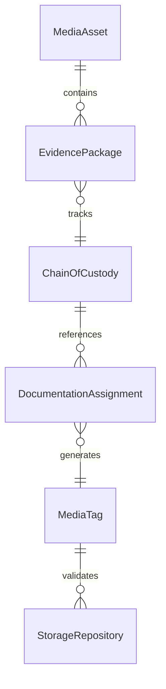
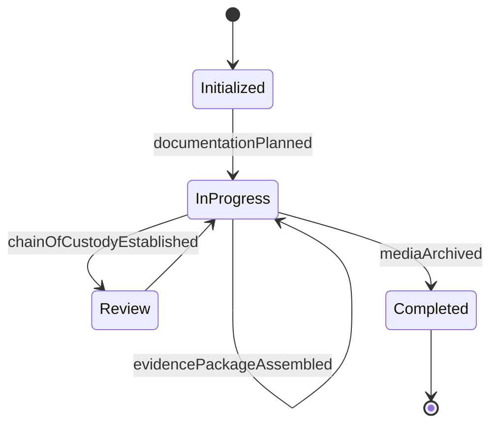
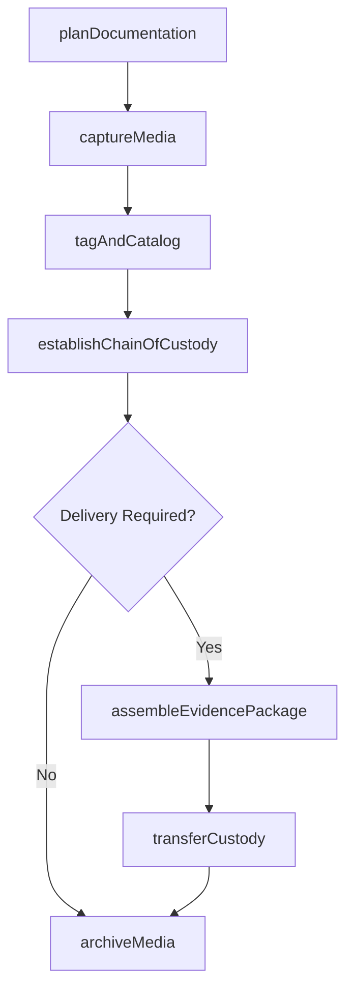
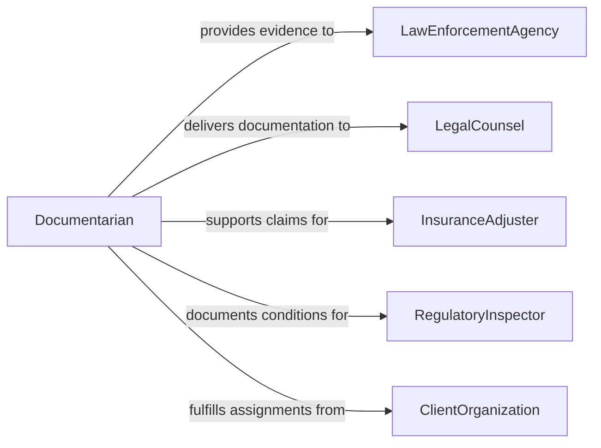

# Document Events Evidence Using Photographic

> Business-as-Code definition for documenting events or evidence using photographic or audiovisual equipment, covering image capture, evidence cataloging, chain of custody tracking, and media asset management.

## Overview

Documenting events or evidence using photographic or audiovisual equipment involves capturing images, video, and audio recordings that serve as formal documentation for investigations, inspections, legal proceedings, and organizational records. This definition exposes actions for planning documentation sessions, capturing media, tagging and cataloging assets, maintaining chain of custody, and exporting evidence packages. It supports event-driven automation for evidence integrity verification and searches for locating media assets by case, location, or subject.

## Actors

| Actor | Description |
|-------|-------------|
| LawEnforcementAgency | Authority requesting or consuming evidentiary documentation |
| LegalCounsel | Attorney requiring photographic or audiovisual evidence for proceedings |
| InsuranceAdjuster | Claims professional using documented evidence for loss assessment |
| RegulatoryInspector | Government official documenting compliance or violation conditions |
| ClientOrganization | Entity commissioning the documentation of events or conditions |

## Roles

| Role | Description |
|------|-------------|
| Documentarian | Captures photographic or audiovisual records at the scene |
| EvidenceCustodian | Manages the chain of custody and storage of documented media |
| MediaAnalyst | Reviews and annotates captured media for relevance and detail |
| QualityAssuranceReviewer | Validates that documentation meets evidentiary standards |
| ProjectCoordinator | Plans and schedules documentation assignments |

## Entities

| Entity | Description |
|--------|-------------|
| MediaAsset | A photograph, video, or audio recording captured as documentation |
| EvidencePackage | A bundled collection of media assets with metadata and custody records |
| ChainOfCustody | A log tracking who handled or accessed the evidence and when |
| DocumentationAssignment | A planned task specifying what, where, and when to document |
| MediaTag | A descriptive label or classification applied to a media asset |
| StorageRepository | The secure location where documented media is archived |

## Actions

| Action | Description |
|--------|-------------|
| planDocumentation | Define the scope, location, and requirements for the documentation session |
| captureMedia | Record photographs, video, or audio at the designated scene |
| tagAndCatalog | Apply metadata, tags, and classifications to captured media |
| establishChainOfCustody | Initialize custody tracking for newly captured evidence |
| transferCustody | Record the handoff of evidence between authorized parties |
| assembleEvidencePackage | Bundle related media assets with metadata for delivery |
| archiveMedia | Move finalized media to long-term secure storage |

## Events

| Event | Description |
|-------|-------------|
| documentationPlanned | The scope and requirements for a documentation session have been defined |
| mediaCaptured | Photographs, video, or audio have been recorded at the scene |
| mediaTaggedAndCataloged | Metadata and classifications have been applied to captured media |
| chainOfCustodyEstablished | Custody tracking has been initialized for evidence |
| custodyTransferred | Evidence has been handed off between authorized parties |
| evidencePackageAssembled | Related media assets have been bundled for delivery |
| mediaArchived | Finalized media has been moved to long-term secure storage |

## Searches

| Search | Description |
|--------|-------------|
| findMediaAssets | Retrieve media by case, location, date, or tag |
| getChainOfCustody | Look up the full custody history for a specific evidence item |
| findEvidencePackages | Locate assembled evidence bundles by case or recipient |
| getMediaByAssignment | Search for media captured during a specific documentation assignment |


## Entity Relationships



## State Diagram


## Workflow



## Actor Relationships



## Usage

### Calling Actions

```typescript
import { documentEventsEvidenceUsingPhotographic } from '@headlessly/document-events-evidence-using-photographic'

const documentation = documentEventsEvidenceUsingPhotographic()

// Plan a documentation assignment
const assignment = await documentation.planDocumentation({
  caseId: 'case-2026-fire-inv-042',
  location: '1200 Industrial Blvd, Warehouse B',
  type: 'incident-scene',
  requirements: ['exterior-perimeter', 'point-of-origin', 'damage-assessment'],
  scheduledDate: '2026-02-06T08:00:00Z'
})

// Capture and catalog media
const media = await documentation.captureMedia({
  assignmentId: assignment.id,
  assets: [
    { type: 'photograph', description: 'Exterior east wall damage', geoTag: { lat: 34.052, lng: -118.243 } },
    { type: 'video', description: 'Walk-through of interior damage', duration: 180 }
  ]
})

// Establish custody and assemble package
await documentation.establishChainOfCustody({
  assetIds: media.map(m => m.id),
  custodian: 'evidence-tech-smith'
})

await documentation.assembleEvidencePackage({
  caseId: 'case-2026-fire-inv-042',
  assetIds: media.map(m => m.id),
  recipient: 'insurance-adjuster-jones'
})
```

### Event-Driven Automation

```typescript
// Auto-establish chain of custody when media is captured
documentation.mediaCaptured(async ({ assetIds, assignmentId }) => {
  await documentation.establishChainOfCustody({
    assetIds,
    custodian: 'system-auto-intake'
  })
})

// Notify legal counsel when evidence package is ready
documentation.evidencePackageAssembled(async ({ caseId, packageId, recipient }) => {
  await notify({
    to: recipient,
    message: `Evidence package for case ${caseId} is ready for review`
  })
})
```
