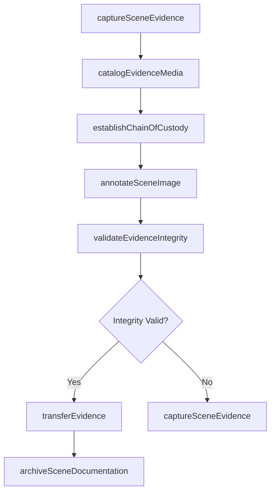
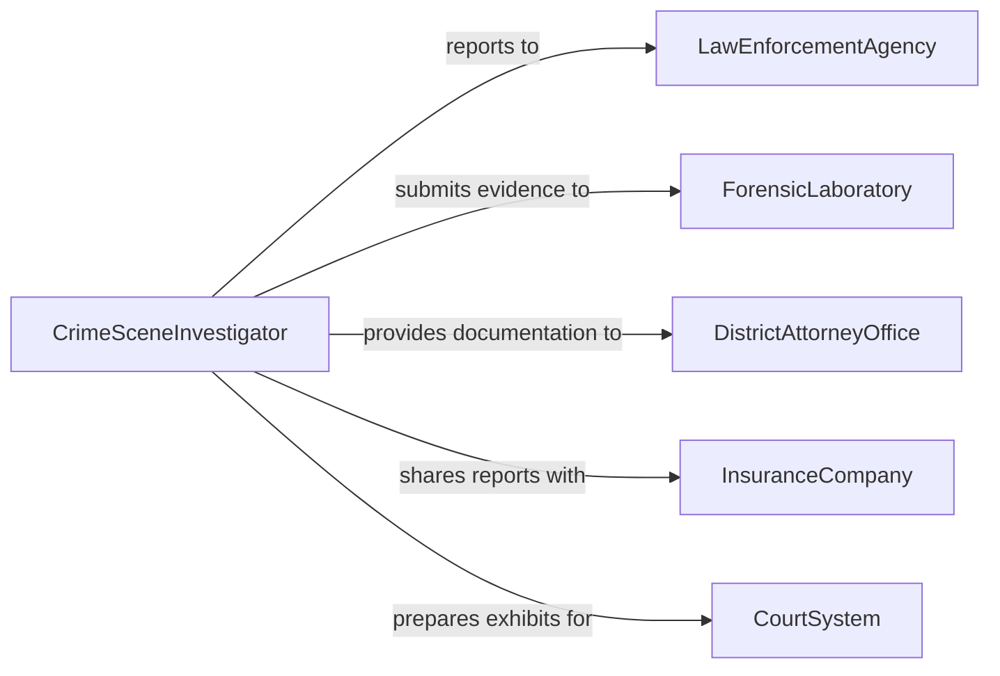

# Record Crime Accident Scene Evidence

> Business-as-Code definition for recording crime and accident scene evidence using photographic and audiovisual equipment to preserve forensic documentation.

## Overview

Recording crime or accident scene evidence involves systematically capturing visual and audio documentation of incident scenes using cameras, video recorders, and specialized forensic imaging equipment. This definition exposes actions for evidence capture workflows, events for chain-of-custody automation, and searches for evidence retrieval across case management systems.

## Actors

| Actor | Description |
|-------|-------------|
| LawEnforcementAgency | Authorizes and oversees scene documentation procedures |
| ForensicLaboratory | Receives and analyzes captured evidence imagery |
| DistrictAttorneyOffice | Uses documented evidence for prosecution case building |
| InsuranceCompany | Reviews accident scene documentation for claims processing |
| CourtSystem | Accepts evidence records as admissible documentation |
| WitnessParty | Provides statements corroborated by scene evidence |

## Roles

| Role | Description |
|------|-------------|
| ForensicPhotographer | Captures standardized photographic evidence at scenes |
| CrimeSceneInvestigator | Directs evidence documentation and scene processing |
| EvidenceCustodian | Manages chain of custody for all recorded media |
| CaseDetective | Coordinates evidence needs with investigation requirements |

## Entities

| Entity | Description |
|--------|-------------|
| EvidenceRecord | A cataloged photographic or video capture from a scene |
| SceneReport | Comprehensive documentation of an incident scene |
| ChainOfCustody | Tracked record of evidence handling and transfers |
| CaseFile | Collection of all evidence and documentation for an incident |
| CaptureDevice | Camera or recording equipment used for evidence collection |
| EvidenceMarker | Physical or digital identifier placed at evidence locations |

## Actions

| Action | Description |
|--------|-------------|
| captureSceneEvidence | Record photographic or video evidence at an incident scene |
| catalogEvidenceMedia | Index and tag captured media with scene metadata |
| establishChainOfCustody | Create custody record for newly captured evidence |
| annotateSceneImage | Add forensic annotations and measurements to captures |
| transferEvidence | Move evidence records to laboratory or case file |
| validateEvidenceIntegrity | Verify captured media has not been altered or corrupted |
| archiveSceneDocumentation | Store finalized evidence in long-term secure repository |

## Events

| Event | Description |
|-------|-------------|
| sceneEvidenceCaptured | Photographic or video evidence has been recorded |
| evidenceMediaCataloged | Captured media has been indexed and tagged |
| chainOfCustodyEstablished | Custody tracking has been initiated for evidence |
| sceneImageAnnotated | Forensic annotations have been applied to captures |
| evidenceTransferred | Evidence records have been moved to recipient |
| evidenceIntegrityValidated | Media integrity verification is complete |
| sceneDocumentationArchived | Finalized evidence has been stored in repository |

## Searches

| Search | Description |
|--------|-------------|
| findEvidenceByCase | Retrieve all evidence records associated with a case |
| findEvidenceByScene | List captured media for a specific incident scene |
| getCustodyHistory | Retrieve chain of custody log for an evidence record |
| findPendingValidation | List evidence records awaiting integrity verification |

## Workflow



## Actor Relationships



## Usage

### Calling Actions

```typescript
import { recordCrimeAccidentSceneEvidence } from '@headlessly/record-crime-accident-scene-evidence'

const evidence = recordCrimeAccidentSceneEvidence()

// Capture scene evidence
const record = await evidence.captureSceneEvidence({
  caseId: 'CASE-2026-04821',
  sceneLocation: '1200 Main Street, intersection',
  captureType: 'photography',
  deviceId: 'NIKON-D850-UNIT-03',
  captureCount: 47
})

// Catalog and tag evidence media
await evidence.catalogEvidenceMedia({
  evidenceId: record.id,
  tags: ['vehicle-damage', 'skid-marks', 'traffic-signal'],
  sceneQuadrant: 'NE'
})

// Establish chain of custody
await evidence.establishChainOfCustody({
  evidenceId: record.id,
  custodian: 'CSI-MARTINEZ',
  storageLocation: 'Evidence Locker B-14'
})
```

### Event-Driven Automation

```typescript
// Notify detective when evidence is cataloged
evidence.evidenceMediaCataloged(async ({ caseId, evidenceId, tags }) => {
  await notify({
    to: `detective-${caseId}`,
    message: `${tags.length} evidence items cataloged for case ${caseId}`
  })
})

// Auto-validate integrity on transfer
evidence.evidenceTransferred(async ({ evidenceId, recipient }) => {
  await evidence.validateEvidenceIntegrity({ evidenceId })
})
```
