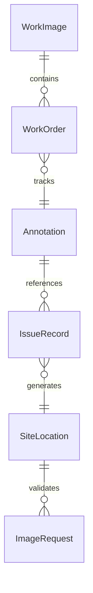
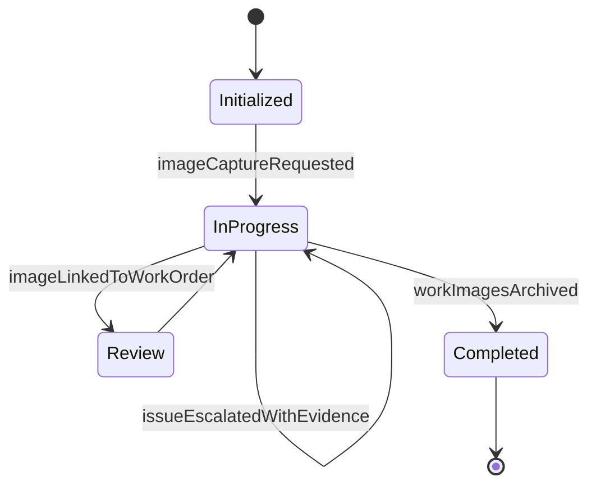
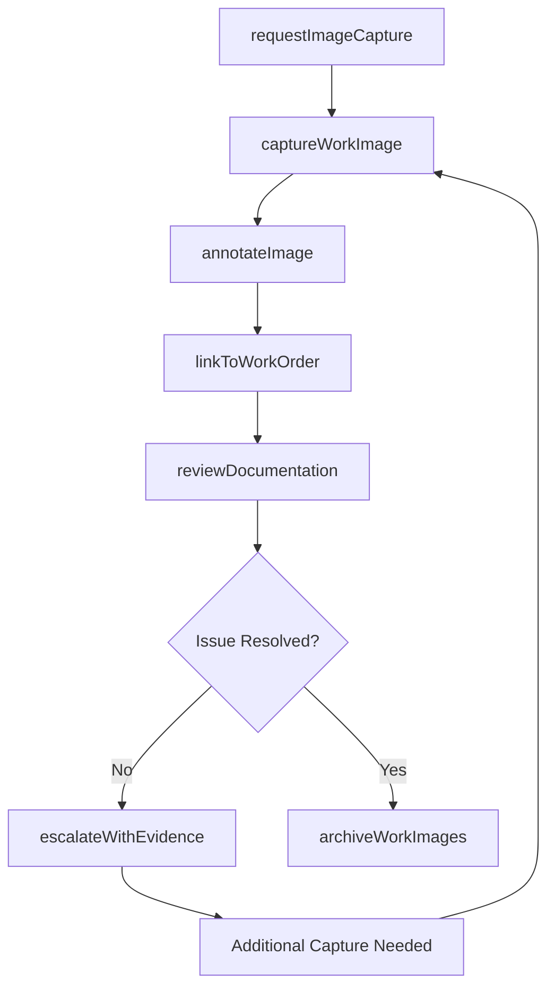
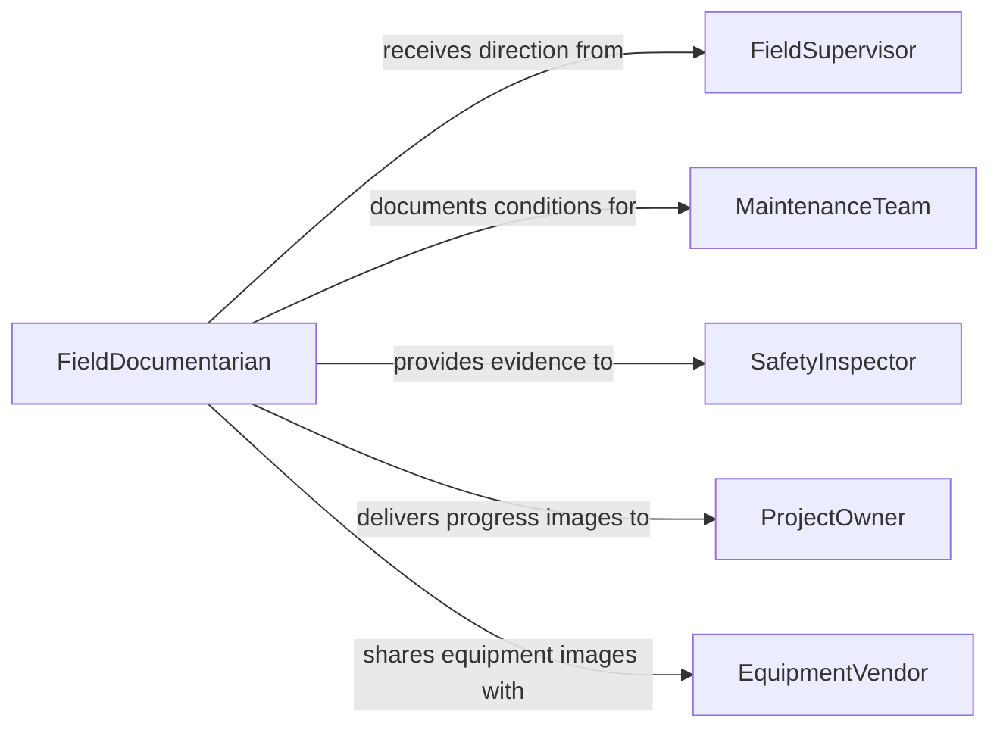

# Record Images Needed Address Work

> Business-as-Code definition for recording images needed to address work issues, covering visual documentation of work conditions, defects, progress, and site assessments for operational decision-making.

## Overview

Recording images needed to address work issues involves capturing photographs and visual documentation of job site conditions, equipment states, defects, progress milestones, and other work-related situations that require visual evidence for troubleshooting, reporting, or decision-making. This definition exposes actions for requesting image capture, recording visual documentation, annotating images with contextual details, and linking images to work orders or issue records. It supports event-driven workflows for issue escalation and searches for retrieving images by work order, location, or issue type.

## Actors

| Actor | Description |
|-------|-------------|
| FieldSupervisor | On-site manager requesting or directing image documentation |
| MaintenanceTeam | Technical crew whose work conditions are being documented |
| SafetyInspector | Compliance officer reviewing visual evidence of site conditions |
| ProjectOwner | Stakeholder requiring visual progress updates |
| EquipmentVendor | Supplier receiving images of equipment issues for warranty or support |

## Roles

| Role | Description |
|------|-------------|
| FieldDocumentarian | Captures images at the work site per documentation requests |
| WorkOrderManager | Links captured images to the relevant work order or issue record |
| ImageAnnotator | Adds contextual notes, markers, and measurements to captured images |
| IssueCoordinator | Routes documented images to the appropriate resolution team |

## Entities

| Entity | Description |
|--------|-------------|
| WorkImage | A photograph or visual record captured to document a work issue |
| WorkOrder | The operational task or issue to which images are attached |
| Annotation | A note, marker, or measurement overlaid on a work image |
| IssueRecord | A documented problem or deficiency requiring resolution |
| SiteLocation | The physical location where the image was captured |
| ImageRequest | A formal request for visual documentation of a specific condition |

## Actions

| Action | Description |
|--------|-------------|
| requestImageCapture | Create a formal request for visual documentation of a work condition |
| captureWorkImage | Record a photograph or visual at the specified work site location |
| annotateImage | Add contextual notes, markers, or measurements to a captured image |
| linkToWorkOrder | Associate captured images with the relevant work order or issue |
| reviewDocumentation | Examine captured images for completeness and relevance |
| escalateWithEvidence | Forward documented images to support issue escalation |
| archiveWorkImages | Move resolved work images to long-term storage |

## Events

| Event | Description |
|-------|-------------|
| imageCaptureRequested | A formal request for visual documentation has been created |
| workImageCaptured | A photograph or visual record has been recorded at the site |
| imageAnnotated | Contextual notes or markers have been added to an image |
| imageLinkedToWorkOrder | A captured image has been associated with a work order |
| documentationReviewed | Captured images have been examined for completeness |
| issueEscalatedWithEvidence | Documented images have been forwarded for escalation |
| workImagesArchived | Resolved work images have been moved to long-term storage |

## Searches

| Search | Description |
|--------|-------------|
| findWorkImages | Retrieve images by work order, location, date, or issue type |
| getImagesByLocation | Look up all images captured at a specific site or area |
| findOpenImageRequests | Identify pending requests for visual documentation |
| getImagesByIssue | Search for images linked to a specific issue record |


## Entity Relationships



## State Diagram


## Workflow



## Actor Relationships



## Usage

### Calling Actions

```typescript
import { recordImagesNeededAddressWork } from '@headlessly/record-images-needed-address-work'

const workImages = recordImagesNeededAddressWork()

// Request image capture for a maintenance issue
const request = await workImages.requestImageCapture({
  workOrderId: 'wo-2026-hvac-034',
  location: 'Building C, Rooftop Unit 7',
  description: 'Capture condenser coil damage and refrigerant leak location',
  priority: 'high',
  requestedBy: 'supervisor-garcia'
})

// Capture and annotate the image
const image = await workImages.captureWorkImage({
  requestId: request.id,
  geoTag: { lat: 37.774, lng: -122.419 },
  description: 'Visible corrosion on condenser coil fins, northeast section'
})

await workImages.annotateImage({
  imageId: image.id,
  annotations: [
    { type: 'marker', label: 'Corrosion area', x: 340, y: 220 },
    { type: 'measurement', label: 'Affected span', value: '18 inches' }
  ]
})

// Link to work order and review
await workImages.linkToWorkOrder({
  imageId: image.id,
  workOrderId: 'wo-2026-hvac-034'
})
```

### Event-Driven Automation

```typescript
// Auto-link images when captured for a request
workImages.workImageCaptured(async ({ imageId, requestId }) => {
  const request = await workImages.findOpenImageRequests({ requestId })
  if (request.workOrderId) {
    await workImages.linkToWorkOrder({
      imageId,
      workOrderId: request.workOrderId
    })
  }
})

// Notify supervisor when documentation is complete
workImages.documentationReviewed(async ({ workOrderId, imageCount }) => {
  await notify({
    to: 'field-supervisor',
    message: `Visual documentation complete for work order ${workOrderId}: ${imageCount} images captured`
  })
})
```
