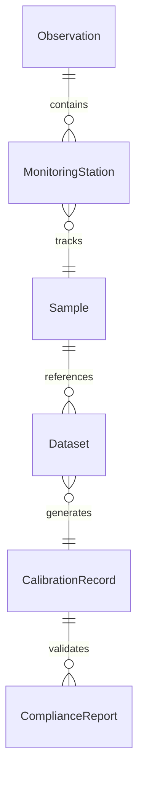
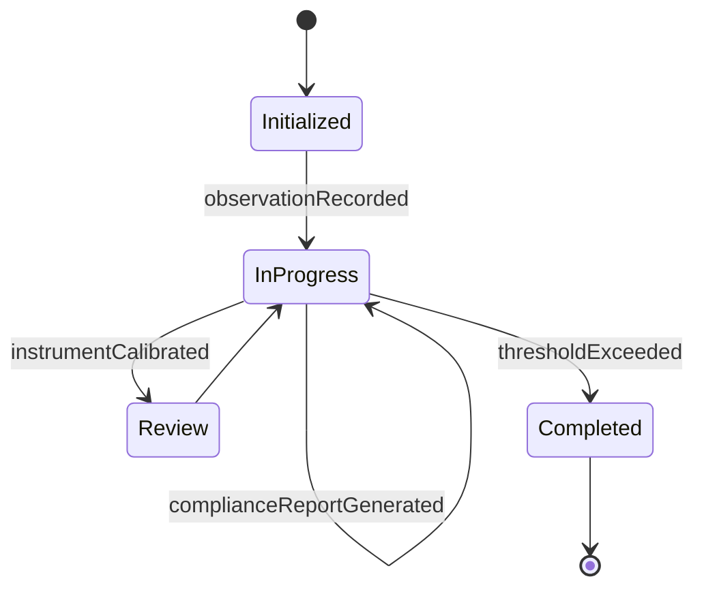
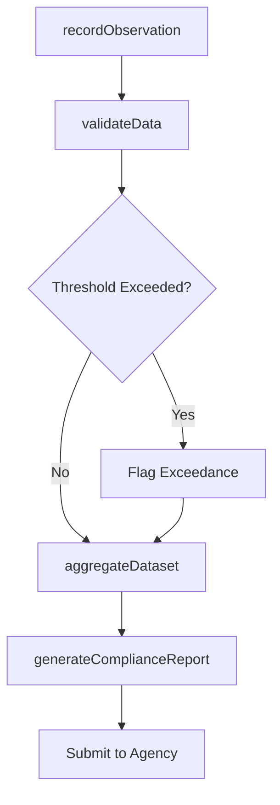
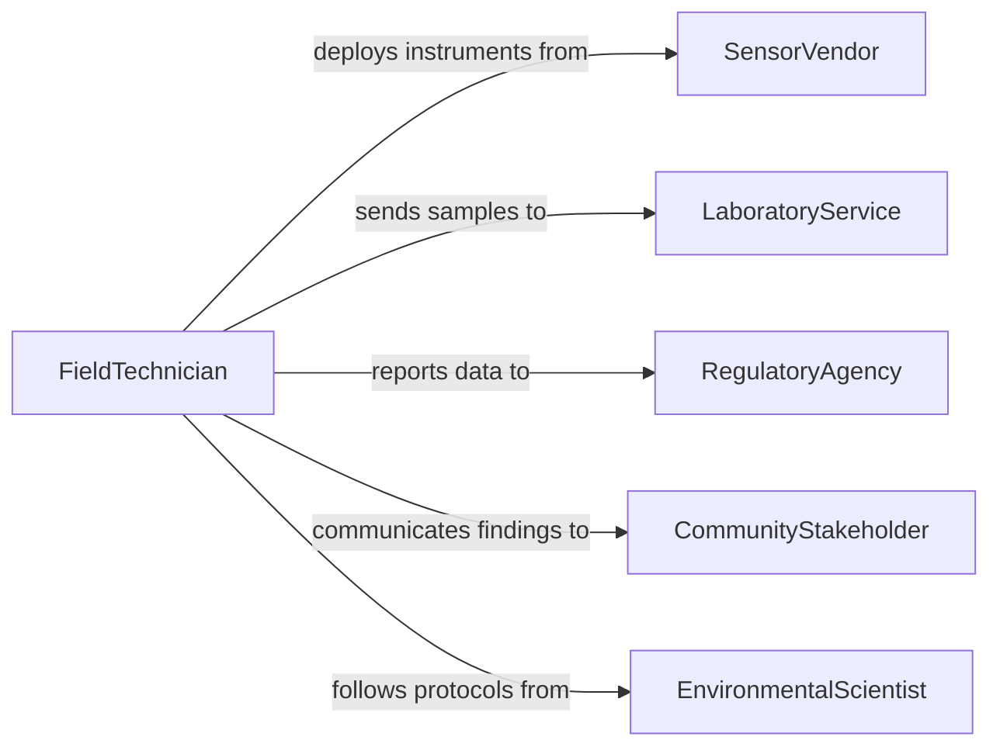

# Record Information About Environmental Conditions

> Business-as-Code definition for recording environmental condition data. Models the capture, validation, and archival of measurements related to weather, air quality, water quality, soil conditions, and ecological observations.

## Overview

Recording information about environmental conditions involves systematically capturing measurements and observations related to the physical environment, including atmospheric data, water quality parameters, soil composition, and habitat assessments. This definition covers the full data collection lifecycle from sensor deployment and field observation through data validation, storage, and regulatory reporting to environmental agencies.

## Actors

| Actor | Description |
|-------|-------------|
| RegulatoryAgency | Government body such as EPA that sets monitoring standards and receives reports |
| LaboratoryService | Third-party lab that analyzes collected samples for contaminants or composition |
| SensorVendor | Provider of environmental monitoring instruments and calibration services |
| CommunityStakeholder | Local residents or organizations affected by environmental conditions |
| FundingSponsor | Entity financing the environmental monitoring program |

## Roles

| Role | Description |
|------|-------------|
| EnvironmentalScientist | Designs monitoring protocols and interprets recorded data |
| FieldTechnician | Deploys sensors, collects samples, and records field observations |
| DataAnalyst | Validates, cleans, and analyzes recorded environmental datasets |
| ComplianceOfficer | Ensures data collection meets regulatory reporting requirements |

## Entities

| Entity | Description |
|--------|-------------|
| Observation | A single recorded measurement or field note at a specific time and location |
| MonitoringStation | A fixed or mobile site equipped with environmental sensors |
| Sample | A physical specimen collected for laboratory analysis |
| Dataset | An aggregated collection of observations for a monitoring period |
| CalibrationRecord | Documentation of instrument accuracy checks and adjustments |
| ComplianceReport | A formatted submission of environmental data to a regulatory agency |

## Actions

| Action | Description |
|--------|-------------|
| recordObservation | Capture a measurement or field note from a monitoring station or field visit |
| collectSample | Log the collection of a physical specimen with chain-of-custody details |
| validateData | Check recorded values against expected ranges and quality control rules |
| calibrateInstrument | Document sensor calibration and any corrections applied |
| aggregateDataset | Combine individual observations into a structured dataset for a reporting period |
| generateComplianceReport | Produce a formatted report meeting regulatory submission requirements |

## Events

| Event | Description |
|-------|-------------|
| observationRecorded | A new environmental measurement has been captured |
| sampleCollected | A physical specimen has been logged with custody details |
| dataValidated | Quality control checks on a dataset have been completed |
| instrumentCalibrated | A monitoring instrument has been recalibrated and documented |
| datasetAggregated | Observations have been compiled into a period dataset |
| complianceReportGenerated | A regulatory report has been produced and is ready for submission |
| thresholdExceeded | A recorded value has surpassed a regulatory or safety threshold |

## Searches

| Search | Description |
|--------|-------------|
| findObservations | Query observations by station, date range, parameter, or value range |
| getStationStatus | Retrieve current operational status and recent readings for monitoring stations |
| getExceedances | List observations where values exceeded regulatory thresholds |
| getDatasets | Retrieve aggregated datasets by monitoring program, period, or region |


## Entity Relationships



## State Diagram


## Workflow



## Actor Relationships



## Usage

### Calling Actions

```typescript
import { recordInformationAboutEnvironmentalConditions } from '@headlessly/record-information-about-environmental-conditions'

const envRecords = recordInformationAboutEnvironmentalConditions()

// Record an air quality observation
const observation = await envRecords.recordObservation({
  stationId: 'AQM-042',
  parameter: 'PM2.5',
  value: 35.2,
  unit: 'ug/m3',
  timestamp: '2026-02-05T14:30:00Z',
  method: 'continuous-monitor'
})

// Validate a batch of recent data
await envRecords.validateData({
  stationId: 'AQM-042',
  dateRange: { start: '2026-02-01', end: '2026-02-05' },
  rules: ['range-check', 'completeness', 'consistency']
})

// Generate a monthly compliance report
const report = await envRecords.generateComplianceReport({
  program: 'Clean Air Act Title V',
  period: '2026-01',
  stations: ['AQM-042', 'AQM-043', 'AQM-044']
})
```

### Event-Driven Automation

```typescript
// Alert on threshold exceedances
envRecords.thresholdExceeded(async ({ stationId, parameter, value, threshold }) => {
  await notify({
    to: 'environmental-compliance',
    message: `${parameter} at ${stationId} measured ${value}, exceeding threshold of ${threshold}`
  })
})

// Auto-aggregate data at end of reporting period
envRecords.dataValidated(async ({ stationId, period }) => {
  if (isPeriodEnd(period)) {
    await envRecords.aggregateDataset({ stationId, period })
  }
})
```
