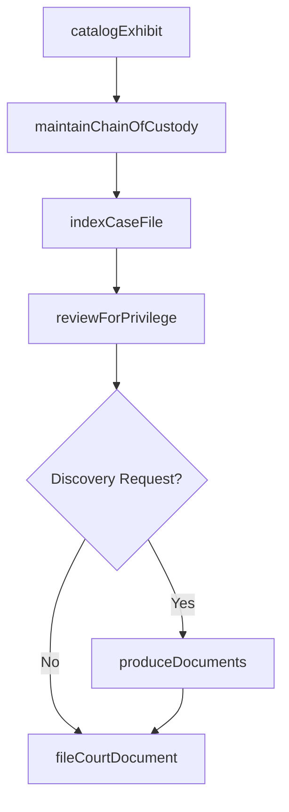
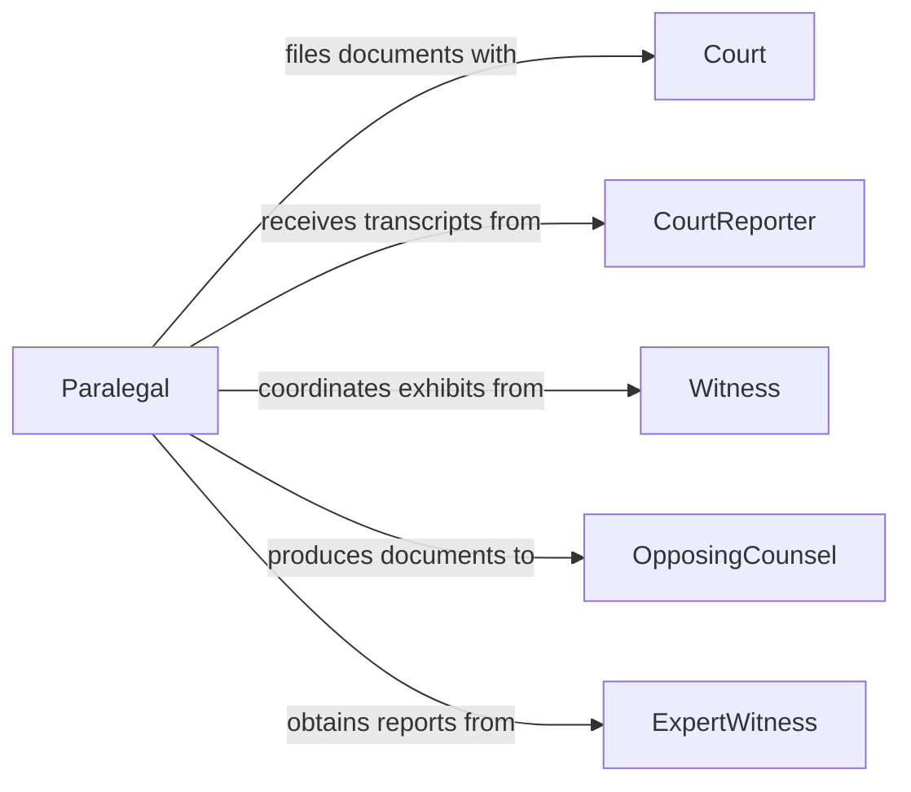

# Document Information Related Legal Proceedings

> Business-as-Code definition for documenting information related to legal proceedings. Models the systematic capture, organization, and management of all case-related evidence, testimony records, and procedural documentation.

## Overview

Documenting information related to legal proceedings involves capturing and organizing evidence, witness statements, court filings, and procedural records throughout the lifecycle of a case. This definition covers the collection of exhibits and depositions, maintaining chain-of-custody for physical and digital evidence, indexing case files for retrieval, and ensuring documentation meets evidentiary standards and court rules for admissibility.

## Actors

| Actor | Description |
|-------|-------------|
| Court | Judicial body with procedural rules governing documentation requirements |
| Witness | Individual providing testimony or statements relevant to the proceeding |
| OpposingCounsel | Opposing attorney who may challenge documentation or request production |
| ExpertWitness | Specialist providing technical opinions and supporting documentation |
| CourtReporter | Stenographer or transcriptionist creating official records of proceedings |

## Roles

| Role | Description |
|------|-------------|
| LitigationAttorney | Directs documentation strategy and ensures legal sufficiency |
| Paralegal | Organizes case files, indexes exhibits, and manages document production |
| LegalSecretary | Handles formatting, filing, and distribution of legal documents |
| eDiscoverySpecialist | Manages electronic evidence collection, processing, and review |

## Entities

| Entity | Description |
|--------|-------------|
| CaseFile | The master collection of all documents associated with a legal proceeding |
| Exhibit | A document or object presented as evidence in the proceeding |
| Deposition | A recorded out-of-court statement given under oath |
| CourtFiling | A document formally submitted to the court as part of the record |
| EvidenceItem | A physical or digital artifact with chain-of-custody tracking |
| TranscriptRecord | An official written account of courtroom or deposition proceedings |

## Actions

| Action | Description |
|--------|-------------|
| catalogExhibit | Register and index an exhibit with metadata and evidentiary classification |
| recordDeposition | Capture deposition details including witness, date, and transcript reference |
| fileCourtDocument | Prepare and submit a document to the court's filing system |
| maintainChainOfCustody | Log each transfer or access of a physical or digital evidence item |
| indexCaseFile | Organize and cross-reference all documents within a case file |
| reviewForPrivilege | Screen documents for attorney-client privilege before production |
| produceDocuments | Package and deliver responsive documents in discovery or subpoena response |

## Events

| Event | Description |
|-------|-------------|
| exhibitCataloged | An exhibit has been registered and indexed in the case file |
| depositionRecorded | A deposition record has been captured with transcript reference |
| courtDocumentFiled | A document has been submitted to the court's filing system |
| chainOfCustodyUpdated | An evidence custody transfer has been logged |
| caseFileIndexed | Case file documents have been organized and cross-referenced |
| privilegeReviewCompleted | Privilege screening of a document set has been finalized |
| documentsProduced | Responsive documents have been delivered to the requesting party |

## Searches

| Search | Description |
|--------|-------------|
| findExhibits | Query exhibits by case, type, date, or evidentiary classification |
| getDepositions | Retrieve deposition records by witness, date, or case |
| searchCaseFiles | Full-text search across all documents within a case file |
| getProductionHistory | List document productions by case, recipient, or date |

## Workflow



## Actor Relationships



## Usage

### Calling Actions

```typescript
import { documentInformationRelatedLegalProceedings } from '@headlessly/document-information-related-legal-proceedings'

const caseDocuments = documentInformationRelatedLegalProceedings()

// Catalog an exhibit
const exhibit = await caseDocuments.catalogExhibit({
  caseId: 'CASE-2026-00142',
  title: 'Email correspondence re: contract terms',
  type: 'electronic',
  classification: 'documentary-evidence',
  dateReceived: '2026-01-20'
})

// Maintain chain of custody
await caseDocuments.maintainChainOfCustody({
  evidenceId: exhibit.id,
  action: 'transfer',
  fromCustodian: 'Sarah Johnson',
  toCustodian: 'Evidence Room B',
  timestamp: '2026-01-21T09:00:00Z'
})

// Produce documents in response to discovery
await caseDocuments.produceDocuments({
  caseId: 'CASE-2026-00142',
  requestId: 'RFP-003',
  documents: [exhibit.id],
  recipient: 'opposing-counsel@firm.com',
  format: 'native'
})
```

### Event-Driven Automation

```typescript
// Log all custody changes for audit trail
caseDocuments.chainOfCustodyUpdated(async ({ evidenceId, action, timestamp }) => {
  await auditLog.record({
    entity: 'evidence',
    entityId: evidenceId,
    event: `custody-${action}`,
    timestamp
  })
})

// Notify team when document production is complete
caseDocuments.documentsProduced(async ({ caseId, requestId, documentCount }) => {
  await notify({
    to: 'litigation-team',
    message: `${documentCount} documents produced for ${requestId} in case ${caseId}`
  })
})
```
