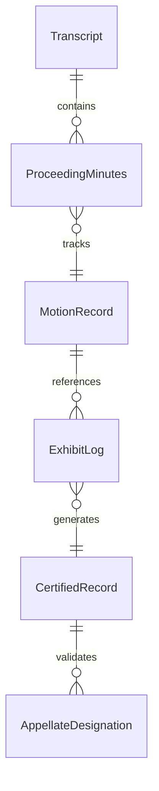
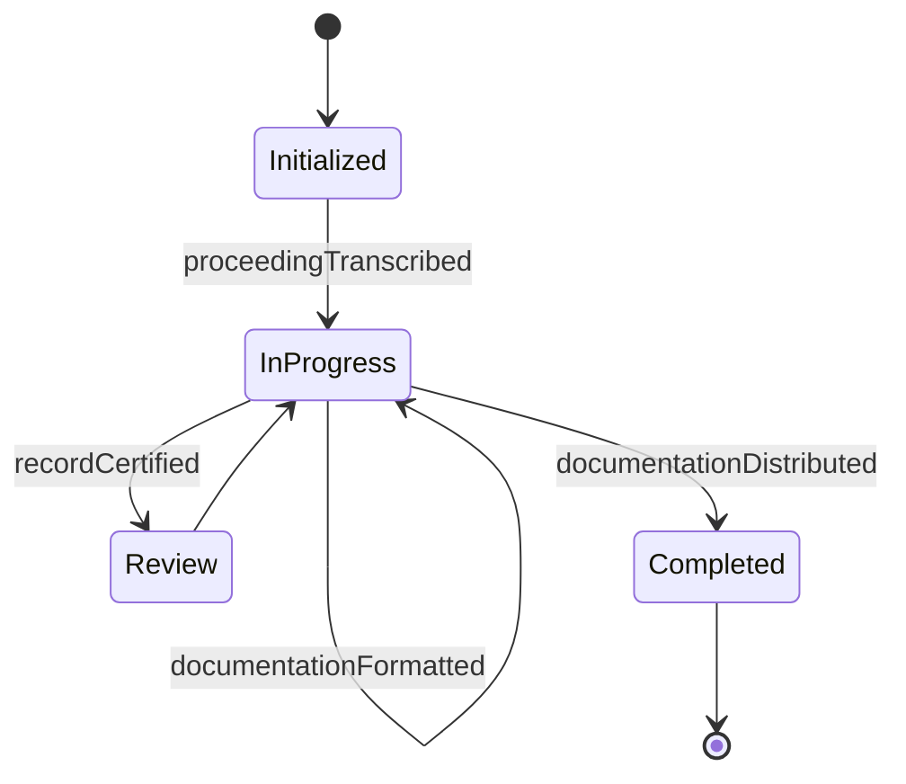
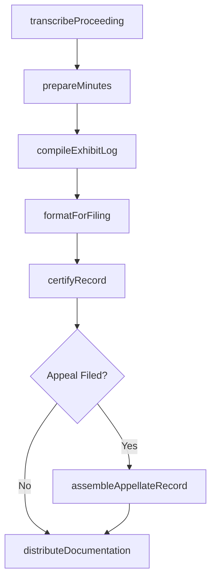
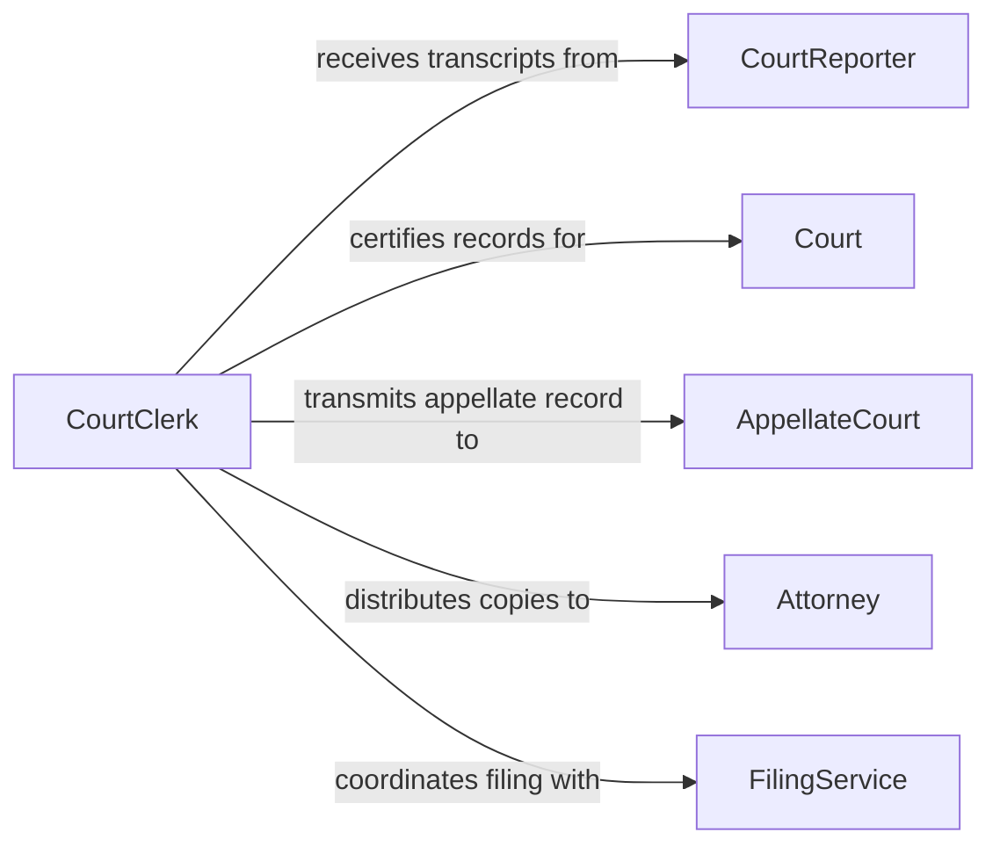

# Prepare Documentation Legal Proceedings

> Business-as-Code definition for preparing documentation of legal proceedings. Models the creation, formatting, and management of official records that capture the substance and procedural history of court hearings, trials, depositions, and administrative proceedings.

## Overview

Preparing documentation of legal proceedings involves creating official records that capture testimony, rulings, motions, and procedural events occurring during court sessions and related proceedings. This definition covers the transcription and formatting of hearing records, preparation of minutes and summaries, assembly of appendices and exhibits for the record, and certification of documents for filing with courts or appellate bodies.

## Actors

| Actor | Description |
|-------|-------------|
| Court | Judicial body whose proceedings are being documented |
| AppellateCourt | Higher court requiring certified records for appeal review |
| Attorney | Legal representative who references and relies on proceeding documentation |
| CourtReporter | Stenographer who captures verbatim transcripts of proceedings |
| FilingService | Third-party service handling electronic or physical document submissions |

## Roles

| Role | Description |
|------|-------------|
| CourtClerk | Prepares and certifies official records of proceedings |
| Paralegal | Assembles and formats proceeding documentation for attorney use |
| LegalTranscriptionist | Converts audio recordings into formatted written transcripts |
| RecordsManager | Maintains the official archive of proceeding documentation |

## Entities

| Entity | Description |
|--------|-------------|
| Transcript | A verbatim written record of spoken testimony and statements |
| ProceedingMinutes | A summary record of actions taken during a hearing or session |
| MotionRecord | Documentation of motions filed, argued, and ruled upon |
| ExhibitLog | An index of all exhibits presented during the proceeding |
| CertifiedRecord | An official copy authenticated by the court clerk for filing |
| AppellateDesignation | A specified subset of the record designated for appeal |

## Actions

| Action | Description |
|--------|-------------|
| transcribeProceeding | Convert audio or stenographic notes into a formatted transcript |
| prepareMinutes | Draft a summary of actions and decisions from a hearing session |
| compileExhibitLog | Create an indexed catalog of all exhibits presented during proceedings |
| certifyRecord | Authenticate the official record with court clerk certification |
| assembleAppellateRecord | Compile the designated portions of the record for appellate review |
| formatForFiling | Apply required formatting standards and cover sheets for court submission |
| distributeDocumentation | Deliver certified copies to attorneys, parties, and the appellate court |

## Events

| Event | Description |
|-------|-------------|
| proceedingTranscribed | A hearing transcript has been completed and is available for review |
| minutesPrepared | Session minutes have been drafted and are ready for approval |
| exhibitLogCompiled | The exhibit index for the proceeding has been finalized |
| recordCertified | The official record has been authenticated by the court clerk |
| appellateRecordAssembled | The designated record for appeal has been compiled |
| documentationFormatted | Proceeding documents have been formatted to court filing standards |
| documentationDistributed | Certified copies have been delivered to all required recipients |

## Searches

| Search | Description |
|--------|-------------|
| findTranscripts | Query transcripts by case, hearing date, or proceeding type |
| getExhibitLog | Retrieve the exhibit index for a specific proceeding |
| getPendingCertifications | List records awaiting court clerk certification |
| getAppellateRecords | Retrieve assembled appellate records by case or filing date |


## Entity Relationships



## State Diagram


## Workflow



## Actor Relationships



## Usage

### Calling Actions

```typescript
import { prepareDocumentationLegalProceedings } from '@headlessly/prepare-documentation-legal-proceedings'

const proceedingDocs = prepareDocumentationLegalProceedings()

// Transcribe a court hearing
const transcript = await proceedingDocs.transcribeProceeding({
  caseId: 'CASE-2026-00218',
  hearingDate: '2026-01-28',
  proceedingType: 'evidentiary-hearing',
  audioSource: 'courtroom-recording-20260128.wav',
  format: 'federal-court-standard'
})

// Compile the exhibit log
await proceedingDocs.compileExhibitLog({
  caseId: 'CASE-2026-00218',
  exhibits: [
    { number: 'P-1', description: 'Employment contract dated 2024-03-15', admitted: true },
    { number: 'P-2', description: 'Email thread regarding termination', admitted: true },
    { number: 'D-1', description: 'Performance review records', admitted: false }
  ]
})

// Certify the official record
await proceedingDocs.certifyRecord({
  caseId: 'CASE-2026-00218',
  certifiedBy: 'Clerk Janet Rodriguez',
  certificationDate: '2026-02-03'
})
```

### Event-Driven Automation

```typescript
// Notify attorneys when transcripts are ready
proceedingDocs.proceedingTranscribed(async ({ caseId, hearingDate, transcriptId }) => {
  await notify({
    to: 'case-attorneys',
    message: `Transcript for ${hearingDate} hearing in case ${caseId} is now available`
  })
})

// Auto-assemble appellate record when appeal is filed
proceedingDocs.recordCertified(async ({ caseId, hasAppeal }) => {
  if (hasAppeal) {
    await proceedingDocs.assembleAppellateRecord({
      caseId,
      designation: 'full-record'
    })
  }
})
```
