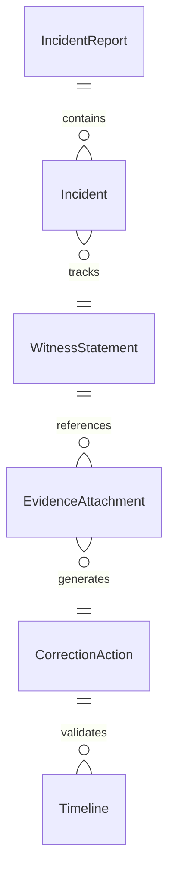
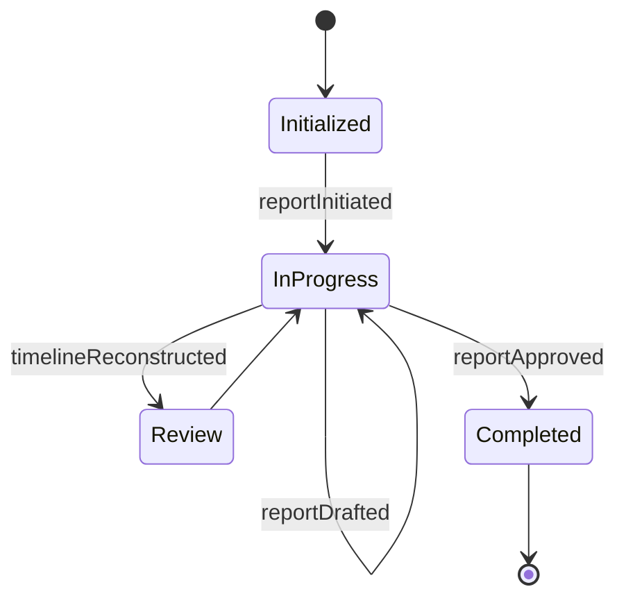
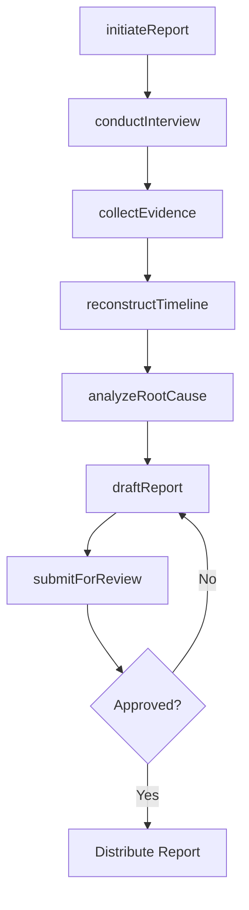
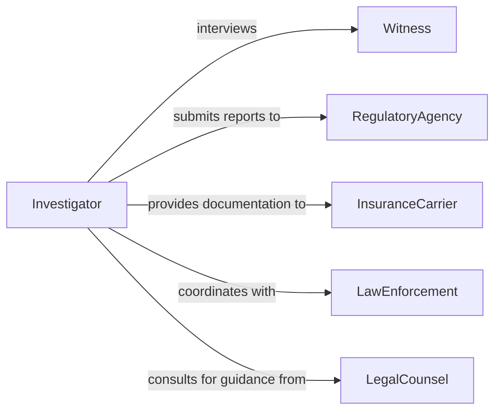

# Prepare Investigation Incident Reports

> Business-as-Code definition for preparing investigation and incident reports. Models the documentation of workplace incidents, security events, compliance violations, and internal investigations from initial reporting through final findings.

## Overview

Preparing investigation and incident reports involves collecting facts from witnesses and evidence, documenting the timeline of events, analyzing root causes, and producing structured reports that support management decisions, insurance claims, or legal proceedings. This definition covers the full reporting lifecycle from initial incident notification through interviews, evidence gathering, draft composition, supervisory review, and distribution to stakeholders including regulatory agencies where required.

## Actors

| Actor | Description |
|-------|-------------|
| RegulatoryAgency | Government authority such as OSHA that requires incident reporting |
| InsuranceCarrier | Underwriter that processes claims resulting from reported incidents |
| Witness | Individual who observed or has knowledge of the incident |
| LawEnforcement | Police or investigative agency involved in criminal or serious incidents |
| LegalCounsel | Attorney advising on liability exposure and report content |

## Roles

| Role | Description |
|------|-------------|
| Investigator | Leads the fact-finding process and authors the report |
| IncidentCoordinator | Manages the overall response and ensures timely reporting |
| SafetyOfficer | Evaluates safety implications and recommends corrective actions |
| ReviewingManager | Approves the final report and authorizes distribution |

## Entities

| Entity | Description |
|--------|-------------|
| IncidentReport | The formal document describing what happened, findings, and recommendations |
| Incident | The event or occurrence being investigated and documented |
| WitnessStatement | A recorded account from an individual with knowledge of the incident |
| EvidenceAttachment | Photographs, video, logs, or physical items supporting the report |
| CorrectionAction | A recommended or required remediation step resulting from findings |
| Timeline | A chronological reconstruction of events leading up to and during the incident |

## Actions

| Action | Description |
|--------|-------------|
| initiateReport | Create a new incident report record with preliminary details |
| conductInterview | Record a witness statement with date, location, and narrative |
| collectEvidence | Attach photographs, documents, or physical evidence to the report |
| reconstructTimeline | Build a chronological sequence of events from gathered information |
| analyzeRootCause | Determine the underlying factors that contributed to the incident |
| draftReport | Compose the narrative report with findings, analysis, and recommendations |
| submitForReview | Route the draft report through supervisory approval |

## Events

| Event | Description |
|-------|-------------|
| reportInitiated | A new incident report has been created with preliminary information |
| interviewConducted | A witness statement has been recorded and attached to the report |
| evidenceCollected | Supporting evidence has been cataloged and linked to the report |
| timelineReconstructed | A chronological event sequence has been assembled |
| rootCauseIdentified | The underlying contributing factors have been determined |
| reportDrafted | The narrative report has been composed and is ready for review |
| reportApproved | The final report has been reviewed and approved for distribution |

## Searches

| Search | Description |
|--------|-------------|
| findReports | Query incident reports by type, date, location, or severity |
| getWitnessStatements | Retrieve statements associated with a specific incident |
| getCorrectiveActions | List recommended or pending corrective actions by status or incident |
| searchByRootCause | Find incidents that share similar root cause classifications |


## Entity Relationships



## State Diagram


## Workflow



## Actor Relationships



## Usage

### Calling Actions

```typescript
import { prepareInvestigationIncidentReports } from '@headlessly/prepare-investigation-incident-reports'

const reports = prepareInvestigationIncidentReports()

// Initiate a new incident report
const report = await reports.initiateReport({
  type: 'workplace-injury',
  severity: 'serious',
  location: 'Warehouse B, Loading Dock 3',
  occurredAt: '2026-02-04T14:30:00Z',
  description: 'Forklift operator struck shelving unit causing material to fall'
})

// Conduct a witness interview
await reports.conductInterview({
  reportId: report.id,
  witness: { name: 'Maria Garcia', role: 'Shift Supervisor' },
  statement: 'I observed the forklift turning too sharply around the corner of aisle 7',
  interviewDate: '2026-02-04T16:00:00Z'
})

// Analyze root cause
await reports.analyzeRootCause({
  reportId: report.id,
  method: 'five-whys',
  findings: [
    'Aisle width below minimum standard for forklift operation',
    'Operator had not completed refresher training in 18 months'
  ]
})
```

### Event-Driven Automation

```typescript
// Notify safety team on serious incidents
reports.reportInitiated(async ({ reportId, severity, type }) => {
  if (severity === 'serious' || severity === 'fatal') {
    await notify({
      to: 'safety-officer',
      priority: 'urgent',
      message: `${severity} ${type} incident reported: ${reportId}`
    })
  }
})

// File regulatory reports upon approval
reports.reportApproved(async ({ reportId, type, severity }) => {
  if (severity === 'serious') {
    await submitToAgency({
      agency: 'OSHA',
      reportId,
      deadline: '8-hours'
    })
  }
})
```
