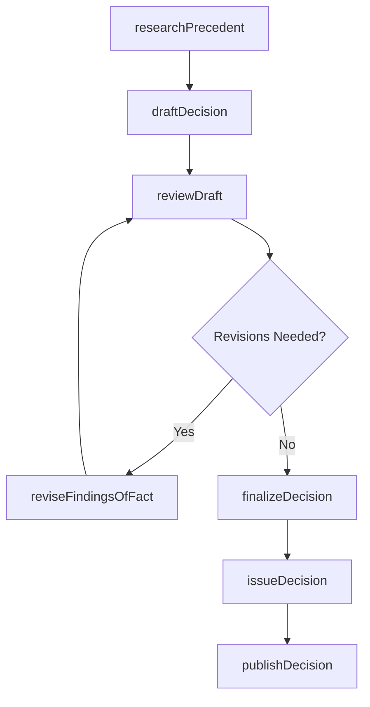
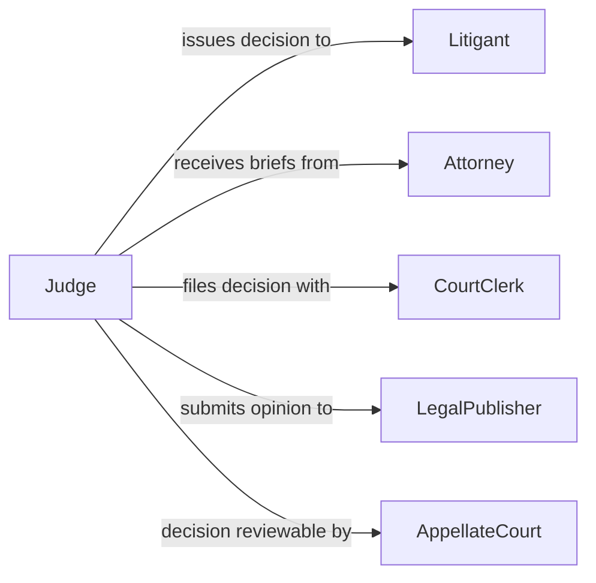

# Prepare Written Decisions Legal Proceedings

> Business-as-Code definition for preparing written decisions in legal proceedings. Models the drafting, review, and issuance of judicial opinions, administrative rulings, and arbitration awards.

## Overview

Preparing written decisions for legal proceedings involves analyzing case facts, applying relevant legal standards, and drafting formal rulings that resolve disputes or adjudicate claims. This definition covers the research and analysis phase, opinion drafting with findings of fact and conclusions of law, internal review and revision cycles, and the final issuance and distribution of decisions to parties and court records.

## Actors

| Actor | Description |
|-------|-------------|
| AppellateCourt | Higher court that may review the decision on appeal |
| Litigant | A party to the proceeding who will be bound by the written decision |
| Attorney | Legal representative who submitted briefs and arguments for consideration |
| CourtClerk | Administrative officer who manages case filings and decision distribution |
| LegalPublisher | Service that indexes and publishes decisions for legal research databases |

## Roles

| Role | Description |
|------|-------------|
| Judge | Presiding judicial officer who authors or approves the written decision |
| LawClerk | Conducts legal research and prepares draft opinions for the judge |
| MediatorArbitrator | Neutral party issuing binding or non-binding written determinations |
| AdministrativeLawJudge | Adjudicator in regulatory or administrative proceedings |

## Entities

| Entity | Description |
|--------|-------------|
| Decision | The formal written ruling resolving a legal matter |
| FindingsOfFact | Documented determinations about what occurred based on evidence |
| ConclusionsOfLaw | Legal reasoning applying statutes and precedent to the facts |
| Order | A directive issued as part of or alongside the written decision |
| Dissent | A separate opinion disagreeing with the majority decision |
| Citation | A reference to a statute, regulation, or prior case relied upon |

## Actions

| Action | Description |
|--------|-------------|
| researchPrecedent | Identify and analyze relevant case law, statutes, and regulations |
| draftDecision | Write the initial version of the opinion with facts, analysis, and conclusion |
| reviewDraft | Circulate the draft for internal review and feedback |
| reviseFindingsOfFact | Update factual determinations based on review comments |
| finalizeDecision | Lock the opinion text and prepare for official issuance |
| issueDecision | Formally release the written decision to parties and the court record |
| publishDecision | Submit the decision for indexing in legal research databases |

## Events

| Event | Description |
|-------|-------------|
| precedentResearched | Relevant legal authorities have been identified and analyzed |
| decisionDrafted | The initial draft of the written decision has been completed |
| draftReviewed | Internal review feedback has been provided on the draft |
| findingsOfFactRevised | Factual determinations have been updated based on review |
| decisionFinalized | The written decision has been locked for official issuance |
| decisionIssued | The decision has been formally released to all parties |
| decisionPublished | The decision has been indexed in legal research databases |

## Searches

| Search | Description |
|--------|-------------|
| findDecisions | Query decisions by case type, judge, date range, or outcome |
| searchPrecedent | Retrieve prior decisions by legal topic, statute, or citation |
| getPendingDrafts | List decisions currently in draft or review status |
| getDecisionHistory | Trace the revision history of a specific decision |

## Workflow



## Actor Relationships



## Usage

### Calling Actions

```typescript
import { prepareWrittenDecisionsLegalProceedings } from '@headlessly/prepare-written-decisions-legal-proceedings'

const decisions = prepareWrittenDecisionsLegalProceedings()

// Research applicable precedent
const research = await decisions.researchPrecedent({
  caseId: 'CASE-2026-00315',
  topics: ['breach-of-contract', 'liquidated-damages'],
  jurisdictions: ['US-NY', 'federal']
})

// Draft the decision
const draft = await decisions.draftDecision({
  caseId: 'CASE-2026-00315',
  findingsOfFact: [
    'Defendant failed to deliver goods by the contractual deadline',
    'Plaintiff suffered documented losses of $450,000'
  ],
  conclusionsOfLaw: [
    'Defendant breached Section 4.2 of the agreement',
    'Liquidated damages clause is enforceable under NY UCC 2-718'
  ],
  outcome: 'judgment-for-plaintiff'
})

// Issue the final decision
await decisions.issueDecision({
  decisionId: draft.id,
  issuedDate: '2026-02-05',
  notifyParties: true
})
```

### Event-Driven Automation

```typescript
// Notify parties when decision is issued
decisions.decisionIssued(async ({ caseId, decisionId, outcome }) => {
  await notify({
    to: 'court-clerk',
    message: `Decision ${decisionId} issued for case ${caseId}: ${outcome}`
  })
})

// Auto-submit to legal publishers
decisions.decisionFinalized(async ({ decisionId, caseType }) => {
  if (caseType === 'published-opinion') {
    await decisions.publishDecision({
      decisionId,
      databases: ['Westlaw', 'LexisNexis']
    })
  }
})
```
