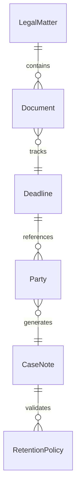
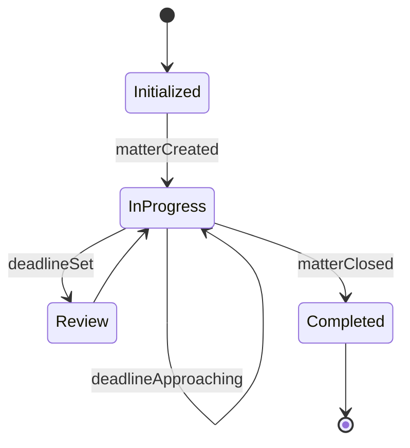
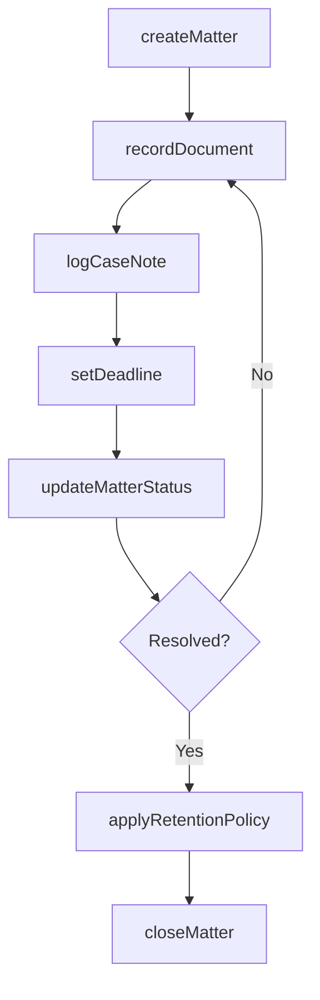
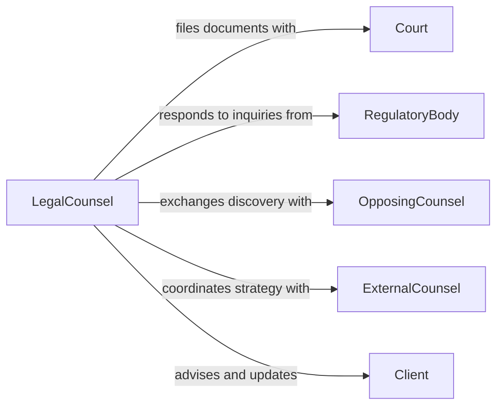

# Record Information About Legal Matters

> Business-as-Code definition for recording information about legal matters. Models the capture, organization, and maintenance of legal case data, regulatory filings, and compliance documentation.

## Overview

Recording information about legal matters involves systematically documenting case details, regulatory filings, contractual obligations, and compliance activities across an organization's legal portfolio. This definition covers intake of new legal matters, cataloging of relevant documents and communications, tracking of key dates and deadlines, and maintaining audit-ready records for litigation, regulatory inquiries, and internal governance.

## Actors

| Actor | Description |
|-------|-------------|
| Court | Judicial body issuing rulings, orders, and procedural requirements |
| RegulatoryBody | Government agency conducting investigations or enforcing compliance |
| OpposingCounsel | Attorney representing the adverse party in legal proceedings |
| ExternalCounsel | Outside law firm retained to handle specialized legal matters |
| Client | Internal business unit or individual involved in the legal matter |

## Roles

| Role | Description |
|------|-------------|
| LegalCounsel | Manages legal strategy and oversees matter documentation |
| Paralegal | Prepares and organizes legal documents, filings, and records |
| ComplianceOfficer | Ensures recordkeeping meets regulatory and retention requirements |
| LegalAssistant | Handles administrative tasks such as calendaring and file management |

## Entities

| Entity | Description |
|--------|-------------|
| LegalMatter | A case, dispute, investigation, or regulatory proceeding being tracked |
| Document | A legal filing, contract, correspondence, or evidence item |
| Deadline | A court-imposed or regulatory date requiring action |
| Party | An individual or organization involved in the legal matter |
| CaseNote | A narrative entry recording observations, communications, or decisions |
| RetentionPolicy | Rules governing how long legal records must be preserved |

## Actions

| Action | Description |
|--------|-------------|
| createMatter | Open a new legal matter record with case details and parties |
| recordDocument | Catalog a document with metadata, classification, and linked matter |
| logCaseNote | Add a narrative entry documenting a communication or decision |
| setDeadline | Register a key date with associated reminders and responsible parties |
| updateMatterStatus | Change the status of a legal matter as it progresses through stages |
| applyRetentionPolicy | Assign document retention rules based on matter type and jurisdiction |
| closeMatter | Finalize and archive a legal matter upon resolution |

## Events

| Event | Description |
|-------|-------------|
| matterCreated | A new legal matter has been opened and cataloged |
| documentRecorded | A document has been filed and linked to a legal matter |
| caseNoteLogged | A narrative entry has been added to the matter record |
| deadlineSet | A key date has been registered with reminders configured |
| matterStatusUpdated | The legal matter has progressed to a new stage |
| deadlineApproaching | A registered deadline is within the configured warning period |
| matterClosed | A legal matter has been resolved and archived |

## Searches

| Search | Description |
|--------|-------------|
| findMatters | Query legal matters by type, status, party, or date range |
| getDocuments | Retrieve documents by matter, classification, or date filed |
| getUpcomingDeadlines | List deadlines approaching within a specified time window |
| searchCaseNotes | Full-text search across case notes for a matter or party |


## Entity Relationships



## State Diagram


## Workflow



## Actor Relationships



## Usage

### Calling Actions

```typescript
import { recordInformationAboutLegalMatters } from '@headlessly/record-information-about-legal-matters'

const legalRecords = recordInformationAboutLegalMatters()

// Open a new legal matter
const matter = await legalRecords.createMatter({
  title: 'Smith v. Acme Corp - Product Liability',
  type: 'litigation',
  jurisdiction: 'US-CA',
  parties: [
    { name: 'John Smith', role: 'plaintiff' },
    { name: 'Acme Corp', role: 'defendant' }
  ]
})

// Record a document
await legalRecords.recordDocument({
  matterId: matter.id,
  title: 'Initial Complaint',
  classification: 'pleading',
  filedDate: '2026-01-15'
})

// Set a discovery deadline
await legalRecords.setDeadline({
  matterId: matter.id,
  description: 'Discovery cutoff',
  dueDate: '2026-06-30',
  reminderDays: [30, 14, 7]
})
```

### Event-Driven Automation

```typescript
// Alert on approaching deadlines
legalRecords.deadlineApproaching(async ({ matterId, description, dueDate, daysRemaining }) => {
  await notify({
    to: 'legal-team',
    message: `Deadline "${description}" for matter ${matterId} due in ${daysRemaining} days`
  })
})

// Auto-apply retention policy on matter closure
legalRecords.matterClosed(async ({ matterId, type }) => {
  await legalRecords.applyRetentionPolicy({
    matterId,
    policy: type === 'litigation' ? '7-year-hold' : '3-year-standard'
  })
})
```
