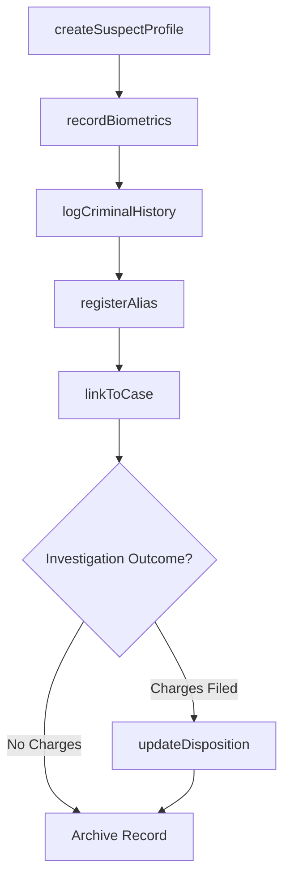
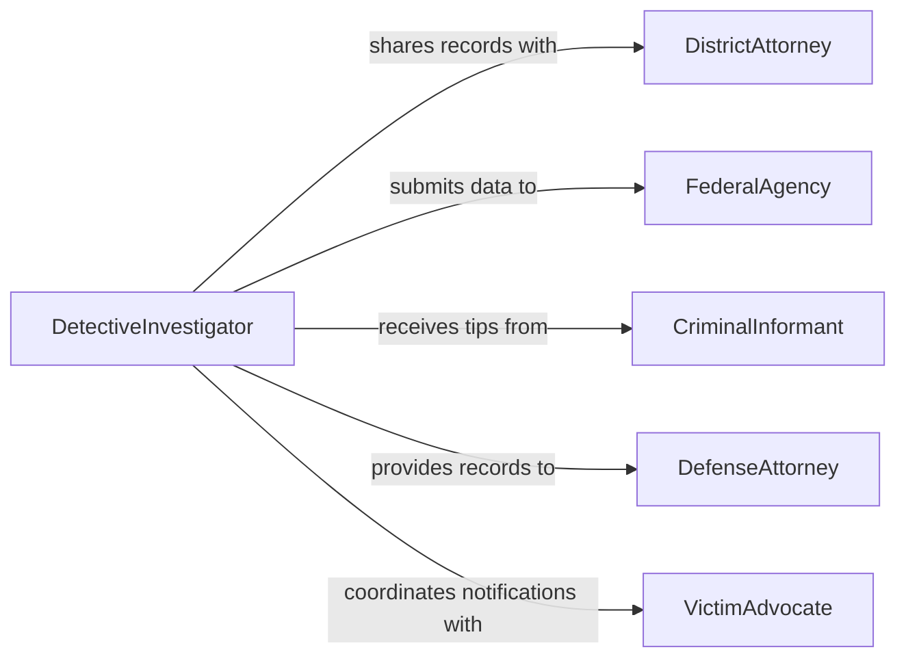

# Record Information About Suspects Criminals

> Business-as-Code definition for recording information about suspects and criminals. Models the documentation of individual profiles, criminal histories, identifying characteristics, and case associations within law enforcement record systems.

## Overview

Recording information about suspects and criminals involves creating and maintaining detailed profiles that include physical descriptions, known aliases, criminal history, fingerprint and photographic records, and associations with active cases. This definition covers the intake of suspect data during booking and field encounters, linking individuals to investigations, maintaining accurate records across jurisdictions, and ensuring data integrity for use in prosecutions and intelligence analysis.

## Actors

| Actor | Description |
|-------|-------------|
| DistrictAttorney | Prosecutor who relies on suspect records for charging decisions |
| FederalAgency | National law enforcement body such as FBI that maintains shared databases |
| CriminalInformant | Individual providing intelligence about suspects or criminal networks |
| VictimAdvocate | Representative ensuring victim rights are protected in suspect documentation |
| DefenseAttorney | Counsel for the accused who may request access to recorded information |

## Roles

| Role | Description |
|------|-------------|
| DetectiveInvestigator | Gathers and records suspect information during investigations |
| BookingOfficer | Processes suspects at intake and creates initial records |
| CrimeAnalyst | Analyzes suspect data to identify patterns and connections |
| RecordsClerk | Maintains the accuracy and integrity of criminal record databases |

## Entities

| Entity | Description |
|--------|-------------|
| SuspectProfile | A comprehensive record of an individual's identifying information and history |
| CriminalHistory | A chronological record of arrests, charges, and dispositions |
| BiometricRecord | Fingerprints, photographs, or DNA profiles linked to an individual |
| Alias | An alternate name, identity, or known moniker used by the suspect |
| CaseAssociation | A link between a suspect profile and one or more active investigations |
| FieldContact | A documented encounter between law enforcement and an individual |

## Actions

| Action | Description |
|--------|-------------|
| createSuspectProfile | Establish a new record with identifying details and physical description |
| recordBiometrics | Capture and store fingerprints, mugshots, or DNA samples |
| logCriminalHistory | Enter arrest, charge, and disposition records for an individual |
| registerAlias | Add a known alias or alternate identity to a suspect profile |
| linkToCase | Associate a suspect profile with an active investigation or case |
| recordFieldContact | Document an encounter with a suspect during patrol or surveillance |
| updateDisposition | Record the outcome of charges such as conviction, acquittal, or dismissal |

## Events

| Event | Description |
|-------|-------------|
| suspectProfileCreated | A new suspect record has been established in the system |
| biometricsRecorded | Fingerprints, photographs, or DNA have been captured and stored |
| criminalHistoryLogged | An arrest or charge record has been added to the individual's history |
| aliasRegistered | A new alias has been linked to a suspect profile |
| suspectLinkedToCase | A suspect has been associated with an active investigation |
| fieldContactRecorded | A field encounter with a suspect has been documented |
| dispositionUpdated | The outcome of criminal charges has been recorded |

## Searches

| Search | Description |
|--------|-------------|
| findSuspects | Query suspect profiles by name, alias, physical description, or case |
| searchBiometrics | Match fingerprints, facial features, or DNA against stored records |
| getCriminalHistory | Retrieve the full arrest and disposition history for an individual |
| getLinkedCases | List all active investigations associated with a specific suspect |

## Workflow



## Actor Relationships



## Usage

### Calling Actions

```typescript
import { recordInformationAboutSuspectsCriminals } from '@headlessly/record-information-about-suspects-criminals'

const suspectRecords = recordInformationAboutSuspectsCriminals()

// Create a new suspect profile
const suspect = await suspectRecords.createSuspectProfile({
  lastName: 'Doe',
  firstName: 'John',
  dateOfBirth: '1985-07-12',
  physicalDescription: {
    height: '5-11',
    weight: 180,
    eyeColor: 'brown',
    hairColor: 'black',
    distinguishingMarks: 'Scar on left forearm'
  }
})

// Record biometric data
await suspectRecords.recordBiometrics({
  suspectId: suspect.id,
  type: 'fingerprint',
  capturedBy: 'Officer Davis',
  capturedAt: '2026-02-05T09:30:00Z'
})

// Link suspect to an active case
await suspectRecords.linkToCase({
  suspectId: suspect.id,
  caseId: 'INV-2026-04521',
  role: 'primary-suspect',
  linkedBy: 'Det. Thompson'
})
```

### Event-Driven Automation

```typescript
// Notify investigators when suspect is linked to new case
suspectRecords.suspectLinkedToCase(async ({ suspectId, caseId }) => {
  const history = await suspectRecords.getCriminalHistory({ suspectId })
  if (history.priorConvictions > 0) {
    await notify({
      to: 'lead-detective',
      message: `Suspect ${suspectId} linked to ${caseId} - has ${history.priorConvictions} prior convictions`
    })
  }
})

// Cross-reference biometrics against federal databases
suspectRecords.biometricsRecorded(async ({ suspectId, type }) => {
  if (type === 'fingerprint') {
    await submitToDatabase({
      database: 'AFIS',
      suspectId,
      searchType: 'tenprint-match'
    })
  }
})
```
