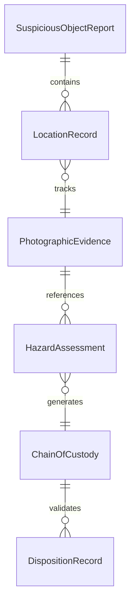
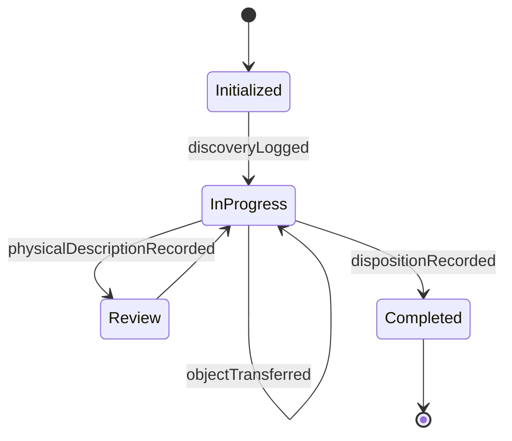
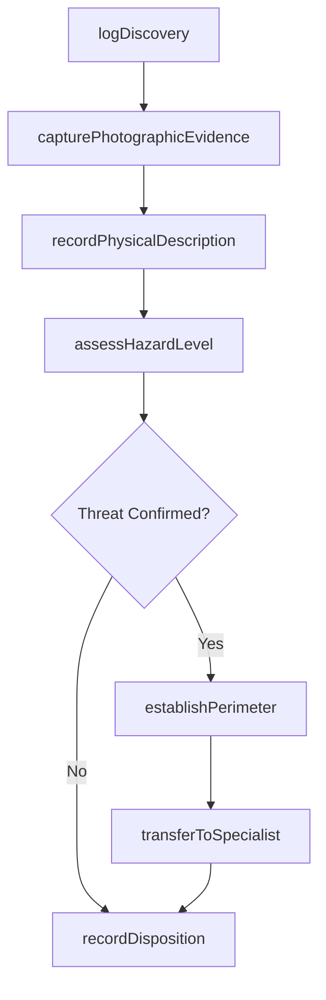
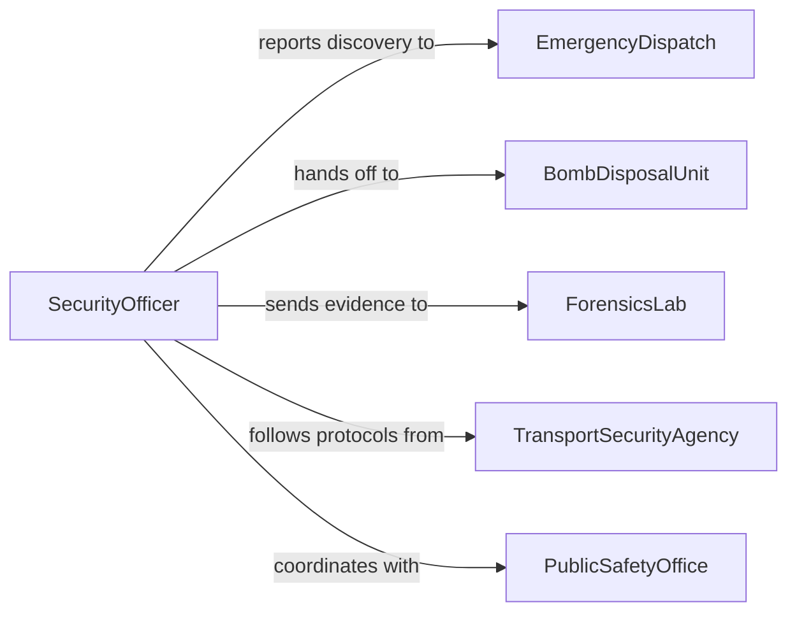

# Record Information About Suspicious Objects

> Business-as-Code definition for recording information about suspicious objects. Models the documentation of unidentified or potentially hazardous items discovered during security operations, law enforcement patrols, or customs inspections.

## Overview

Recording information about suspicious objects involves systematically documenting the discovery, physical characteristics, location, and disposition of items flagged as potentially dangerous, contraband, or evidence-related. This definition covers the initial report from the field through photographic documentation, chain-of-custody logging, hazard assessment, and coordination with bomb disposal or forensic units for further analysis and safe resolution.

## Actors

| Actor | Description |
|-------|-------------|
| EmergencyDispatch | Coordinates first responders and relays initial reports from the field |
| BombDisposalUnit | Specialized team that assesses and neutralizes explosive threats |
| ForensicsLab | Facility that analyzes suspicious objects for composition and origin |
| TransportSecurityAgency | Authority overseeing security screening at transportation hubs |
| PublicSafetyOffice | Local government entity responsible for community safety protocols |

## Roles

| Role | Description |
|------|-------------|
| SecurityOfficer | Identifies and initially documents suspicious objects in the field |
| IncidentCommander | Oversees the response operation and coordinates specialized units |
| EvidenceTechnician | Photographs, measures, and catalogs the object with forensic precision |
| IntelligenceAnalyst | Evaluates object characteristics against known threat patterns |

## Entities

| Entity | Description |
|--------|-------------|
| SuspiciousObjectReport | A formal record documenting the discovery and characteristics of an item |
| LocationRecord | GPS coordinates and descriptive details of where the object was found |
| PhotographicEvidence | Images captured of the object in situ and during processing |
| HazardAssessment | An evaluation of the potential threat level posed by the object |
| ChainOfCustody | A log tracking every person who handled or accessed the object |
| DispositionRecord | The final outcome documenting how the object was resolved or disposed |

## Actions

| Action | Description |
|--------|-------------|
| logDiscovery | Create an initial report documenting the discovery of a suspicious object |
| capturePhotographicEvidence | Record images and video of the object and surrounding area |
| assessHazardLevel | Evaluate the threat level based on visual inspection and context |
| recordPhysicalDescription | Document dimensions, materials, markings, and condition of the object |
| establishPerimeter | Log the security perimeter boundaries and access restrictions |
| transferToSpecialist | Hand off the object to bomb disposal or forensics with custody logging |
| recordDisposition | Document the final resolution including clearance, seizure, or destruction |

## Events

| Event | Description |
|-------|-------------|
| discoveryLogged | A suspicious object has been initially reported and documented |
| photographicEvidenceCaptured | Images and video of the object have been recorded |
| hazardLevelAssessed | The threat evaluation has been completed and categorized |
| physicalDescriptionRecorded | Detailed characteristics of the object have been documented |
| perimeterEstablished | A security zone has been set up and logged |
| objectTransferred | The object has been handed to a specialized unit with custody logged |
| dispositionRecorded | The final outcome of the suspicious object has been documented |

## Searches

| Search | Description |
|--------|-------------|
| findReports | Query suspicious object reports by location, date, or hazard level |
| getObjectsByType | Retrieve reports filtered by object category or material description |
| getCustodyChain | Trace the full chain of custody for a specific object |
| getDispositions | List final outcomes by resolution type, date, or handling unit |


## Entity Relationships



## State Diagram


## Workflow



## Actor Relationships



## Usage

### Calling Actions

```typescript
import { recordInformationAboutSuspiciousObjects } from '@headlessly/record-information-about-suspicious-objects'

const suspiciousObjects = recordInformationAboutSuspiciousObjects()

// Log the initial discovery
const report = await suspiciousObjects.logDiscovery({
  location: { lat: 40.7128, lng: -74.0060, description: 'Penn Station, Platform 7' },
  discoveredBy: 'Officer Martinez',
  timestamp: '2026-02-05T08:15:00Z',
  initialDescription: 'Unattended black duffel bag near support column'
})

// Record detailed physical description
await suspiciousObjects.recordPhysicalDescription({
  reportId: report.id,
  dimensions: { length: 60, width: 30, height: 25, unit: 'cm' },
  material: 'nylon',
  markings: 'No visible labels or tags',
  condition: 'zipped-closed'
})

// Assess hazard level
await suspiciousObjects.assessHazardLevel({
  reportId: report.id,
  threatLevel: 'medium',
  basis: 'Unattended in high-traffic transit area, no owner identified'
})
```

### Event-Driven Automation

```typescript
// Escalate high-threat discoveries
suspiciousObjects.hazardLevelAssessed(async ({ reportId, threatLevel }) => {
  if (threatLevel === 'high' || threatLevel === 'critical') {
    await notify({
      to: 'bomb-disposal-unit',
      priority: 'urgent',
      message: `High-threat suspicious object reported: ${reportId}`
    })
  }
})

// Archive reports after disposition
suspiciousObjects.dispositionRecorded(async ({ reportId, resolution }) => {
  await archive({
    entity: 'suspicious-object-report',
    entityId: reportId,
    resolution,
    retentionYears: 5
  })
})
```
