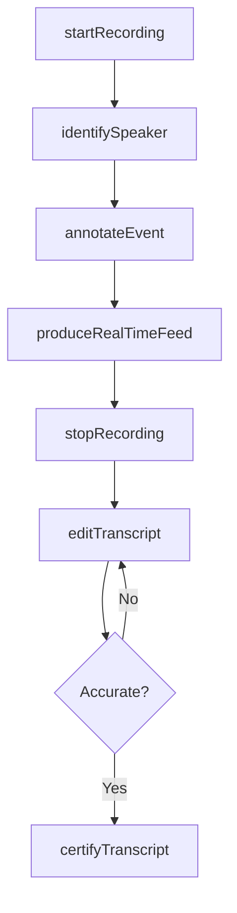
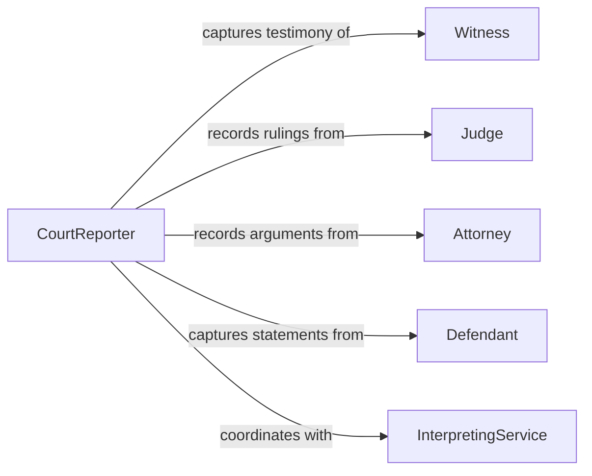

# Record Information Legal Proceedings

> Business-as-Code definition for recording information from legal proceedings. Models the real-time capture and preservation of testimony, rulings, arguments, and procedural events as they occur during court hearings, depositions, and arbitration sessions.

## Overview

Recording information from legal proceedings involves capturing spoken testimony, judicial rulings, attorney arguments, and procedural actions in real time during active court sessions and related events. This definition covers stenographic and audio recording of proceedings, real-time transcription, annotation of key moments such as objections and rulings, synchronization of audio with written records, and production of certified transcripts for use by attorneys, courts, and appellate bodies.

## Actors

| Actor | Description |
|-------|-------------|
| Judge | Presiding officer whose rulings and instructions must be accurately captured |
| Attorney | Legal representative whose arguments and objections are recorded |
| Witness | Individual providing testimony that must be captured verbatim |
| Defendant | Accused party whose statements during proceedings require documentation |
| InterpretingService | Language interpreter ensuring accurate translation for non-English testimony |

## Roles

| Role | Description |
|------|-------------|
| CourtReporter | Captures verbatim proceedings using stenography or digital recording |
| RealTimeTranscriptionist | Produces live text feeds of proceedings for attorneys and the judge |
| AudioVideoTechnician | Operates recording equipment and ensures quality capture of proceedings |
| TranscriptEditor | Reviews and corrects raw transcripts for accuracy before certification |

## Entities

| Entity | Description |
|--------|-------------|
| Transcript | The verbatim written record of everything spoken during a proceeding |
| AudioRecording | The digital audio capture of a proceeding session |
| Annotation | A marked notation identifying objections, rulings, or sidebar conferences |
| SpeakerIdentification | Attribution of recorded statements to specific individuals |
| CertifiedCopy | An authenticated version of the transcript bearing the reporter's certification |
| RealTimeFeed | A live text stream of proceedings provided to participants |

## Actions

| Action | Description |
|--------|-------------|
| startRecording | Begin capturing a proceeding session via stenography and audio |
| identifySpeaker | Attribute spoken statements to the correct individual in the record |
| annotateEvent | Mark significant procedural events such as objections, rulings, and recesses |
| produceRealTimeFeed | Stream live transcription text to attorneys and the bench |
| stopRecording | End the capture session and finalize raw records |
| editTranscript | Review and correct the raw transcript for accuracy and formatting |
| certifyTranscript | Authenticate the final transcript with official certification |

## Events

| Event | Description |
|-------|-------------|
| recordingStarted | A proceeding session capture has begun |
| speakerIdentified | A statement has been attributed to a specific individual |
| eventAnnotated | A procedural event such as an objection or ruling has been marked |
| realTimeFeedActive | Live transcription is being streamed to proceeding participants |
| recordingStopped | The capture session has ended and raw records are available |
| transcriptEdited | The raw transcript has been reviewed and corrected |
| transcriptCertified | The final transcript has been authenticated for official use |

## Searches

| Search | Description |
|--------|-------------|
| findTranscripts | Query transcripts by case, date, proceeding type, or court reporter |
| searchTestimony | Full-text search within transcript content by keyword or speaker |
| getAnnotations | Retrieve annotated events such as objections and rulings for a session |
| getPendingEdits | List transcripts awaiting review and correction |

## Workflow



## Actor Relationships



## Usage

### Calling Actions

```typescript
import { recordInformationLegalProceedings } from '@headlessly/record-information-legal-proceedings'

const proceedingRecords = recordInformationLegalProceedings()

// Start recording a hearing session
const session = await proceedingRecords.startRecording({
  caseId: 'CASE-2026-00456',
  proceedingType: 'jury-trial',
  courtroom: 'Room 4B',
  startTime: '2026-02-05T09:00:00Z',
  method: 'stenographic-and-audio'
})

// Annotate a procedural event
await proceedingRecords.annotateEvent({
  sessionId: session.id,
  timestamp: '2026-02-05T10:22:15Z',
  type: 'objection',
  speaker: 'Defense Counsel',
  ruling: 'sustained',
  context: 'Objection to hearsay testimony from Witness #3'
})

// Certify the completed transcript
await proceedingRecords.certifyTranscript({
  sessionId: session.id,
  certifiedBy: 'CSR Patricia Morales, RPR',
  certificationDate: '2026-02-07'
})
```

### Event-Driven Automation

```typescript
// Notify attorneys when certified transcript is available
proceedingRecords.transcriptCertified(async ({ caseId, sessionId }) => {
  await notify({
    to: 'case-attorneys',
    message: `Certified transcript for session ${sessionId} in case ${caseId} is now available for download`
  })
})

// Auto-start real-time feed when recording begins
proceedingRecords.recordingStarted(async ({ sessionId, caseId }) => {
  await proceedingRecords.produceRealTimeFeed({
    sessionId,
    recipients: ['judge-bench', 'counsel-table-plaintiff', 'counsel-table-defense']
  })
})
```
