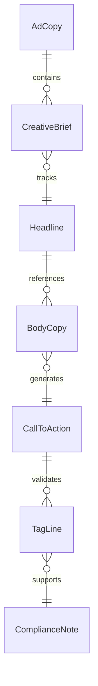
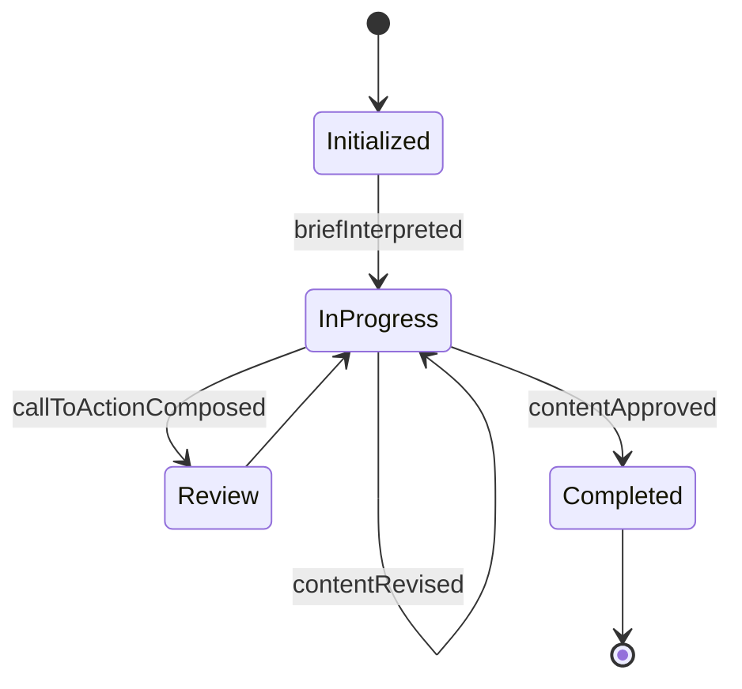
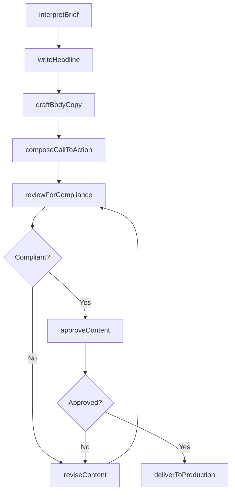
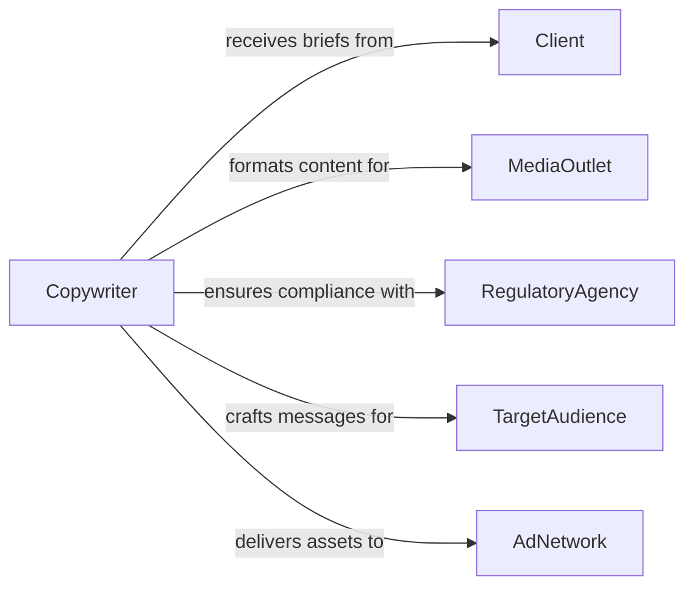

# Write Advertising or Promotional Material

> Business-as-Code definition for writing advertising and promotional content. Models the creation, review, and deployment of marketing copy used in campaigns, product promotions, and brand communications.

## Overview

Writing advertising and promotional material involves crafting compelling copy for advertisements, marketing campaigns, product descriptions, email sequences, and brand messaging. This definition covers the creative brief interpretation, copywriting process, compliance review, and delivery to production channels, enabling marketing teams to produce on-brand, regulation-compliant content that drives customer engagement and conversion.

## Actors

| Actor | Description |
|-------|-------------|
| Client | The brand or organization commissioning the advertising content |
| MediaOutlet | The publication, platform, or channel where ads will appear |
| RegulatoryAgency | Enforces truth-in-advertising and disclosure requirements |
| TargetAudience | The consumer segment the advertising is designed to reach |
| AdNetwork | Distributes digital advertising across publisher properties |
| ComplianceReviewer | Ensures advertising claims meet legal and ethical standards |

## Roles

| Role | Description |
|------|-------------|
| Copywriter | Authors advertising and promotional content |
| CreativeDirector | Oversees the creative vision and quality of advertising copy |
| BrandManager | Ensures content aligns with brand guidelines and positioning |
| MediaPlanner | Determines where and when advertising content will be placed |

## Entities

| Entity | Description |
|--------|-------------|
| AdCopy | Written text for an advertisement or promotional piece |
| CreativeBrief | A document outlining campaign objectives, audience, and messaging |
| Headline | The primary attention-grabbing text of an advertisement |
| BodyCopy | The supporting text that expands on the headline message |
| CallToAction | A directive phrase designed to prompt audience response |
| TagLine | A memorable phrase associated with the brand or campaign |
| ComplianceNote | A notation indicating required disclosures or restrictions |
| CampaignAsset | A finished piece of advertising content ready for deployment |

## Actions

| Action | Description |
|--------|-------------|
| interpretBrief | Analyze the creative brief to understand campaign objectives |
| writeHeadline | Craft the primary attention-grabbing text for the ad |
| draftBodyCopy | Author the supporting promotional text |
| composeCallToAction | Create action-oriented phrases to drive audience response |
| reviewForCompliance | Verify that advertising claims meet legal requirements |
| reviseContent | Refine copy based on creative or compliance feedback |
| approveContent | Obtain final approval from the brand manager or client |
| deliverToProduction | Hand off approved copy for design and media placement |

## Events

| Event | Description |
|-------|-------------|
| briefInterpreted | Campaign objectives and messaging have been analyzed |
| headlineWritten | The primary advertising text has been crafted |
| bodyCopyDrafted | Supporting promotional text has been authored |
| callToActionComposed | Action-oriented response phrases have been created |
| complianceReviewed | Advertising claims have been verified for legality |
| contentRevised | Copy has been refined based on feedback |
| contentApproved | Final approval has been granted for the advertising content |
| deliveredToProduction | Approved copy has been handed off for production |

## Searches

| Search | Description |
|--------|-------------|
| findAdCopy | List advertising copy by campaign, product, or status |
| getBriefs | Retrieve creative briefs by client, campaign, or date |
| findByCampaign | Locate all copy assets associated with a specific campaign |
| getPendingApprovals | List copy awaiting brand manager or client approval |
| searchByProduct | Find advertising materials by product or service line |


## Entity Relationships



## State Diagram


## Workflow



## Actor Relationships



## Usage

### Calling Actions

```typescript
import { writeAdvertisingPromotionalMaterial } from '@headlessly/write-advertising-promotional-material'

const ads = writeAdvertisingPromotionalMaterial()

// Interpret brief and write copy
const brief = await ads.interpretBrief({
  campaign: 'Summer Product Launch 2026',
  product: 'ProFit Running Shoe',
  audience: 'fitness-enthusiasts-25-45',
  channels: ['social-media', 'display', 'email']
})

const headline = await ads.writeHeadline({
  briefId: brief.id,
  variants: 3,
  maxLength: 60
})

await ads.draftBodyCopy({
  briefId: brief.id,
  headlineId: headline.id,
  format: 'social-media-ad',
  maxLength: 125
})

// Review and approve
await ads.reviewForCompliance({ briefId: brief.id })
await ads.approveContent({ briefId: brief.id })
await ads.deliverToProduction({
  briefId: brief.id,
  channels: ['meta-ads', 'google-display', 'email-platform']
})
```

### Event-Driven Automation

```typescript
// Auto-trigger compliance review when copy is drafted
ads.bodyCopyDrafted(async ({ briefId }) => {
  await ads.reviewForCompliance({ briefId })
})

// Notify media planner when content is production-ready
ads.deliveredToProduction(async ({ briefId, channels }) => {
  await notify({
    to: 'media-planning',
    message: `Ad copy for campaign ready - ${channels.length} channels to schedule`
  })
})
```
