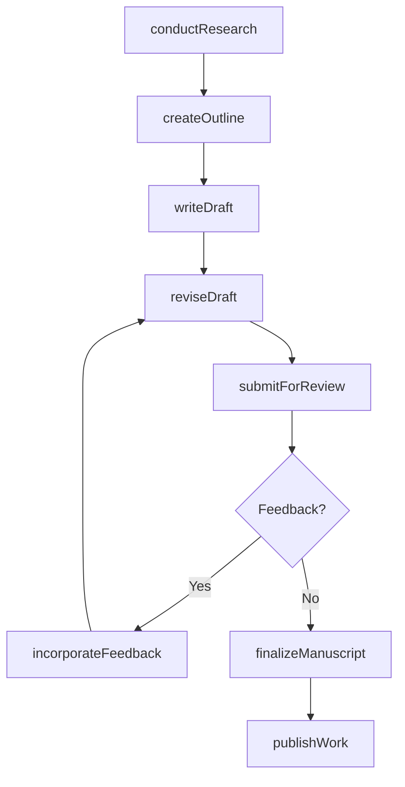
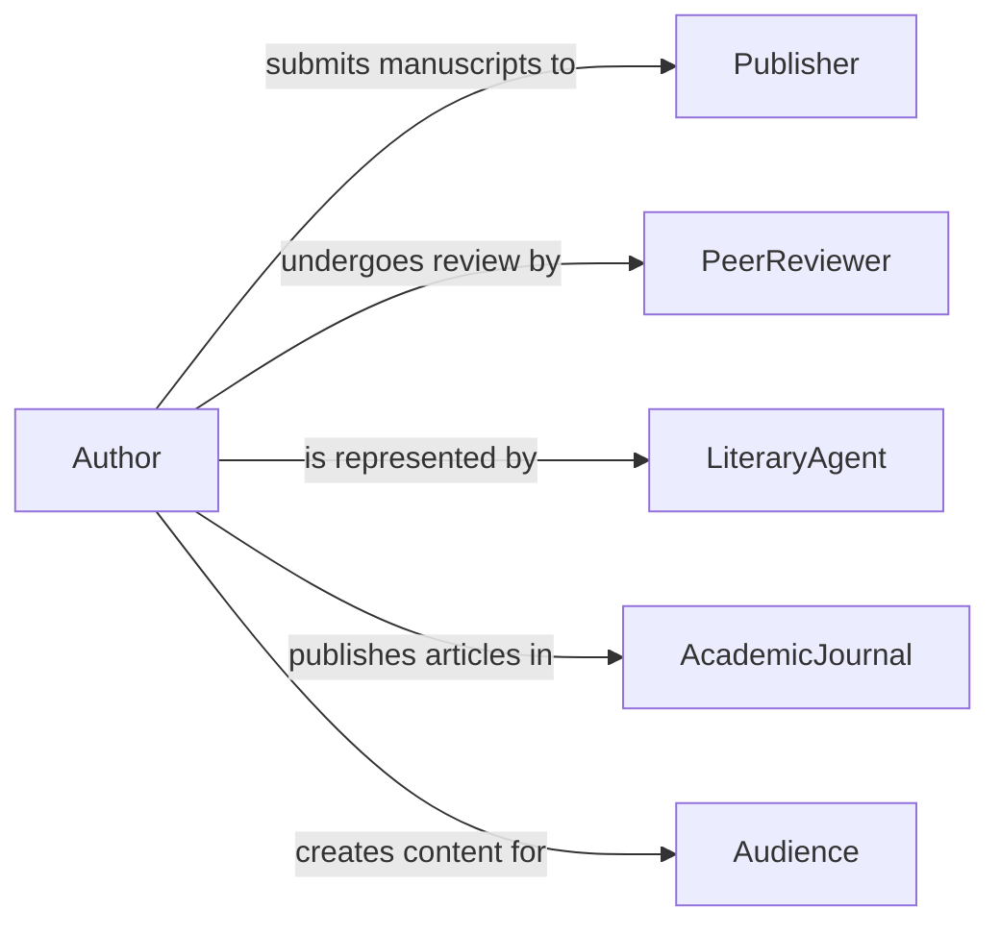

# Write Articles, Books, or Other Original Materials

> Business-as-Code definition for writing articles, books, and original expert content. Models the authoring lifecycle from research and outlining through publication and distribution of original written works.

## Overview

Writing articles, books, and original materials in an area of expertise involves researching topics, developing outlines, drafting manuscripts, undergoing editorial review, and publishing finished works through appropriate channels. This definition covers academic papers, trade publications, technical books, white papers, and thought leadership content, enabling authors and organizations to manage the full content creation pipeline from concept through distribution and impact measurement.

## Actors

| Actor | Description |
|-------|-------------|
| Publisher | Produces and distributes the finished written work |
| PeerReviewer | Evaluates manuscript quality and accuracy for academic works |
| LiteraryAgent | Represents the author in negotiations with publishers |
| AcademicJournal | Publishes peer-reviewed scholarly articles |
| Audience | The target readership that consumes the published material |
| CopyrightOffice | Registers intellectual property protections for original works |

## Roles

| Role | Description |
|------|-------------|
| Author | Researches and writes the original content |
| Editor | Reviews and refines manuscripts for publication quality |
| ResearchAssistant | Supports the author with data gathering and fact verification |
| ContentStrategist | Plans publication timing and distribution channels |

## Entities

| Entity | Description |
|--------|-------------|
| Manuscript | A complete written work prepared for publication |
| Article | A shorter written piece for journals, magazines, or online outlets |
| BookChapter | A section of a longer work organized by topic |
| Outline | A structural plan for the content and organization of a work |
| Bibliography | A list of sources referenced in the written material |
| DraftRevision | A versioned iteration of the manuscript during development |
| PublicationContract | An agreement governing the terms of publication |
| Abstract | A concise summary of the work's content and conclusions |

## Actions

| Action | Description |
|--------|-------------|
| conductResearch | Investigate the subject matter and gather source materials |
| createOutline | Develop the structural plan for the written work |
| writeDraft | Author the initial version of the manuscript or article |
| reviseDraft | Refine the manuscript based on self-review or feedback |
| submitForReview | Send the manuscript to editors or peer reviewers |
| incorporateFeedback | Apply reviewer suggestions and corrections |
| finalizeManuscript | Complete the final version for publication |
| publishWork | Release the finished work through the designated channel |

## Events

| Event | Description |
|-------|-------------|
| researchCompleted | Subject matter investigation has been finalized |
| outlineCreated | The structural plan for the work has been developed |
| draftCompleted | An initial version of the manuscript has been written |
| draftRevised | The manuscript has been refined based on review |
| reviewSubmitted | The manuscript has been sent for editorial or peer review |
| feedbackIncorporated | Reviewer suggestions have been applied |
| manuscriptFinalized | The final version is ready for publication |
| workPublished | The written work has been released to the audience |

## Searches

| Search | Description |
|--------|-------------|
| findManuscripts | List manuscripts by topic, status, or author |
| getDraftHistory | Retrieve the revision history for a specific work |
| findByPublication | Locate works by publisher, journal, or outlet |
| getReviewStatus | Check the current review stage of submitted manuscripts |
| searchByTopic | Find published works by subject area or keyword |

## Workflow



## Actor Relationships



## Usage

### Calling Actions

```typescript
import { writeArticlesBooksOriginalMaterials } from '@headlessly/write-articles-books-original-materials'

const writing = writeArticlesBooksOriginalMaterials()

// Research and outline a new book
const research = await writing.conductResearch({
  topic: 'Machine Learning in Supply Chain Optimization',
  sources: ['academic-databases', 'industry-reports', 'case-studies'],
  scope: 'comprehensive'
})

const outline = await writing.createOutline({
  title: 'Intelligent Supply Chains',
  chapters: 12,
  targetWordCount: 80000,
  audience: 'supply-chain-professionals'
})

// Write and submit
const draft = await writing.writeDraft({
  outlineId: outline.id,
  researchId: research.id
})

await writing.submitForReview({
  manuscriptId: draft.id,
  reviewers: ['technical-editor', 'peer-reviewer-1', 'peer-reviewer-2']
})
```

### Event-Driven Automation

```typescript
// Notify author when review feedback arrives
writing.reviewSubmitted(async ({ manuscriptId, reviewerCount }) => {
  await notify({
    to: 'author',
    message: `Manuscript submitted for review by ${reviewerCount} reviewers`
  })
})

// Auto-notify publisher when manuscript is finalized
writing.manuscriptFinalized(async ({ manuscriptId, title }) => {
  await notify({
    to: 'publisher',
    message: `Manuscript "${title}" is ready for publication`
  })
})
```
