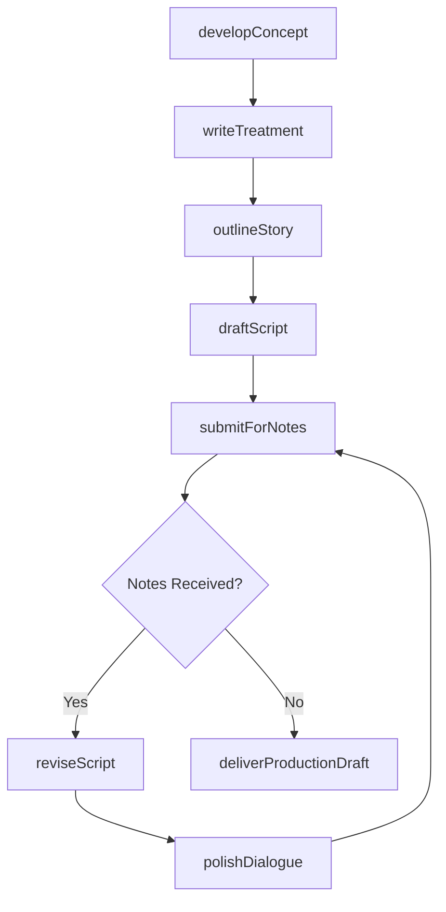
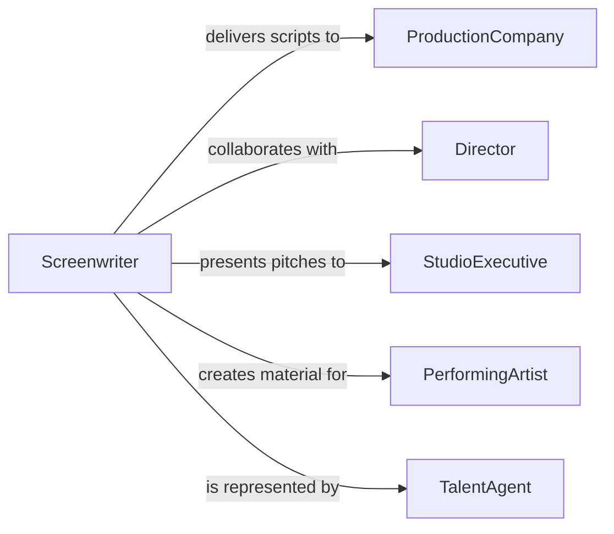

# Write Material for Artistic or Entertainment Purposes

> Business-as-Code definition for writing artistic and entertainment content. Models the creative writing lifecycle from concept development through production-ready delivery of scripts, screenplays, lyrics, and other creative written works.

## Overview

Writing material for artistic or entertainment purposes involves developing creative concepts, drafting scripts and narratives, collaborating with directors and producers, revising based on creative feedback, and delivering production-ready written content. This definition covers screenplays, television scripts, stage plays, song lyrics, podcast scripts, and literary fiction, enabling creative teams to manage the writing pipeline from initial pitch through final delivery.

## Actors

| Actor | Description |
|-------|-------------|
| ProductionCompany | Commissions and produces entertainment content |
| Director | Collaborates with writers on creative vision and script interpretation |
| StudioExecutive | Approves creative direction and greenlights projects |
| PerformingArtist | Interprets and performs the written material |
| DistributionPlatform | Delivers the finished entertainment product to audiences |
| TalentAgent | Represents writers and negotiates engagement terms |

## Roles

| Role | Description |
|------|-------------|
| Screenwriter | Authors scripts for film, television, or digital media |
| Playwright | Writes material for theatrical stage productions |
| Lyricist | Composes words for songs and musical compositions |
| ScriptEditor | Reviews and refines creative written material for production |
| StoryDeveloper | Creates story arcs, characters, and narrative structures |

## Entities

| Entity | Description |
|--------|-------------|
| Script | A written work formatted for performance or production |
| Screenplay | A script formatted specifically for film production |
| Treatment | A narrative summary describing the story, characters, and tone |
| StoryOutline | A structural plan for plot progression and character arcs |
| DialogueDraft | Written character dialogue for a specific scene or sequence |
| RevisionNote | Feedback from creative collaborators on the current draft |
| ProductionDraft | The final version of the script approved for production |

## Actions

| Action | Description |
|--------|-------------|
| developConcept | Create the initial story idea, theme, and creative direction |
| writeTreatment | Author a narrative summary of the proposed work |
| outlineStory | Structure the plot, acts, and character arcs |
| draftScript | Write the full script with dialogue, action, and stage directions |
| submitForNotes | Send the draft to creative collaborators for feedback |
| reviseScript | Incorporate feedback and refine the creative content |
| polishDialogue | Refine character voices and conversational authenticity |
| deliverProductionDraft | Finalize and deliver the production-ready script |

## Events

| Event | Description |
|-------|-------------|
| conceptDeveloped | The initial creative idea has been formulated |
| treatmentWritten | A narrative summary has been authored |
| storyOutlined | The plot structure and character arcs have been defined |
| scriptDrafted | A full draft of the script has been completed |
| notesReceived | Creative feedback has been provided on the draft |
| scriptRevised | The script has been updated based on feedback |
| dialoguePolished | Character dialogue has been refined |
| productionDraftDelivered | The final script has been delivered for production |

## Searches

| Search | Description |
|--------|-------------|
| findScripts | List scripts by genre, format, or development stage |
| getTreatments | Retrieve treatments by project, writer, or status |
| findByGenre | Locate written works by genre or audience category |
| getRevisionHistory | Retrieve the draft history for a specific script |
| findProductionReady | List scripts approved and ready for production |

## Workflow



## Actor Relationships



## Usage

### Calling Actions

```typescript
import { writeMaterialArtisticEntertainmentPurposes } from '@headlessly/write-material-artistic-entertainment-purposes'

const creative = writeMaterialArtisticEntertainmentPurposes()

// Develop a concept and write treatment
const concept = await creative.developConcept({
  title: 'The Last Algorithm',
  genre: 'science-fiction-thriller',
  logline: 'A data scientist discovers her AI model is predicting real-world events',
  format: 'feature-film'
})

const treatment = await creative.writeTreatment({
  conceptId: concept.id,
  targetLength: '120 minutes',
  tone: 'suspenseful'
})

// Draft the screenplay
const script = await creative.draftScript({
  treatmentId: treatment.id,
  format: 'screenplay',
  targetPages: 110
})

// Submit for creative notes
await creative.submitForNotes({
  scriptId: script.id,
  reviewers: ['director', 'producer', 'studio-development']
})
```

### Event-Driven Automation

```typescript
// Notify production team when script is production-ready
creative.productionDraftDelivered(async ({ scriptId, title, format }) => {
  await notify({
    to: 'production-team',
    message: `Production draft of "${title}" (${format}) is ready`
  })
})

// Track revision cycles
creative.notesReceived(async ({ scriptId, noteCount }) => {
  await notify({
    to: 'writer',
    message: `${noteCount} notes received on script ${scriptId} - revision needed`
  })
})
```
