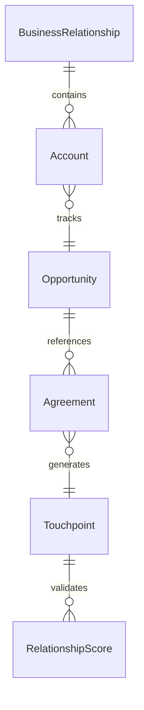
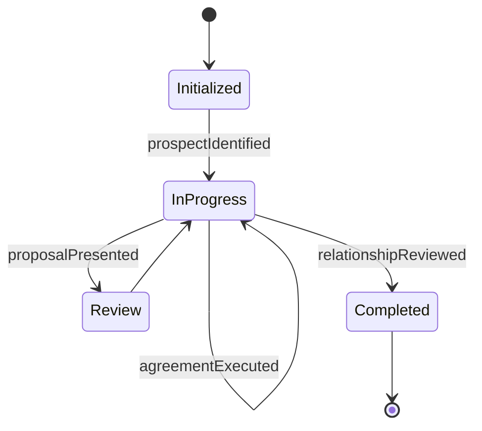
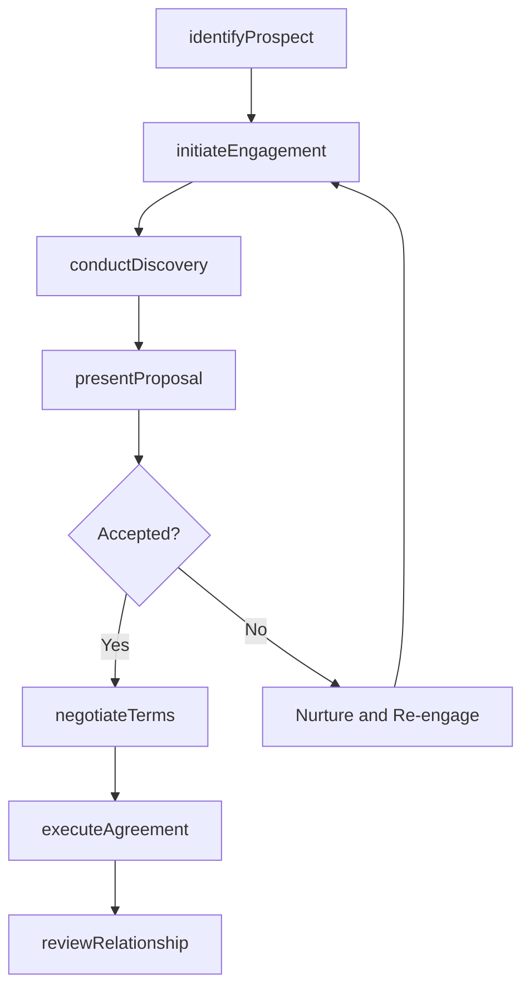
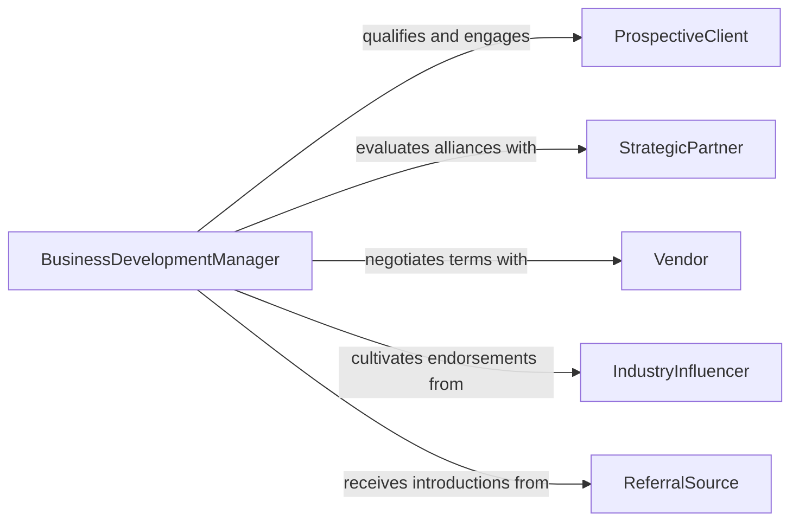

# Develop Business Relationships

> Business-as-Code definition for developing business relationships. Models the identification, cultivation, and management of strategic business partnerships, client relationships, and vendor engagements that drive revenue and operational success.

## Overview

Developing business relationships involves identifying potential partners, clients, and vendors, initiating engagement through outreach and meetings, negotiating terms of collaboration, and nurturing ongoing connections that generate mutual value. This definition covers the full relationship lifecycle from lead identification and qualification through proposal development, agreement execution, account management, and periodic relationship reviews to ensure alignment with business objectives.

## Actors

| Actor | Description |
|-------|-------------|
| ProspectiveClient | Organization or individual being evaluated as a potential customer |
| StrategicPartner | Company with complementary capabilities for joint market opportunities |
| Vendor | Supplier providing goods or services critical to business operations |
| IndustryInfluencer | Thought leader or analyst whose endorsement amplifies market credibility |
| ReferralSource | Existing contact who provides introductions to new business opportunities |

## Roles

| Role | Description |
|------|-------------|
| BusinessDevelopmentManager | Identifies and pursues new business opportunities and partnerships |
| AccountExecutive | Manages active client relationships and drives revenue growth |
| PartnershipDirector | Oversees strategic alliances and channel partner programs |
| ClientSuccessManager | Ensures client satisfaction and identifies expansion opportunities |

## Entities

| Entity | Description |
|--------|-------------|
| BusinessRelationship | A tracked connection between the organization and an external entity |
| Account | A client or partner record with associated contacts and deal history |
| Opportunity | A potential deal or collaboration under evaluation |
| Agreement | A formal contract or memorandum of understanding governing the relationship |
| Touchpoint | A recorded interaction such as a meeting, call, or email exchange |
| RelationshipScore | A quantitative assessment of relationship health and engagement level |

## Actions

| Action | Description |
|--------|-------------|
| identifyProspect | Research and qualify a potential client, partner, or vendor |
| initiateEngagement | Make first contact through outreach, introduction, or event |
| conductDiscovery | Hold a meeting to understand the prospect's needs and objectives |
| presentProposal | Deliver a tailored value proposition or partnership proposal |
| negotiateTerms | Work through contract details, pricing, and scope of collaboration |
| executeAgreement | Finalize and sign a formal business agreement |
| reviewRelationship | Conduct a periodic assessment of relationship value and satisfaction |

## Events

| Event | Description |
|-------|-------------|
| prospectIdentified | A potential business contact has been researched and qualified |
| engagementInitiated | First contact has been made with a prospect |
| discoveryCompleted | A needs-assessment meeting with the prospect has concluded |
| proposalPresented | A value proposition or partnership proposal has been delivered |
| termsNegotiated | Contract terms have been discussed and agreed upon |
| agreementExecuted | A formal business agreement has been signed by all parties |
| relationshipReviewed | A periodic assessment of the relationship has been completed |

## Searches

| Search | Description |
|--------|-------------|
| findAccounts | Query business accounts by industry, revenue tier, or relationship status |
| getOpportunities | Retrieve open opportunities by stage, value, or expected close date |
| getTouchpoints | List all interactions with a specific account within a date range |
| getRelationshipScores | Retrieve health scores for active business relationships |


## Entity Relationships



## State Diagram


## Workflow



## Actor Relationships



## Usage

### Calling Actions

```typescript
import { developBusinessRelationships } from '@headlessly/develop-business-relationships'

const bizRelationships = developBusinessRelationships()

// Identify a new prospect
const prospect = await bizRelationships.identifyProspect({
  company: 'Meridian Healthcare Systems',
  industry: 'Healthcare',
  annualRevenue: 50000000,
  contactName: 'Robert Chen',
  contactTitle: 'Chief Technology Officer',
  source: 'industry-conference'
})

// Conduct discovery meeting
await bizRelationships.conductDiscovery({
  accountId: prospect.id,
  date: '2026-02-10',
  attendees: ['Robert Chen', 'Sarah Mills'],
  topics: ['data-integration-challenges', 'compliance-requirements', 'budget-timeline'],
  notes: 'Seeking unified patient data platform, budget allocated for Q2'
})

// Execute a partnership agreement
await bizRelationships.executeAgreement({
  accountId: prospect.id,
  type: 'master-service-agreement',
  value: 1200000,
  term: '24-months',
  signedDate: '2026-03-01'
})
```

### Event-Driven Automation

```typescript
// Notify team when major agreement is executed
bizRelationships.agreementExecuted(async ({ accountId, type, value }) => {
  if (value > 500000) {
    await notify({
      to: 'executive-team',
      message: `New ${type} signed with account ${accountId} valued at $${value.toLocaleString()}`
    })
  }
})

// Schedule periodic relationship reviews
bizRelationships.agreementExecuted(async ({ accountId, term }) => {
  await bizRelationships.reviewRelationship({
    accountId,
    frequency: 'quarterly',
    firstReview: addMonths(new Date(), 3)
  })
})
```
