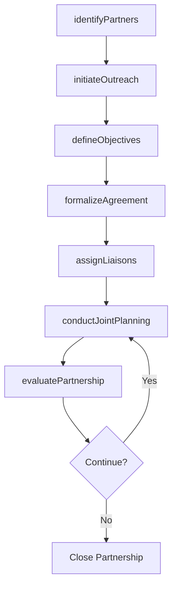
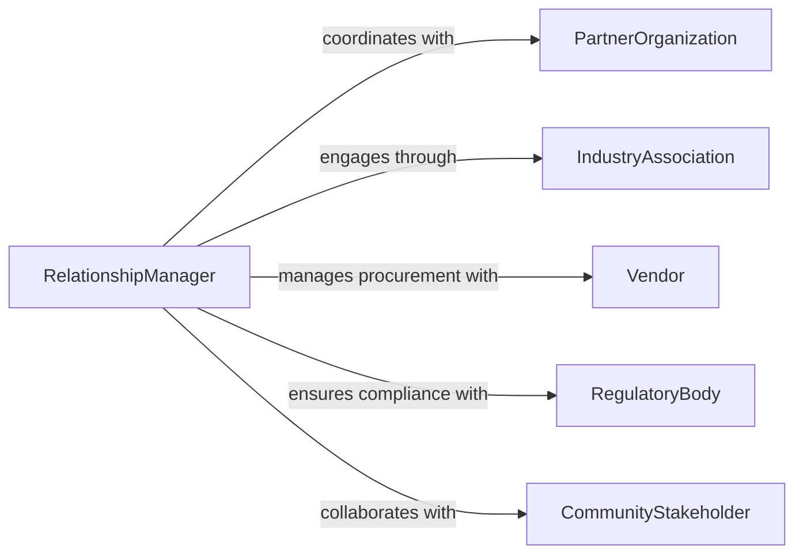

# Develop Collaborative Relationships Between Department

> Business-as-Code definition for developing collaborative relationships between departments or with external organizations. Models the full lifecycle of cross-functional and external partnership building.

## Overview

Developing collaborative relationships between departments or with external organizations involves identifying shared objectives, establishing communication channels, and formalizing partnership agreements that enable joint initiatives. This process bridges organizational silos by creating governance structures, shared resources, and feedback loops that sustain productive working relationships over time. Effective cross-departmental collaboration reduces duplication of effort, accelerates decision-making, and improves organizational agility.

## Actors

| Actor | Description |
|-------|-------------|
| PartnerOrganization | External entity seeking joint initiatives or resource sharing |
| IndustryAssociation | Professional body facilitating inter-organizational connections |
| Vendor | Third-party supplier involved in collaborative procurement |
| RegulatoryBody | Government or standards authority requiring coordinated compliance |
| CommunityStakeholder | Local or civic group engaged in public-private partnerships |

## Roles

| Role | Description |
|------|-------------|
| RelationshipManager | Oversees the development and maintenance of collaborative partnerships |
| DepartmentLiaison | Represents a specific department in cross-functional initiatives |
| ExecutiveSponsor | Provides strategic direction and authorizes resource commitments |
| ProjectCoordinator | Manages day-to-day logistics of collaborative projects |

## Entities

| Entity | Description |
|--------|-------------|
| Partnership | A formal or informal collaborative agreement between parties |
| MemorandumOfUnderstanding | A documented framework defining collaboration terms |
| JointInitiative | A specific project or program pursued collaboratively |
| CommunicationChannel | An established pathway for information exchange between parties |
| StakeholderRegistry | A catalog of individuals and organizations involved in partnerships |
| CollaborationMetric | A measure of partnership effectiveness and engagement |

## Actions

| Action | Description |
|--------|-------------|
| identifyPartners | Discover departments or organizations with aligned objectives |
| initiateOutreach | Make first contact and propose collaboration opportunities |
| defineObjectives | Establish shared goals and success criteria for the partnership |
| formalizeAgreement | Draft and sign memoranda of understanding or partnership contracts |
| assignLiaisons | Designate representatives from each party to manage the relationship |
| conductJointPlanning | Collaborate on shared roadmaps and resource allocation |
| evaluatePartnership | Assess the health and outcomes of the collaborative relationship |

## Events

| Event | Description |
|-------|-------------|
| partnerIdentified | A potential collaboration partner has been discovered |
| outreachInitiated | First contact has been made with a prospective partner |
| objectivesDefined | Shared goals for the partnership have been established |
| agreementFormalized | A partnership agreement has been signed by all parties |
| liaisonsAssigned | Department representatives have been designated |
| jointPlanningCompleted | A shared project roadmap has been finalized |
| partnershipEvaluated | A periodic review of the partnership has been completed |

## Searches

| Search | Description |
|--------|-------------|
| findPartnerships | List partnerships by status, department, or organization |
| getJointInitiatives | Retrieve active collaborative projects and their progress |
| getStakeholders | Look up individuals and roles involved in a partnership |
| getCollaborationMetrics | Retrieve effectiveness scores and engagement data |

## Workflow



## Actor Relationships



## Usage

### Calling Actions

```typescript
import { developCollaborativeRelationshipsBetweenDepartments } from '@headlessly/develop-collaborative-relationships-between-departments'

const relationships = developCollaborativeRelationshipsBetweenDepartments()

// Identify potential cross-departmental partners
const partners = await relationships.identifyPartners({
  criteria: 'shared-supply-chain-goals',
  scope: ['Procurement', 'Logistics', 'Manufacturing']
})

// Formalize a partnership agreement
const agreement = await relationships.formalizeAgreement({
  parties: ['Engineering', 'Quality Assurance'],
  type: 'memorandum-of-understanding',
  objectives: ['Reduce defect rate by 20%', 'Shared testing infrastructure'],
  duration: { start: '2026-01-01', end: '2026-12-31' }
})

// Evaluate an existing partnership
const evaluation = await relationships.evaluatePartnership({
  partnershipId: agreement.id,
  metrics: ['engagement-score', 'milestone-completion', 'satisfaction-rating']
})
```

### Event-Driven Automation

```typescript
// Notify stakeholders when a partnership is formalized
relationships.agreementFormalized(async ({ partnershipId, parties }) => {
  await notify({
    to: parties.map(p => `${p}-leadership`),
    message: `Partnership agreement ${partnershipId} has been signed`
  })
})

// Schedule periodic reviews after joint planning is complete
relationships.jointPlanningCompleted(async ({ partnershipId, roadmap }) => {
  await schedule({
    task: 'evaluatePartnership',
    partnershipId,
    frequency: 'quarterly',
    startDate: roadmap.milestones[0].date
  })
})
```
