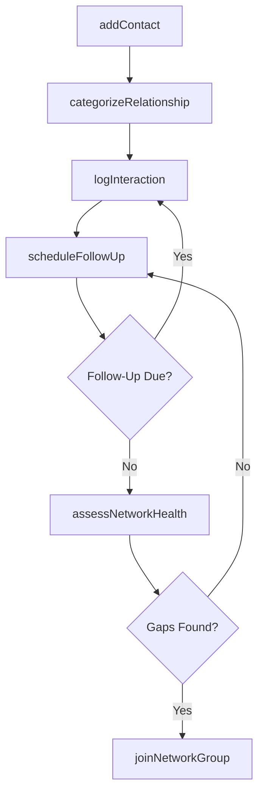
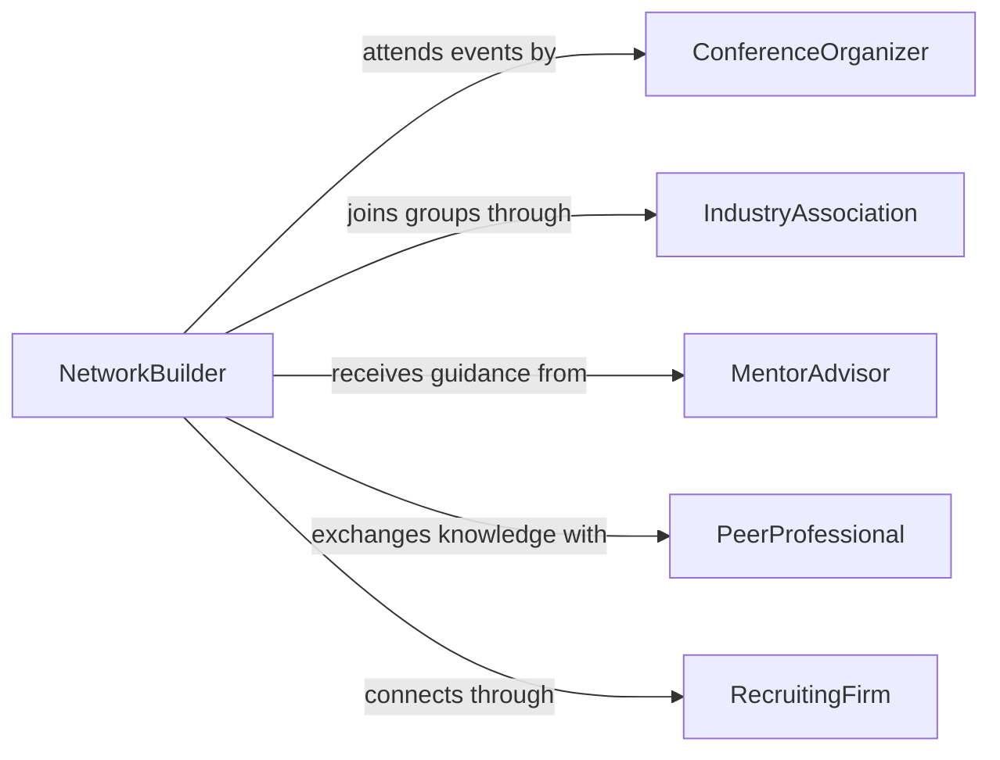

# Develop Professional Relationships Networks

> Business-as-Code definition for developing professional relationships and networks. Models the identification, cultivation, and management of professional contacts across industries, associations, and communities of practice.

## Overview

Developing professional relationships and networks involves strategically identifying valuable contacts, building rapport through regular engagement, and maintaining ongoing connections that support career advancement, knowledge sharing, and business development. This definition covers prospecting for new contacts at conferences and industry events, nurturing relationships through follow-ups and collaboration, tracking interaction history, and leveraging network connections for referrals, partnerships, and professional growth.

## Actors

| Actor | Description |
|-------|-------------|
| IndustryAssociation | Professional body hosting events and directories for networking |
| ConferenceOrganizer | Entity planning and managing professional events and trade shows |
| MentorAdvisor | Experienced professional providing guidance and introductions |
| PeerProfessional | Colleague in the same field available for knowledge exchange |
| RecruitingFirm | Talent agency that facilitates professional introductions and placements |

## Roles

| Role | Description |
|------|-------------|
| NetworkBuilder | Actively identifies and cultivates new professional connections |
| RelationshipManager | Maintains and strengthens existing professional relationships |
| CommunityLeader | Organizes and leads professional groups or communities of practice |
| BrandAmbassador | Represents the organization at external networking events |

## Entities

| Entity | Description |
|--------|-------------|
| Contact | A professional individual in the network with profile and interaction history |
| Relationship | A tracked connection between two professionals with strength and type |
| Interaction | A recorded touchpoint such as a meeting, email, or event attendance |
| NetworkGroup | A defined community or association of professionals with shared interests |
| Referral | An introduction or recommendation made through the network |
| Event | A conference, meetup, or gathering where networking occurs |

## Actions

| Action | Description |
|--------|-------------|
| addContact | Register a new professional contact with profile details |
| logInteraction | Record a meeting, conversation, or correspondence with a contact |
| categorizeRelationship | Classify the relationship by type, strength, and strategic value |
| scheduleFollowUp | Set a reminder for the next engagement with a contact |
| requestReferral | Ask a contact for an introduction to someone in their network |
| joinNetworkGroup | Register membership in a professional association or community |
| assessNetworkHealth | Evaluate the breadth, depth, and activity level of the professional network |

## Events

| Event | Description |
|-------|-------------|
| contactAdded | A new professional contact has been registered in the network |
| interactionLogged | A touchpoint with a contact has been recorded |
| relationshipCategorized | A relationship has been classified by type and strength |
| followUpScheduled | A future engagement reminder has been set for a contact |
| referralRequested | An introduction request has been made through the network |
| networkGroupJoined | Membership in a professional community has been established |
| networkHealthAssessed | A review of network activity and coverage has been completed |

## Searches

| Search | Description |
|--------|-------------|
| findContacts | Query contacts by industry, role, location, or relationship strength |
| getInteractionHistory | Retrieve all touchpoints with a specific contact over time |
| getStaleRelationships | List contacts with no interaction within a specified period |
| findNetworkGroups | Search professional associations and communities by focus area |

## Workflow



## Actor Relationships



## Usage

### Calling Actions

```typescript
import { developProfessionalRelationshipsNetworks } from '@headlessly/develop-professional-relationships-networks'

const network = developProfessionalRelationshipsNetworks()

// Add a new professional contact
const contact = await network.addContact({
  name: 'Dr. Lisa Park',
  title: 'VP of Engineering',
  company: 'TechVentures Inc.',
  industry: 'Software',
  metAt: 'AWS re:Invent 2025',
  linkedIn: 'linkedin.com/in/lisapark'
})

// Log a follow-up interaction
await network.logInteraction({
  contactId: contact.id,
  type: 'coffee-meeting',
  date: '2026-01-15',
  notes: 'Discussed potential collaboration on edge computing project',
  nextStep: 'Send proposal outline by Jan 22'
})

// Assess overall network health
const assessment = await network.assessNetworkHealth({
  period: 'last-6-months',
  metrics: ['contact-growth', 'interaction-frequency', 'industry-coverage']
})
```

### Event-Driven Automation

```typescript
// Remind about stale relationships
network.networkHealthAssessed(async ({ staleContacts }) => {
  for (const contact of staleContacts) {
    await network.scheduleFollowUp({
      contactId: contact.id,
      reason: `No interaction in ${contact.daysSinceLastContact} days`,
      suggestedAction: 'Send check-in message'
    })
  }
})

// Notify when referral is received
network.referralRequested(async ({ contactId, referredTo, context }) => {
  await notify({
    to: 'relationship-manager',
    message: `Referral requested from ${contactId} to connect with ${referredTo}: ${context}`
  })
})
```
