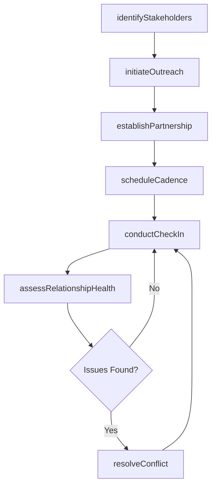
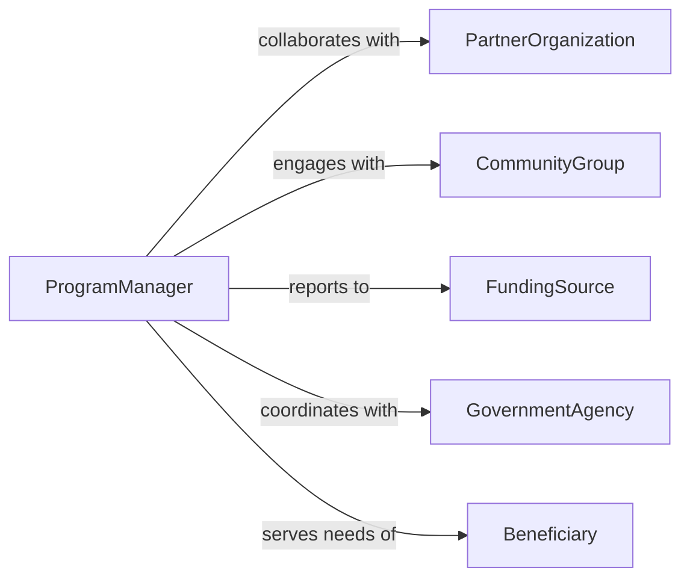

# Develop Working Relationships Others Facilitate

> Business-as-Code definition for developing working relationships with others to facilitate program activities. Models the identification, engagement, and coordination of cross-functional stakeholders needed to deliver programs and initiatives.

## Overview

Developing working relationships with others to facilitate program activities involves building trust and collaborative rapport with internal teams, partner organizations, and community stakeholders whose participation is essential for program success. This definition covers stakeholder identification and mapping, initial outreach and engagement, establishing shared goals and communication cadences, managing ongoing coordination through regular touchpoints, and evaluating relationship effectiveness in supporting program outcomes.

## Actors

| Actor | Description |
|-------|-------------|
| PartnerOrganization | External entity collaborating on joint program delivery |
| CommunityGroup | Local organization or advocacy group whose support is needed for program goals |
| FundingSource | Grant maker or sponsor whose requirements shape program activities |
| GovernmentAgency | Public sector entity providing regulatory guidance or program mandates |
| Beneficiary | Target population or end users served by the program |

## Roles

| Role | Description |
|------|-------------|
| ProgramManager | Leads the overall program and coordinates stakeholder engagement |
| StakeholderLiaison | Maintains day-to-day communication with partner organizations |
| CommunityOutreachCoordinator | Builds relationships with local groups and program beneficiaries |
| ProgramDirector | Sets strategic direction and authorizes partnership agreements |

## Entities

| Entity | Description |
|--------|-------------|
| Stakeholder | An individual or organization with an interest in program outcomes |
| Partnership | A formal or informal agreement to collaborate on program activities |
| CommunicationPlan | A schedule and strategy for regular stakeholder engagement |
| SharedObjective | A mutually agreed-upon goal that guides collaborative work |
| MeetingRecord | Documentation of a coordination meeting including decisions and action items |
| StakeholderMap | A visual representation of relationships and influence among stakeholders |

## Actions

| Action | Description |
|--------|-------------|
| identifyStakeholders | Map individuals and organizations essential to program success |
| initiateOutreach | Make first contact with a potential collaborator or partner |
| establishPartnership | Formalize a collaborative agreement with shared objectives |
| scheduleCadence | Set up recurring coordination meetings or check-in calls |
| conductCheckIn | Hold a regular meeting to review progress and address concerns |
| assessRelationshipHealth | Evaluate the effectiveness and satisfaction of working relationships |
| resolveConflict | Address disagreements or misalignments between collaborating parties |

## Events

| Event | Description |
|-------|-------------|
| stakeholderIdentified | A key individual or organization has been mapped to the program |
| outreachInitiated | First contact has been made with a potential partner |
| partnershipEstablished | A collaborative agreement has been formalized |
| cadenceScheduled | Recurring coordination meetings have been set up |
| checkInConducted | A regular coordination meeting has been completed |
| relationshipHealthAssessed | The effectiveness of a working relationship has been evaluated |
| conflictResolved | A disagreement between collaborating parties has been addressed |

## Searches

| Search | Description |
|--------|-------------|
| findStakeholders | Query stakeholders by program, role, organization, or influence level |
| getPartnerships | Retrieve partnership agreements by program, status, or partner |
| getUpcomingCheckIns | List scheduled coordination meetings within a time window |
| getRelationshipScores | Retrieve health scores for active working relationships |

## Workflow



## Actor Relationships



## Usage

### Calling Actions

```typescript
import { developWorkingRelationshipsOthersFacilitate } from '@headlessly/develop-working-relationships-others-facilitate'

const relationships = developWorkingRelationshipsOthersFacilitate()

// Identify key stakeholders for a new program
const stakeholders = await relationships.identifyStakeholders({
  programId: 'PROG-2026-YOUTH-STEM',
  categories: ['partner-organization', 'community-group', 'school-district'],
  influenceThreshold: 'high'
})

// Establish a partnership
await relationships.establishPartnership({
  programId: 'PROG-2026-YOUTH-STEM',
  partner: 'City Science Museum',
  sharedObjectives: [
    'Provide hands-on STEM workshops for 500 students',
    'Train 20 volunteer mentors by Q3 2026'
  ],
  startDate: '2026-03-01',
  duration: '12-months'
})

// Conduct a check-in meeting
await relationships.conductCheckIn({
  programId: 'PROG-2026-YOUTH-STEM',
  partner: 'City Science Museum',
  date: '2026-04-15',
  topics: ['enrollment-numbers', 'mentor-recruitment', 'facility-scheduling'],
  actionItems: [
    { owner: 'Museum Director', task: 'Confirm lab availability for May sessions' }
  ]
})
```

### Event-Driven Automation

```typescript
// Alert when relationship health declines
relationships.relationshipHealthAssessed(async ({ partnerId, score, programId }) => {
  if (score < 0.6) {
    await notify({
      to: 'program-manager',
      message: `Relationship with ${partnerId} in program ${programId} scored ${score} - attention needed`
    })
  }
})

// Auto-schedule follow-up after conflict resolution
relationships.conflictResolved(async ({ programId, partnerId }) => {
  await relationships.scheduleCadence({
    programId,
    partnerId,
    frequency: 'weekly',
    duration: '30-days',
    reason: 'Post-conflict increased engagement period'
  })
})
```
