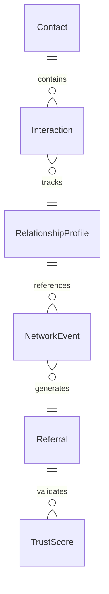
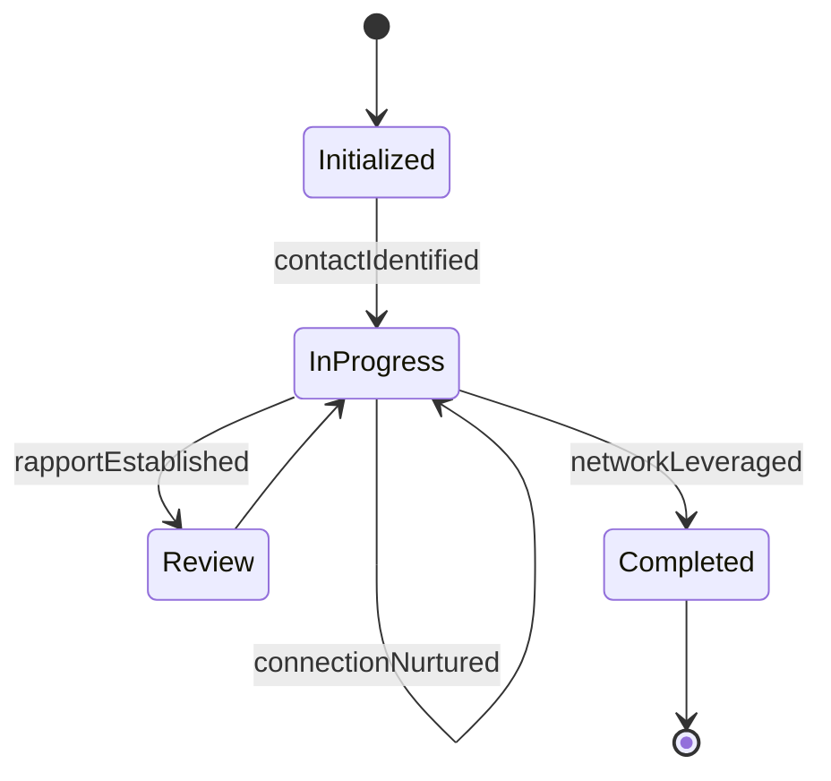
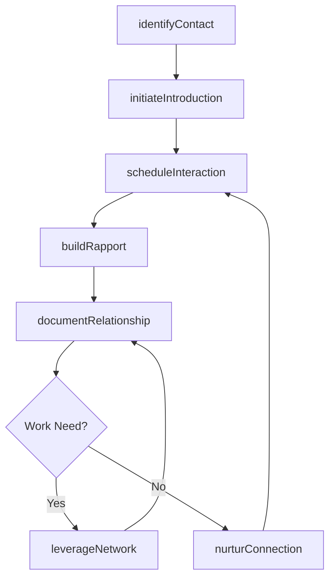
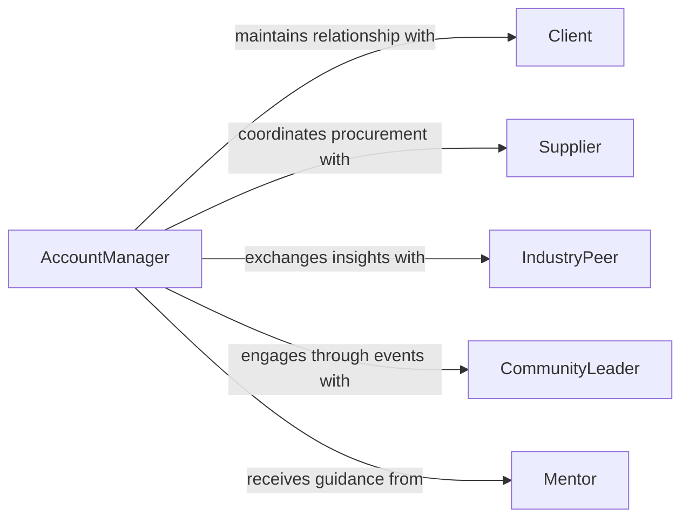

# Establish Interpersonal Business Relationships Facilit

> Business-as-Code definition for establishing interpersonal business relationships to facilitate work activities. Models the process of building professional rapport, trust, and mutual understanding that enables productive collaboration.

## Overview

Establishing interpersonal business relationships to facilitate work activities involves building trust, rapport, and mutual respect with colleagues, clients, and stakeholders to enable smoother collaboration on projects and daily operations. This process encompasses networking, relationship nurturing, and ongoing communication that creates a foundation for effective teamwork. Strong interpersonal relationships reduce friction in handoffs, accelerate conflict resolution, and foster a culture of knowledge sharing across organizational boundaries.

## Actors

| Actor | Description |
|-------|-------------|
| Client | External customer or account contact requiring a working relationship |
| Supplier | Vendor representative engaged in ongoing business transactions |
| IndustryPeer | Professional contact from another organization in the same field |
| CommunityLeader | Influential figure in a professional community or network |
| Mentor | Experienced professional providing guidance and introductions |

## Roles

| Role | Description |
|------|-------------|
| AccountManager | Builds and maintains client-facing relationships |
| NetworkingCoordinator | Organizes events and opportunities for professional connection |
| TeamLead | Fosters interpersonal bonds within and across teams |
| BusinessDevelopmentRep | Cultivates new contacts to expand the organization's network |

## Entities

| Entity | Description |
|--------|-------------|
| Contact | An individual with whom a professional relationship exists |
| Interaction | A recorded meeting, call, or message exchanged between contacts |
| RelationshipProfile | A summary of history, trust level, and engagement with a contact |
| NetworkEvent | A conference, meeting, or social gathering for professional networking |
| Referral | A recommendation or introduction provided by an existing contact |
| TrustScore | A qualitative measure of relationship strength and reliability |

## Actions

| Action | Description |
|--------|-------------|
| identifyContact | Locate individuals who can support or benefit from collaboration |
| initiateIntroduction | Make a first connection through referral, event, or direct outreach |
| scheduleInteraction | Arrange a meeting, call, or informal check-in with a contact |
| buildRapport | Deepen the relationship through shared interests and mutual support |
| documentRelationship | Record interaction history and relationship status |
| nurturConnection | Maintain the relationship with periodic follow-ups and value sharing |
| leverageNetwork | Activate existing relationships to facilitate a specific work activity |

## Events

| Event | Description |
|-------|-------------|
| contactIdentified | A potential professional contact has been discovered |
| introductionMade | A first meeting or exchange has occurred with a new contact |
| interactionScheduled | A follow-up meeting or call has been arranged |
| rapportEstablished | A meaningful level of trust and familiarity has been reached |
| relationshipDocumented | Contact history and profile have been recorded |
| connectionNurtured | An ongoing relationship has been reinforced through follow-up |
| networkLeveraged | An existing relationship has been activated for a work outcome |

## Searches

| Search | Description |
|--------|-------------|
| findContacts | List professional contacts by industry, role, or relationship strength |
| getInteractions | Retrieve interaction history with a specific contact |
| getNetworkEvents | Find upcoming or past networking opportunities |
| getReferrals | Look up referrals made or received through the network |


## Entity Relationships



## State Diagram


## Workflow



## Actor Relationships



## Usage

### Calling Actions

```typescript
import { establishInterpersonalBusinessRelationshipsFacilitate } from '@headlessly/establish-interpersonal-business-relationships-facilitate'

const relationships = establishInterpersonalBusinessRelationshipsFacilitate()

// Identify relevant contacts for an upcoming product launch
const contacts = await relationships.identifyContact({
  industry: 'healthcare-technology',
  roles: ['CTO', 'VP Engineering', 'Product Manager'],
  minimumTrustScore: 0.6
})

// Schedule a relationship-building interaction
await relationships.scheduleInteraction({
  contactId: contacts[0].id,
  type: 'coffee-meeting',
  purpose: 'Discuss integration partnership opportunities',
  date: '2026-03-15'
})

// Leverage existing network for a project need
const referrals = await relationships.leverageNetwork({
  need: 'regulatory-compliance-expertise',
  urgency: 'medium',
  preferredContactTypes: ['IndustryPeer', 'Mentor']
})
```

### Event-Driven Automation

```typescript
// Log and follow up after a new introduction
relationships.introductionMade(async ({ contactId, source, context }) => {
  await relationships.documentRelationship({
    contactId,
    notes: `Introduced via ${source} regarding ${context}`,
    nextAction: 'send-follow-up-email'
  })
})

// Schedule periodic nurturing for established relationships
relationships.rapportEstablished(async ({ contactId }) => {
  await schedule({
    task: 'nurturConnection',
    contactId,
    frequency: 'monthly',
    channel: 'email-or-call'
  })
})
```
