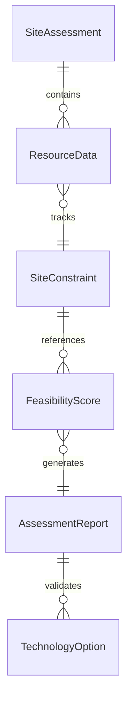
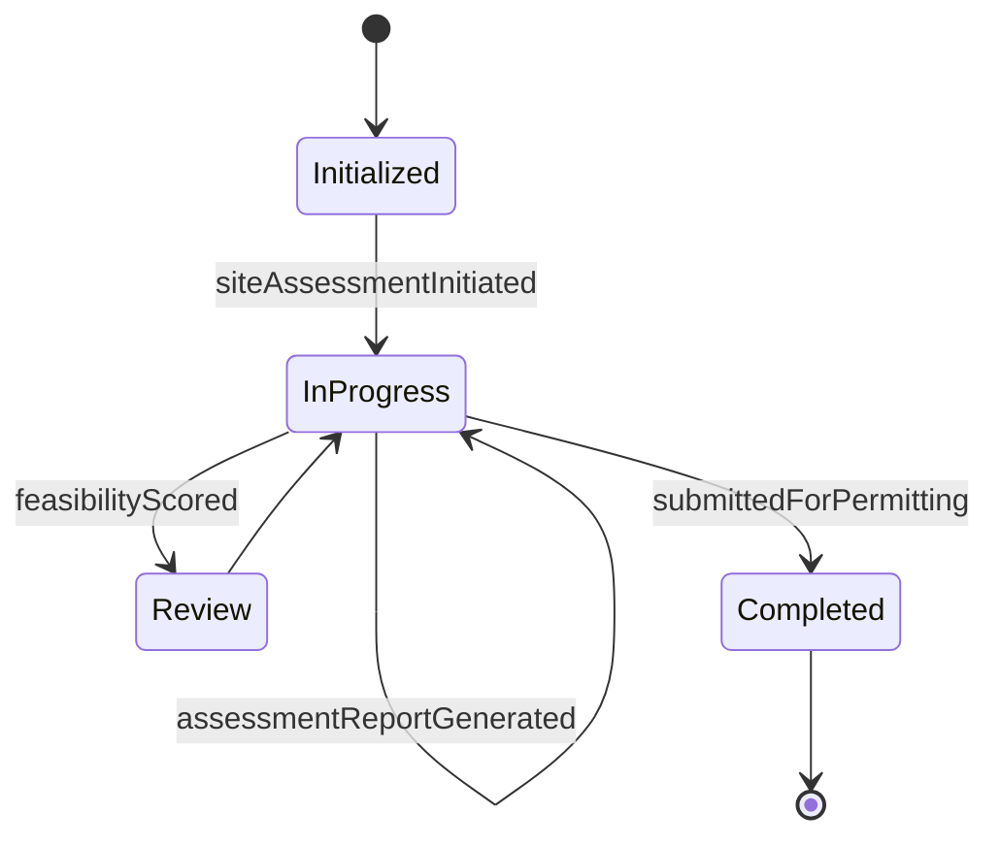
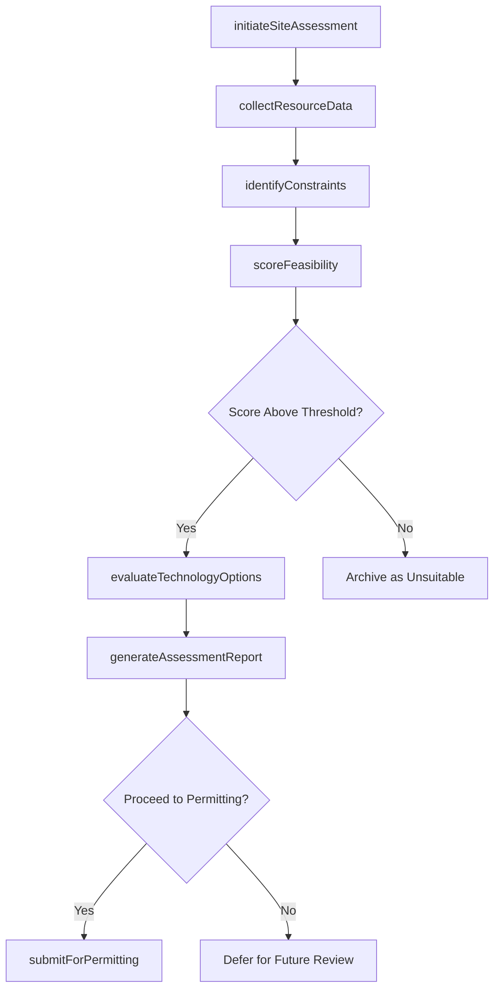
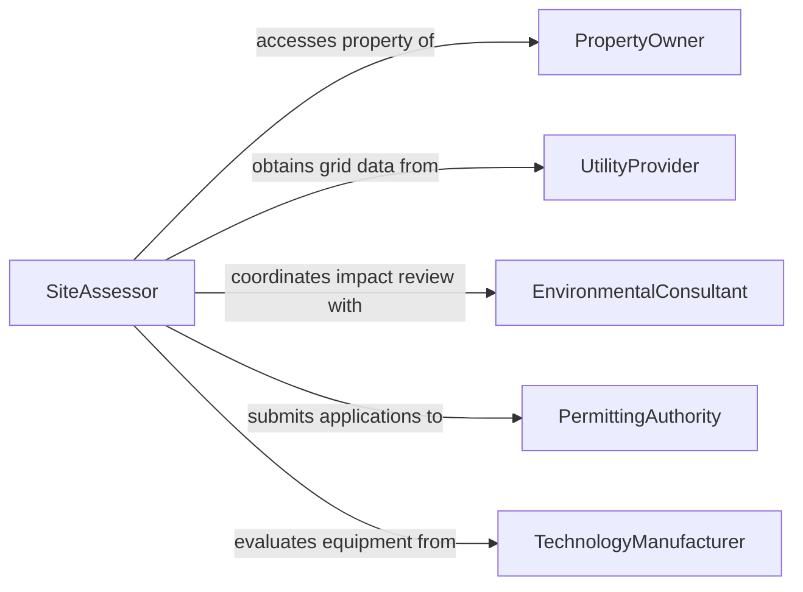

# Assess Locations Potential Green Technology

> Business-as-Code definition for assessing locations for potential green technology installations. Models site feasibility evaluation workflows from resource data collection through suitability scoring and recommendation.

## Overview

Assessing locations for green technology installations involves evaluating sites for solar, wind, geothermal, and other renewable energy or sustainability systems. This definition exposes actions for collecting environmental resource data, analyzing site constraints, scoring feasibility, and producing assessment reports. Events enable integration with permitting systems, energy modeling tools, and project development pipelines.

## Actors

| Actor | Description |
|-------|-------------|
| PropertyOwner | Owns the site under evaluation and authorizes access |
| UtilityProvider | Supplies grid interconnection data and capacity constraints |
| EnvironmentalConsultant | Provides ecological and environmental impact assessments |
| PermittingAuthority | Issues permits and enforces zoning for green technology installations |
| TechnologyManufacturer | Supplies specifications for solar panels, turbines, or other equipment |
| IncentiveProgram | Offers grants, tax credits, or rebates for qualifying installations |

## Roles

| Role | Description |
|------|-------------|
| SiteAssessor | Conducts on-site evaluations and collects resource data |
| RenewableEnergyEngineer | Analyzes resource data and designs system configurations |
| ProjectDeveloper | Evaluates financial viability and advances qualifying sites |
| SustainabilityConsultant | Advises on technology selection and environmental benefits |

## Entities

| Entity | Description |
|--------|-------------|
| SiteAssessment | A comprehensive evaluation of a location for green technology |
| ResourceData | Measured environmental data such as solar irradiance or wind speed |
| SiteConstraint | A physical, regulatory, or environmental limitation on installation |
| FeasibilityScore | A computed rating of overall site suitability for a technology type |
| AssessmentReport | A formal document presenting findings and recommendations |
| TechnologyOption | A specific green technology system considered for the site |

## Actions

| Action | Description |
|--------|-------------|
| initiateSiteAssessment | Begin a new assessment for a candidate location |
| collectResourceData | Gather environmental measurements relevant to the technology type |
| identifyConstraints | Document physical, regulatory, and environmental site limitations |
| scoreFeasibility | Calculate a suitability rating based on resource data and constraints |
| evaluateTechnologyOptions | Compare different green technology systems for the site |
| generateAssessmentReport | Produce a formal report with findings and recommendations |
| submitForPermitting | Forward assessment data to permitting authorities for review |

## Events

| Event | Description |
|-------|-------------|
| siteAssessmentInitiated | A new location assessment has been started |
| resourceDataCollected | Environmental resource measurements have been gathered |
| constraintsIdentified | Site limitations have been documented |
| feasibilityScored | A suitability rating has been calculated for the site |
| technologyOptionsEvaluated | Green technology alternatives have been compared for the site |
| assessmentReportGenerated | A formal assessment report has been produced |
| submittedForPermitting | Assessment data has been forwarded to permitting authorities |

## Searches

| Search | Description |
|--------|-------------|
| findSiteAssessments | Retrieve assessments by location, technology type, score, or status |
| getResourceData | Look up environmental measurements by site, parameter, or date |
| getHighScoringLocations | Find sites with feasibility scores above a specified threshold |
| getConstraintsByType | List site constraints filtered by category or severity |


## Entity Relationships



## State Diagram


## Workflow



## Actor Relationships



## Usage

### Calling Actions

```typescript
import { assessLocationsPotentialGreenTechnology } from '@headlessly/assess-locations-potential-green-technology'

const assessment = assessLocationsPotentialGreenTechnology()

// Initiate a site assessment
const site = await assessment.initiateSiteAssessment({
  locationId: 'LOC-2026-INDUSTRIAL-PARK-07',
  technologyType: 'solar-photovoltaic',
  coordinates: { lat: 34.0522, lng: -118.2437 },
  areaHectares: 2.5
})

// Collect resource data
await assessment.collectResourceData({
  assessmentId: site.id,
  parameters: [
    { type: 'solar-irradiance', value: 5.8, unit: 'kWh/m2/day' },
    { type: 'shading-factor', value: 0.92 },
    { type: 'roof-tilt', value: 15, unit: 'degrees' }
  ]
})

// Score feasibility
const score = await assessment.scoreFeasibility({
  assessmentId: site.id,
  weightings: { resource: 0.4, constraints: 0.3, economics: 0.3 }
})
```

### Event-Driven Automation

```typescript
// Notify developer when high-scoring site is found
assessment.feasibilityScored(async ({ assessmentId, score, technologyType }) => {
  if (score >= 0.8) {
    await notify({
      to: 'project-development',
      message: `Site assessment ${assessmentId} scored ${score} for ${technologyType} - high potential`
    })
  }
})

// Auto-check incentive eligibility after report generation
assessment.assessmentReportGenerated(async ({ assessmentId, technologyType, location }) => {
  await notify({
    to: 'sustainability-team',
    message: `Assessment report ready for ${assessmentId} - review incentive eligibility for ${technologyType} at ${location}`
  })
})
```
