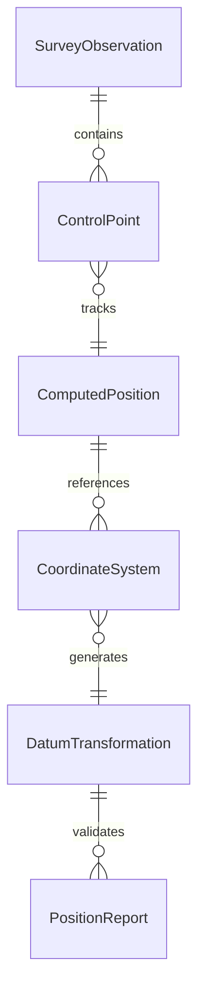
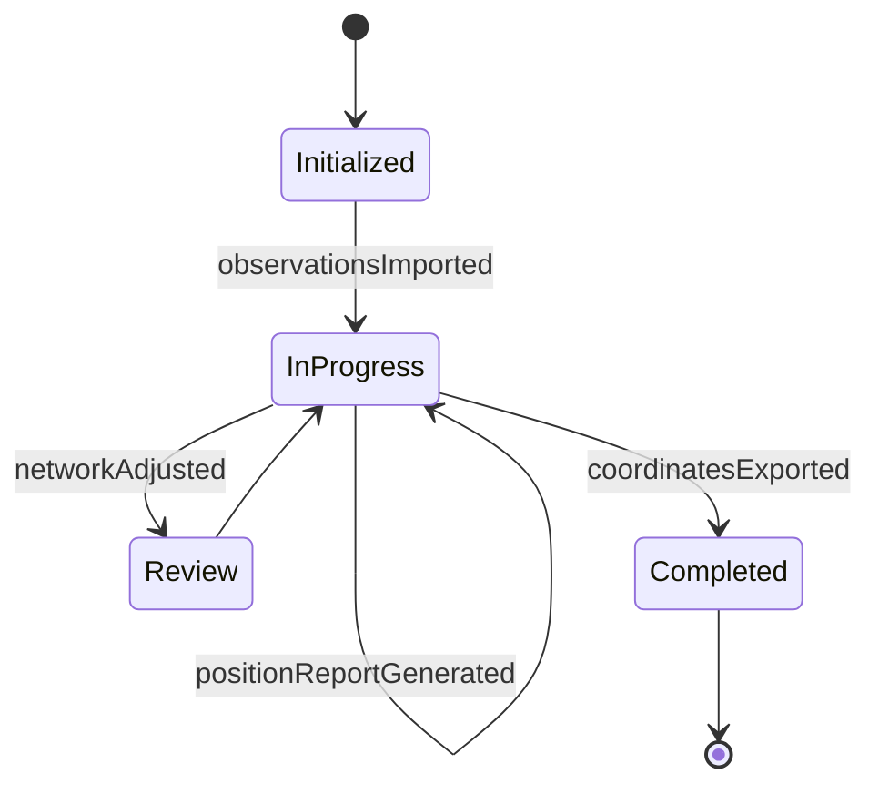
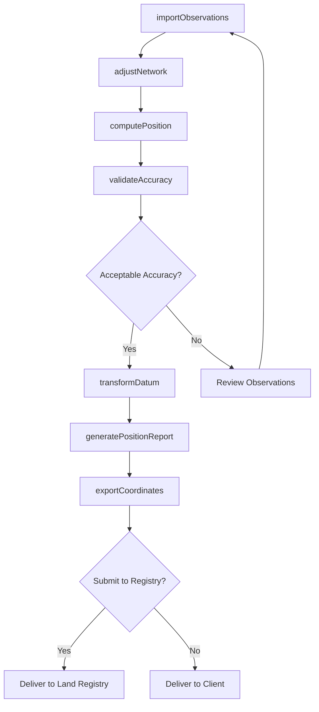
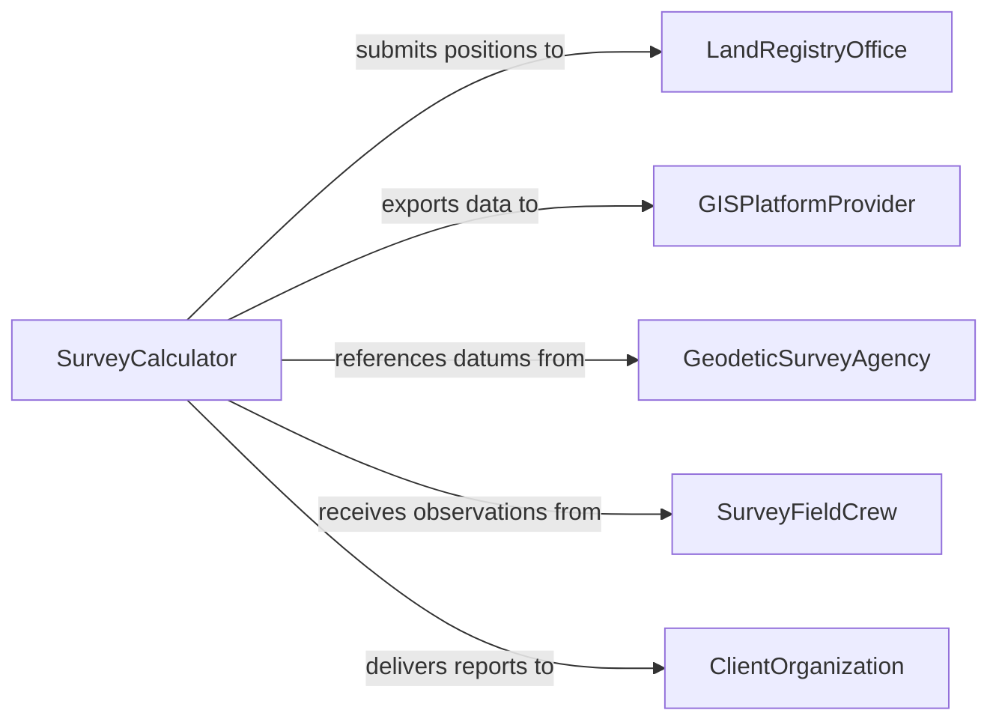

# Calculate Geographic Positions Survey Data

> Business-as-Code definition for calculating geographic positions from survey data. Models geodetic computation workflows from raw field observations through coordinate transformation and positional output.

## Overview

Calculating geographic positions from survey data transforms raw field observations such as angles, distances, and satellite signals into precise latitude, longitude, and elevation coordinates. This definition exposes actions for importing survey observations, performing coordinate computations, applying datum transformations, and generating positional output files. Events support integration with GIS platforms, mapping systems, and land records databases.

## Actors

| Actor | Description |
|-------|-------------|
| LandRegistryOffice | Receives computed positions for property boundary records |
| GISPlatformProvider | Consumes positional data for spatial analysis and mapping |
| GeodeticSurveyAgency | Publishes datum parameters and control point networks |
| SurveyFieldCrew | Collects raw observations in the field for computation |
| ClientOrganization | Commissions survey work and receives computed positions |

## Roles

| Role | Description |
|------|-------------|
| SurveyCalculator | Performs geodetic computations and coordinate transformations |
| LicensedSurveyor | Reviews and certifies computed positions for legal use |
| GISAnalyst | Integrates computed positions into geographic information systems |
| DataProcessor | Cleans and prepares raw survey observations for computation |

## Entities

| Entity | Description |
|--------|-------------|
| SurveyObservation | A raw field measurement such as angle, distance, or GNSS signal |
| ControlPoint | A known geographic position used as a reference for computations |
| ComputedPosition | A calculated latitude, longitude, and elevation from observations |
| CoordinateSystem | A reference frame defining how positions are expressed |
| DatumTransformation | A mathematical conversion between two coordinate systems |
| PositionReport | A formal document presenting computed positions and accuracy |

## Actions

| Action | Description |
|--------|-------------|
| importObservations | Load raw survey field data into the computation system |
| computePosition | Calculate geographic coordinates from survey observations |
| transformDatum | Convert positions between coordinate systems or datums |
| adjustNetwork | Perform a least-squares adjustment on a network of observations |
| validateAccuracy | Check computed positions against known control points |
| generatePositionReport | Produce a formal report of computed positions and uncertainties |
| exportCoordinates | Output computed positions in a specified format for downstream use |

## Events

| Event | Description |
|-------|-------------|
| observationsImported | Raw survey data has been loaded into the computation system |
| positionComputed | A geographic position has been calculated from observations |
| datumTransformed | Positions have been converted to a different coordinate system |
| networkAdjusted | A least-squares adjustment has been completed on observations |
| accuracyValidated | Computed positions have been checked against control points |
| positionReportGenerated | A formal position report has been produced |
| coordinatesExported | Computed positions have been output for downstream systems |

## Searches

| Search | Description |
|--------|-------------|
| findComputedPositions | Retrieve positions by project, area, date, or accuracy class |
| getControlPoints | List control points by network, coordinate system, or proximity |
| getObservations | Retrieve raw survey data by field crew, date, or instrument |
| getPositionReports | Look up position reports by project, surveyor, or date |


## Entity Relationships



## State Diagram


## Workflow



## Actor Relationships



## Usage

### Calling Actions

```typescript
import { calculateGeographicPositionsSurveyData } from '@headlessly/calculate-geographic-positions-survey-data'

const survey = calculateGeographicPositionsSurveyData()

// Import raw field observations
const observations = await survey.importObservations({
  projectId: 'PRJ-BOUNDARY-2026-0088',
  source: 'gnss-receiver',
  format: 'rinex',
  fileUrl: 'https://storage.example.com.ai/obs/session-042.obs'
})

// Compute positions from observations
const positions = await survey.computePosition({
  observationSetId: observations.id,
  method: 'static-gnss',
  baseControlPoint: 'CP-STATE-NAD83-4412'
})

// Transform to local coordinate system
await survey.transformDatum({
  positionIds: positions.map(p => p.id),
  fromDatum: 'NAD83-2011',
  toDatum: 'StatePlane-NY-East'
})
```

### Event-Driven Automation

```typescript
// Alert on accuracy issues
survey.accuracyValidated(async ({ projectId, positionId, residual, threshold }) => {
  if (residual > threshold) {
    await notify({
      to: 'survey-team',
      message: `Position ${positionId} in project ${projectId} has residual ${residual}m, exceeding ${threshold}m threshold`
    })
  }
})

// Auto-export when report is generated
survey.positionReportGenerated(async ({ projectId, reportId }) => {
  await survey.exportCoordinates({
    projectId,
    format: 'geojson',
    destination: 'gis-platform'
  })
})
```
