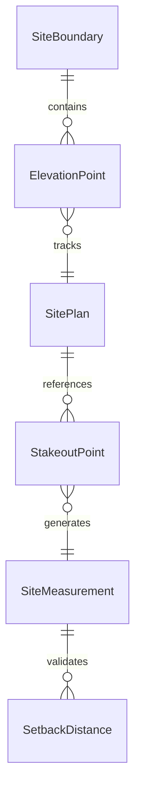
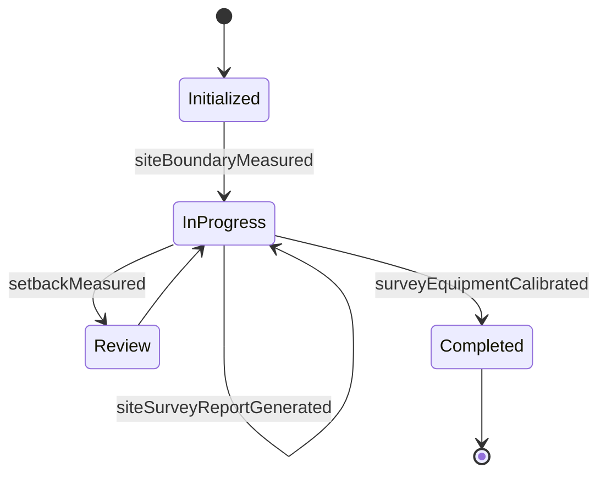
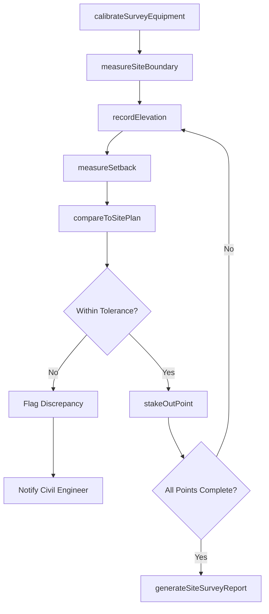
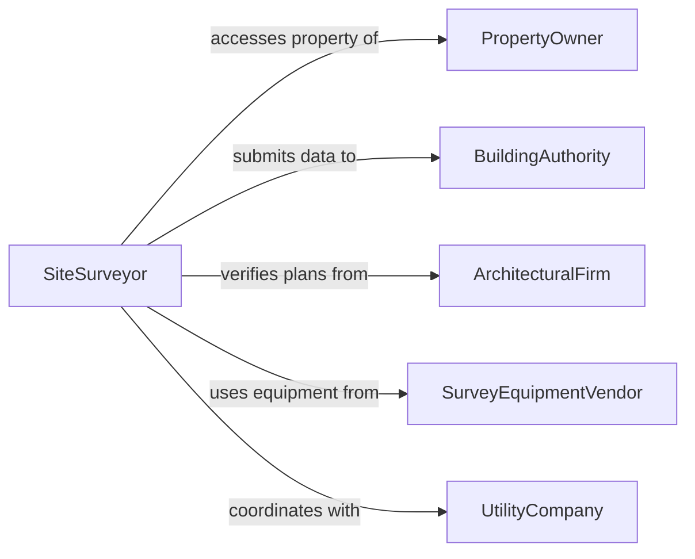

# Measure Work Site Dimensions

> Business-as-Code definition for measuring work site dimensions. Models site surveying and layout measurement workflows from field data collection through plan comparison and documentation.

## Overview

Measuring work site dimensions is essential for construction planning, excavation, installation, and as-built verification. This definition exposes actions for capturing site boundaries, elevations, setbacks, and clearances using surveying and measurement instruments. Events enable automated plan compliance checks and integration with project management and building information modeling systems.

## Actors

| Actor | Description |
|-------|-------------|
| PropertyOwner | Owns the site and authorizes access for measurement activities |
| BuildingAuthority | Requires site dimensions for permit and code compliance |
| ArchitecturalFirm | Produces site plans that define expected dimensions and layouts |
| SurveyEquipmentVendor | Supplies total stations, GPS receivers, and laser measurers |
| UtilityCompany | Provides underground utility locations that constrain site layout |

## Roles

| Role | Description |
|------|-------------|
| SiteSurveyor | Performs on-site dimensional measurements and records data |
| ProjectManager | Coordinates measurement activities with the construction schedule |
| CivilEngineer | Defines measurement requirements and reviews site data |
| LayoutForeman | Uses site dimensions to establish construction reference points |

## Entities

| Entity | Description |
|--------|-------------|
| SiteBoundary | The measured perimeter of the work site |
| ElevationPoint | A recorded height measurement at a specific location on site |
| SitePlan | A reference drawing showing expected site dimensions and features |
| StakeoutPoint | A physical marker placed at a calculated position on site |
| SiteMeasurement | A recorded dimensional value with coordinates and metadata |
| SetbackDistance | The measured distance from a structure to a property line or feature |

## Actions

| Action | Description |
|--------|-------------|
| measureSiteBoundary | Capture the perimeter dimensions of the work site |
| recordElevation | Measure and log the elevation at a specific site point |
| stakeOutPoint | Place a physical marker at a calculated position on the site |
| measureSetback | Capture the distance from a structure to a boundary or feature |
| compareToSitePlan | Check measured site dimensions against the reference plan |
| generateSiteSurveyReport | Produce a comprehensive report of all site measurements |
| calibrateSurveyEquipment | Verify and adjust surveying instruments against known references |

## Events

| Event | Description |
|-------|-------------|
| siteBoundaryMeasured | The perimeter dimensions of the site have been captured |
| elevationRecorded | An elevation measurement has been logged for a site point |
| pointStakedOut | A physical marker has been placed at a calculated position |
| setbackMeasured | A distance from a structure to a boundary has been recorded |
| comparedToSitePlan | Site measurements have been checked against the reference plan |
| siteSurveyReportGenerated | A comprehensive site measurement report has been produced |
| surveyEquipmentCalibrated | Surveying instruments have been verified and adjusted |

## Searches

| Search | Description |
|--------|-------------|
| findSiteMeasurements | Retrieve measurements by site, area, date, or measurement type |
| getElevationData | Look up elevation points by location or coordinate range |
| getSitePlanDeviations | Find measurements that differ from the site plan beyond tolerance |
| getStakeoutPoints | List staked points by site, status, or reference plan |


## Entity Relationships



## State Diagram


## Workflow



## Actor Relationships



## Usage

### Calling Actions

```typescript
import { measureWorkSiteDimensions } from '@headlessly/measure-work-site-dimensions'

const site = measureWorkSiteDimensions()

// Measure site boundary
const boundary = await site.measureSiteBoundary({
  siteId: 'SITE-2026-MAPLE-AVE',
  points: [
    { lat: 40.7128, lng: -74.0060 },
    { lat: 40.7130, lng: -74.0060 },
    { lat: 40.7130, lng: -74.0058 },
    { lat: 40.7128, lng: -74.0058 }
  ],
  instrumentId: 'total-station-05'
})

// Record elevation at a corner
await site.recordElevation({
  siteId: 'SITE-2026-MAPLE-AVE',
  pointId: 'NE-CORNER',
  elevation: 12.45,
  unit: 'm',
  datum: 'NAVD88'
})

// Compare to site plan
await site.compareToSitePlan({
  siteId: 'SITE-2026-MAPLE-AVE',
  sitePlanId: 'SP-MAPLE-REV-B',
  tolerance: 0.03,
  unit: 'm'
})
```

### Event-Driven Automation

```typescript
// Alert on site plan deviations
site.comparedToSitePlan(async ({ siteId, deviations }) => {
  const significant = deviations.filter(d => Math.abs(d.difference) > d.tolerance)
  if (significant.length > 0) {
    await notify({
      to: 'civil-engineering',
      message: `Site ${siteId}: ${significant.length} measurements exceed plan tolerance`
    })
  }
})

// Auto-generate survey report when all points are measured
site.pointStakedOut(async ({ siteId }) => {
  const points = await site.getStakeoutPoints({ siteId, status: 'pending' })
  if (points.length === 0) {
    await site.generateSiteSurveyReport({ siteId })
  }
})
```
