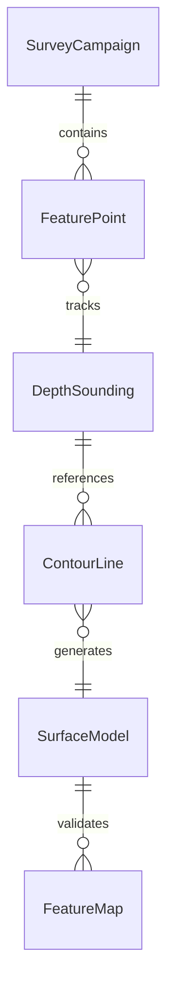
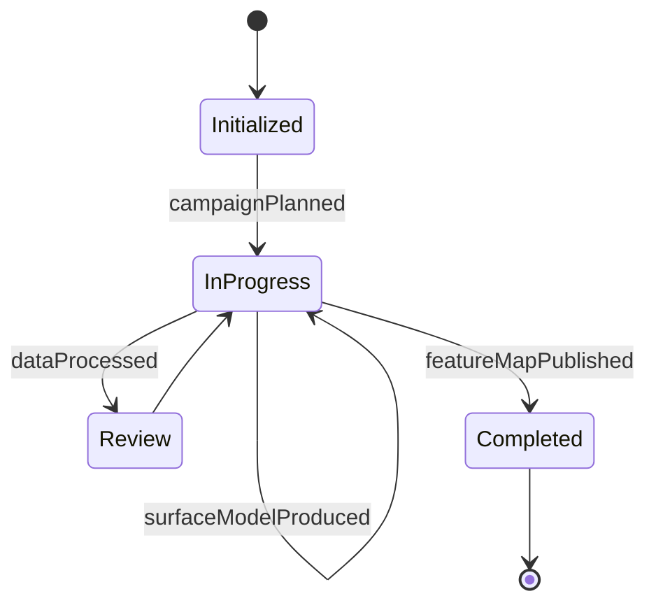
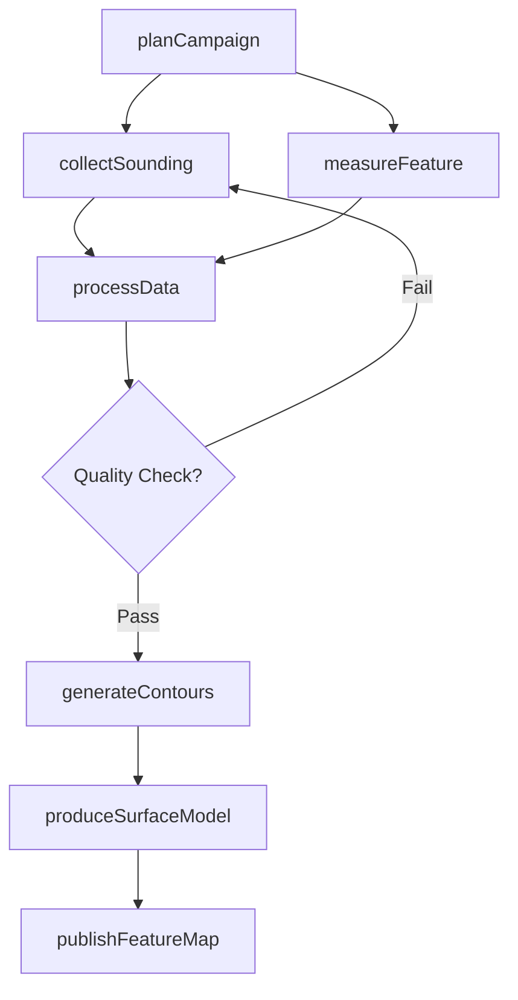
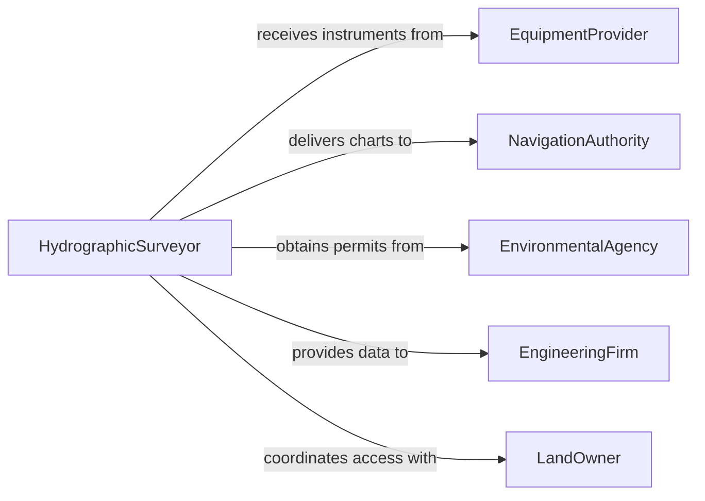

# Survey Land Bodies Water Measure

> Business-as-Code definition for surveying land and bodies of water to measure or determine physical features. Models hydrographic and topographic survey workflows from planning through data collection and feature mapping.

## Overview

Surveying land and bodies of water involves measuring and mapping physical features such as terrain contours, water depths, shorelines, and submerged structures. This definition exposes actions for planning survey campaigns, collecting bathymetric and topographic data, processing measurements, and producing feature maps. It supports both terrestrial and hydrographic survey operations with events for automated quality checks and searches for retrieving geospatial datasets.

## Actors

| Actor | Description |
|-------|-------------|
| LandOwner | Requests surveys for property or waterfront features |
| NavigationAuthority | Requires charting data for safe waterway passage |
| EnvironmentalAgency | Regulates surveys in protected waterways and wetlands |
| EngineeringFirm | Commissions surveys for design and construction projects |
| EquipmentProvider | Supplies sonar, GPS, and total station instruments |

## Roles

| Role | Description |
|------|-------------|
| HydrographicSurveyor | Plans and executes water body survey campaigns |
| FieldSurveyor | Conducts terrestrial measurements of land features |
| DataProcessor | Processes raw survey data into geospatial models |
| CartographicSpecialist | Produces maps, charts, and digital surface models |

## Entities

| Entity | Description |
|--------|-------------|
| SurveyCampaign | A planned set of survey activities for a defined area |
| FeaturePoint | A georeferenced point representing a physical feature |
| DepthSounding | A bathymetric measurement of water depth at a location |
| ContourLine | A line connecting points of equal elevation or depth |
| SurfaceModel | A digital representation of terrain or seabed topography |
| FeatureMap | A cartographic output showing measured features |

## Actions

| Action | Description |
|--------|-------------|
| planCampaign | Define the survey area, methodology, and equipment requirements |
| collectSounding | Record a depth measurement at a specified location |
| measureFeature | Capture the position and attributes of a physical feature |
| processData | Transform raw observations into corrected geospatial coordinates |
| generateContours | Create contour lines from processed elevation or depth data |
| produceSurfaceModel | Build a digital terrain or bathymetric surface model |
| publishFeatureMap | Finalize and distribute the survey map or chart |

## Events

| Event | Description |
|-------|-------------|
| campaignPlanned | A survey campaign has been defined and scheduled |
| soundingCollected | A depth measurement has been recorded |
| featureMeasured | A physical feature observation has been captured |
| dataProcessed | Raw survey data has been corrected and georeferenced |
| contoursGenerated | Contour lines have been computed from processed data |
| surfaceModelProduced | A digital surface model has been created |
| featureMapPublished | The final survey map has been distributed |

## Searches

| Search | Description |
|--------|-------------|
| findCampaigns | List survey campaigns by area, date, or status |
| getSoundings | Retrieve depth measurements for a survey area |
| getFeaturePoints | Look up measured features by type, area, or campaign |
| getSurfaceModels | Find digital surface models by region or date |


## Entity Relationships



## State Diagram


## Workflow



## Actor Relationships



## Usage

### Calling Actions

```typescript
import { surveyLandBodiesWaterMeasure } from '@headlessly/survey-land-bodies-water-measure'

const surveys = surveyLandBodiesWaterMeasure()

// Plan a hydrographic survey campaign
const campaign = await surveys.planCampaign({
  name: 'Harbor Basin Bathymetry',
  area: { type: 'Polygon', coordinates: [[-122.4, 37.8], [-122.3, 37.8], [-122.3, 37.7], [-122.4, 37.7]] },
  methodology: 'multibeam',
  startDate: '2026-03-15'
})

// Collect depth soundings
await surveys.collectSounding({
  campaignId: campaign.id,
  position: { lat: 37.75, lng: -122.35 },
  depth: 12.4,
  unit: 'meters',
  tideCorrected: true
})

// Generate the final surface model
const model = await surveys.produceSurfaceModel({
  campaignId: campaign.id,
  resolution: 1.0,
  format: 'GeoTIFF'
})
```

### Event-Driven Automation

```typescript
// Trigger quality check after data processing
surveys.dataProcessed(async ({ campaignId, pointCount, errorRate }) => {
  if (errorRate > 0.02) {
    await notify({
      to: 'survey-lead',
      message: `Campaign ${campaignId} has ${errorRate * 100}% error rate - review required`
    })
  }
})

// Auto-publish when surface model is ready
surveys.surfaceModelProduced(async ({ campaignId, modelId }) => {
  await surveys.publishFeatureMap({
    campaignId,
    sourceModel: modelId,
    format: 'nautical-chart'
  })
})
```
