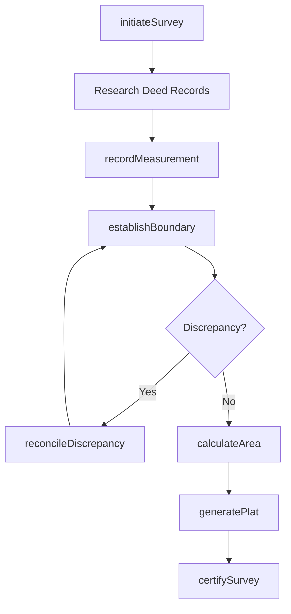
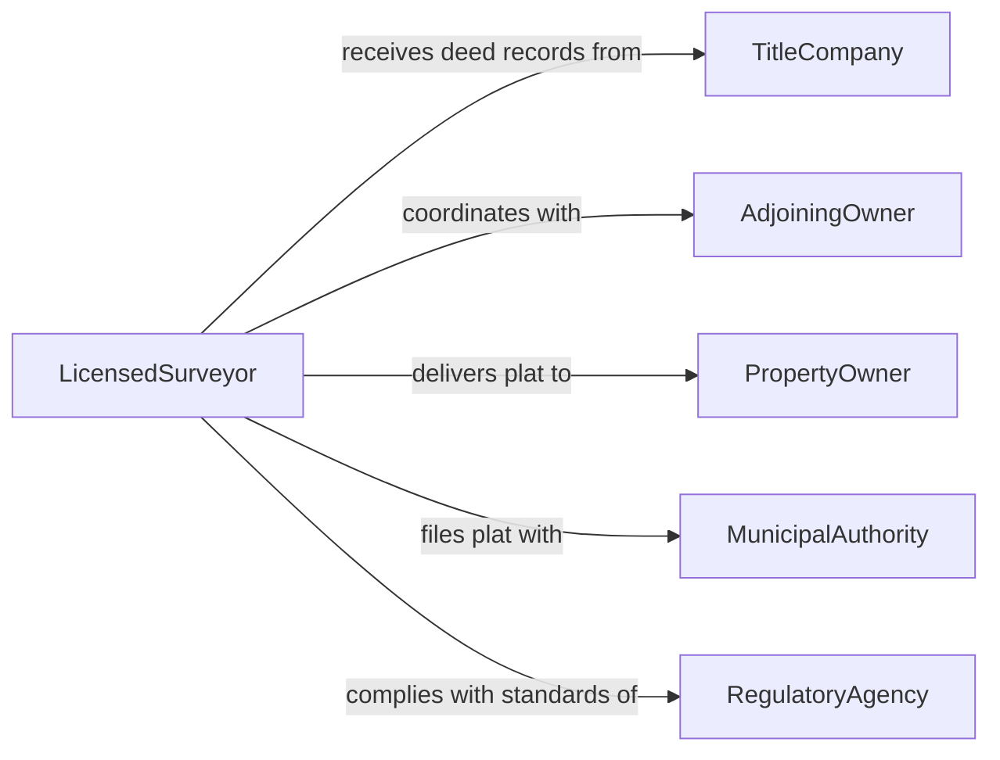

# Survey Land Properties

> Business-as-Code definition for surveying land and properties. Models the complete land survey lifecycle from project initiation through boundary determination, measurement, and deliverable generation.

## Overview

Land and property surveying involves establishing or re-establishing boundary lines, measuring topographic features, and documenting legal descriptions of real property. This definition exposes actions for initiating surveys, recording measurements, calculating areas, and producing plats and legal descriptions. It supports boundary, topographic, and construction survey workflows with events for automation and searches for retrieval of historical survey data.

## Actors

| Actor | Description |
|-------|-------------|
| PropertyOwner | Requests the survey and provides deed or title information |
| AdjoiningOwner | Neighboring property owner whose boundaries may be affected |
| TitleCompany | Provides title documents and chain-of-title research |
| MunicipalAuthority | Maintains official plat records and zoning information |
| RegulatoryAgency | Enforces surveying standards and licensing requirements |

## Roles

| Role | Description |
|------|-------------|
| LicensedSurveyor | Directs fieldwork and certifies survey deliverables |
| SurveyTechnician | Operates instruments and records field measurements |
| DraftingSpecialist | Produces plats, maps, and CAD drawings from field data |
| ProjectCoordinator | Manages scheduling, client communication, and deadlines |

## Entities

| Entity | Description |
|--------|-------------|
| SurveyProject | A defined scope of survey work for a parcel or set of parcels |
| Parcel | A legally described unit of land |
| BoundaryPoint | A georeferenced coordinate marking a property corner or line |
| Measurement | A recorded distance, angle, or elevation observation |
| Plat | A scaled drawing depicting property boundaries and features |
| LegalDescription | A written description that uniquely identifies a parcel |

## Actions

| Action | Description |
|--------|-------------|
| initiateSurvey | Create a new survey project with scope and parcel details |
| recordMeasurement | Capture a field observation such as distance, angle, or elevation |
| establishBoundary | Determine and set a property boundary point |
| calculateArea | Compute the area of a parcel from boundary coordinates |
| generatePlat | Produce a scaled drawing of the surveyed property |
| certifySurvey | Sign and seal the survey deliverables for legal use |
| reconcileDiscrepancy | Resolve conflicts between deed descriptions and field evidence |

## Events

| Event | Description |
|-------|-------------|
| surveyInitiated | A new survey project has been created |
| measurementRecorded | A field observation has been captured |
| boundaryEstablished | A property corner or line has been determined |
| areaCalculated | Parcel area computation is complete |
| platGenerated | A survey plat drawing has been produced |
| surveyCertified | The licensed surveyor has signed and sealed deliverables |
| discrepancyReconciled | A conflict between records and field evidence has been resolved |

## Searches

| Search | Description |
|--------|-------------|
| findSurveyProjects | List survey projects by client, parcel, or status |
| getMeasurements | Retrieve field observations for a survey project |
| getBoundaryPoints | Look up established boundary coordinates for a parcel |
| getPlats | Find plats by parcel identifier, date, or surveyor |

## Workflow



## Actor Relationships



## Usage

### Calling Actions

```typescript
import { surveyLandProperties } from '@headlessly/survey-land-properties'

const surveys = surveyLandProperties()

// Initiate a boundary survey
const project = await surveys.initiateSurvey({
  client: 'owner-456',
  parcelId: 'APN-12345',
  type: 'boundary',
  deedReference: 'Book 201, Page 45'
})

// Record field measurements
await surveys.recordMeasurement({
  projectId: project.id,
  type: 'distance',
  from: 'MON-A',
  to: 'MON-B',
  value: 150.32,
  unit: 'feet'
})

// Generate the final plat
const plat = await surveys.generatePlat({
  projectId: project.id,
  scale: '1:200',
  format: 'pdf'
})
```

### Event-Driven Automation

```typescript
// Notify client when survey is certified
surveys.surveyCertified(async ({ projectId, parcelId, certifiedBy }) => {
  await notify({
    to: 'property-owner',
    message: `Survey for parcel ${parcelId} has been certified by ${certifiedBy}`
  })
})

// Flag discrepancies for review
surveys.measurementRecorded(async ({ projectId, type, value }) => {
  const existing = await surveys.getBoundaryPoints({ projectId })
  if (existing.length > 0 && detectsOverlap(existing, value)) {
    await surveys.reconcileDiscrepancy({ projectId, type, observedValue: value })
  }
})
```
