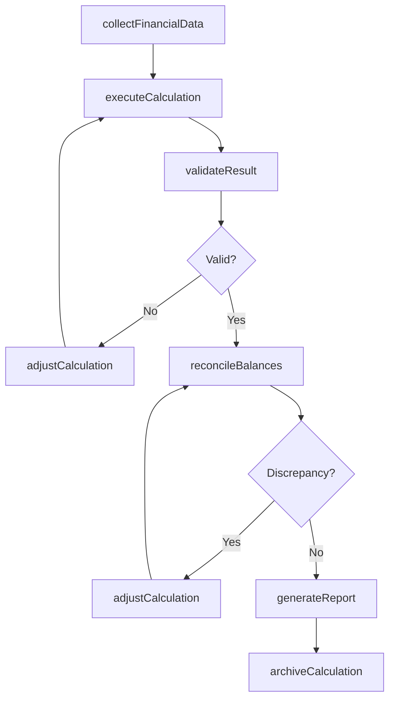
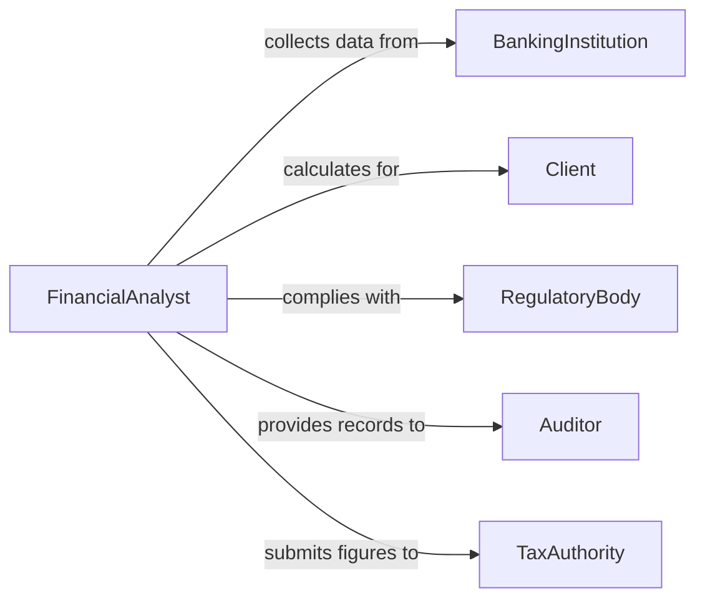

# Calculate Financial Data

> Business-as-Code definition for calculating financial data. Models the complete financial computation lifecycle from data collection through calculation, validation, and reporting.

## Overview

Calculating financial data involves performing arithmetic and analytical computations on monetary figures such as revenues, expenses, margins, interest, and balances. This definition exposes actions for initiating and executing financial calculations, events for tracking computation outcomes, and searches for retrieving calculated results and historical data.

## Actors

| Actor | Description |
|-------|-------------|
| Client | Individual or organization whose financial data is being calculated |
| BankingInstitution | Provides account balances, interest rates, and transaction data |
| RegulatoryBody | Sets financial reporting standards and compliance requirements |
| Auditor | Reviews calculation accuracy and methodology for compliance |
| TaxAuthority | Requires specific financial calculations for tax filings |

## Roles

| Role | Description |
|------|-------------|
| FinancialAnalyst | Performs and validates financial calculations |
| Accountant | Prepares and reconciles financial figures for reporting |
| Controller | Oversees calculation accuracy and financial controls |
| DataEntrySpecialist | Inputs raw financial data into calculation systems |

## Entities

| Entity | Description |
|--------|-------------|
| FinancialRecord | A structured set of monetary data for a specific period or entity |
| Calculation | A defined computation applied to financial inputs producing a result |
| Ledger | The authoritative record of all financial transactions and balances |
| Report | A formatted output presenting calculated financial results |
| Adjustment | A correction or modification applied to a prior calculation |
| Formula | A reusable mathematical expression for deriving financial metrics |

## Actions

| Action | Description |
|--------|-------------|
| collectFinancialData | Gather raw financial inputs from source systems and documents |
| executeCalculation | Run a defined computation against financial data inputs |
| validateResult | Verify that calculated outputs fall within expected ranges and rules |
| adjustCalculation | Apply corrections to a previously computed financial result |
| generateReport | Produce a formatted summary of calculated financial data |
| reconcileBalances | Compare and resolve discrepancies between independent data sources |
| archiveCalculation | Store completed calculations with full audit trail |

## Events

| Event | Description |
|-------|-------------|
| financialDataCollected | Raw financial inputs have been gathered and staged for calculation |
| calculationExecuted | A financial computation has been completed |
| resultValidated | Calculated output has been verified for accuracy |
| calculationAdjusted | A prior calculation has been corrected or modified |
| reportGenerated | A financial report has been produced from calculated data |
| discrepancyDetected | A mismatch has been found during balance reconciliation |
| calculationArchived | A completed calculation has been stored with audit trail |

## Searches

| Search | Description |
|--------|-------------|
| findCalculations | List calculations by type, date, status, or entity |
| getFinancialSummary | Retrieve aggregated financial totals for a period or category |
| getReconciliationStatus | Check the state of balance reconciliation across accounts |
| findDiscrepancies | Identify unresolved mismatches in financial data |

## Workflow



## Actor Relationships



## Usage

### Calling Actions

```typescript
import { calculateFinancialData } from '@headlessly/calculate-financial-data'

const finance = calculateFinancialData()

// Collect and calculate quarterly revenue
const data = await finance.collectFinancialData({
  source: 'general-ledger',
  period: { start: '2026-01-01', end: '2026-03-31' },
  categories: ['revenue', 'expenses', 'cogs']
})

const result = await finance.executeCalculation({
  dataId: data.id,
  formula: 'grossProfit',
  inputs: { revenue: data.revenue, cogs: data.cogs }
})

// Validate and generate report
await finance.validateResult({ calculationId: result.id })
await finance.generateReport({
  calculationIds: [result.id],
  format: 'quarterly-summary',
  period: 'Q1-2026'
})
```

### Event-Driven Automation

```typescript
// Alert on discrepancies during reconciliation
finance.discrepancyDetected(async ({ accountId, amount, source }) => {
  await notify({
    to: 'accounting-team',
    message: `Discrepancy of ${amount} detected in account ${accountId} from ${source}`
  })
})

// Auto-archive validated calculations
finance.resultValidated(async ({ calculationId }) => {
  await finance.archiveCalculation({ calculationId, retentionYears: 7 })
})
```
