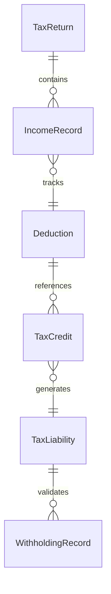
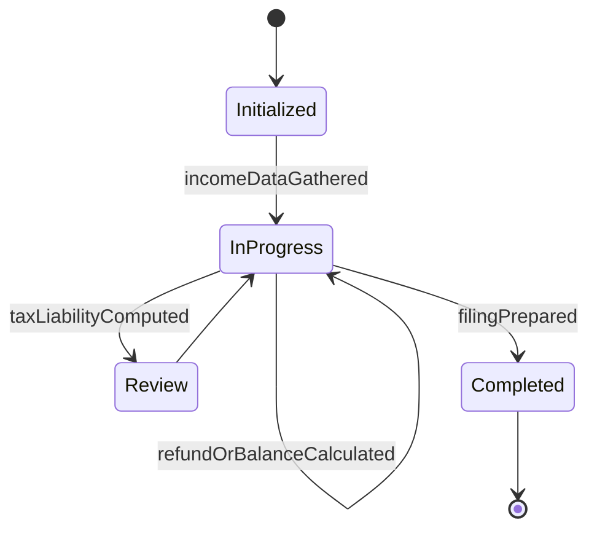
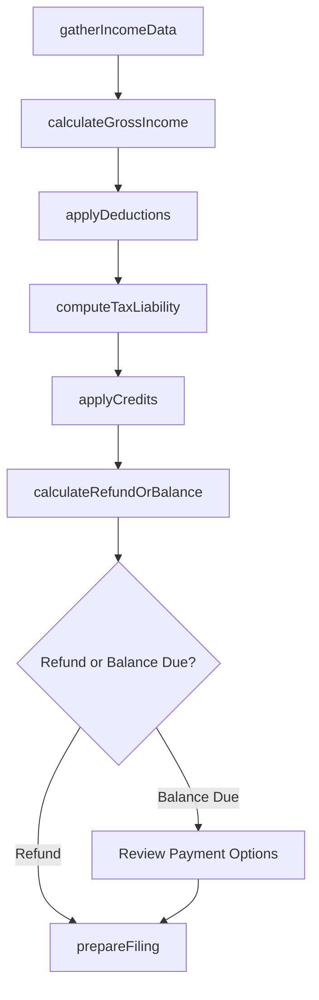
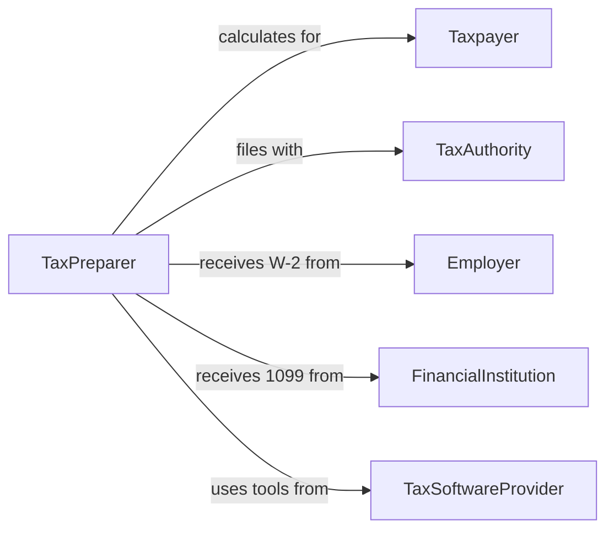

# Calculate Tax Information

> Business-as-Code definition for calculating tax information. Models the complete tax computation lifecycle from income gathering through deduction analysis, liability calculation, and filing preparation.

## Overview

Calculating tax information involves determining taxable income, applying deductions and credits, computing tax liability, and preparing figures for filing with tax authorities. This definition exposes actions for each phase of tax calculation, events for tracking computation milestones, and searches for retrieving tax data and historical filings.

## Actors

| Actor | Description |
|-------|-------------|
| Taxpayer | Individual or entity whose tax information is being calculated |
| TaxAuthority | Government agency that administers tax collection and enforcement |
| Employer | Provides income statements and withholding data for employees |
| FinancialInstitution | Reports interest, dividends, and investment income to the taxpayer |
| TaxSoftwareProvider | Supplies tools and rate tables for automated tax calculations |

## Roles

| Role | Description |
|------|-------------|
| TaxPreparer | Gathers financial data and computes tax liability for taxpayers |
| TaxAdvisor | Provides strategic guidance on deductions, credits, and planning |
| Reviewer | Verifies calculation accuracy before filing submission |
| PayrollSpecialist | Computes withholding amounts and employer tax obligations |

## Entities

| Entity | Description |
|--------|-------------|
| TaxReturn | The complete set of forms and schedules for a filing period |
| IncomeRecord | Documentation of earnings from wages, investments, or other sources |
| Deduction | An allowable expense that reduces taxable income |
| TaxCredit | A direct reduction of tax liability based on qualifying criteria |
| TaxLiability | The total amount of tax owed for a given period |
| WithholdingRecord | Taxes already paid through payroll or estimated payments |

## Actions

| Action | Description |
|--------|-------------|
| gatherIncomeData | Collect all income sources and amounts for the tax period |
| calculateGrossIncome | Sum all income sources to determine total gross income |
| applyDeductions | Subtract qualifying deductions from gross income |
| computeTaxLiability | Apply tax rates and brackets to determine the amount owed |
| applyCredits | Reduce tax liability by applying qualifying tax credits |
| calculateRefundOrBalance | Determine if the taxpayer owes additional tax or is due a refund |
| prepareFiling | Assemble calculated figures into the required filing format |

## Events

| Event | Description |
|-------|-------------|
| incomeDataGathered | All income sources have been collected for the tax period |
| grossIncomeCalculated | Total gross income has been determined |
| deductionsApplied | Qualifying deductions have been subtracted from gross income |
| taxLiabilityComputed | Tax owed has been calculated based on applicable rates |
| creditsApplied | Tax credits have been applied to reduce liability |
| refundOrBalanceCalculated | Net tax position has been determined as refund or balance due |
| filingPrepared | Tax figures have been assembled into the required filing format |

## Searches

| Search | Description |
|--------|-------------|
| findTaxReturns | List tax returns by taxpayer, year, or filing status |
| getDeductionSummary | Retrieve itemized deductions and totals for a tax period |
| getTaxLiabilityHistory | Get historical tax liability amounts across filing periods |
| findApplicableCredits | Identify tax credits the taxpayer may qualify for |


## Entity Relationships



## State Diagram


## Workflow



## Actor Relationships



## Usage

### Calling Actions

```typescript
import { calculateTaxInformation } from '@headlessly/calculate-tax-information'

const tax = calculateTaxInformation()

// Gather income and calculate gross income
const income = await tax.gatherIncomeData({
  taxpayerId: 'taxpayer-1120',
  taxYear: 2025,
  sources: ['wages', 'interest', 'dividends', 'capital-gains']
})

const gross = await tax.calculateGrossIncome({ incomeDataId: income.id })

// Apply deductions and compute liability
await tax.applyDeductions({
  taxpayerId: 'taxpayer-1120',
  method: 'itemized',
  deductions: [
    { type: 'mortgage-interest', amount: 12500 },
    { type: 'state-local-taxes', amount: 10000 },
    { type: 'charitable-contributions', amount: 3200 }
  ]
})

const liability = await tax.computeTaxLiability({
  taxpayerId: 'taxpayer-1120',
  taxYear: 2025,
  filingStatus: 'married-filing-jointly'
})
```

### Event-Driven Automation

```typescript
// Notify taxpayer when calculation is complete
tax.refundOrBalanceCalculated(async ({ taxpayerId, amount, type }) => {
  const message = type === 'refund'
    ? `You are due a refund of $${amount}`
    : `You owe a balance of $${amount}`
  await notify({ to: taxpayerId, message })
})

// Auto-flag returns with unusual deductions for review
tax.deductionsApplied(async ({ taxpayerId, totalDeductions, taxYear }) => {
  const history = await tax.getTaxLiabilityHistory({ taxpayerId })
  const avgDeductions = history.averageDeductions
  if (totalDeductions > avgDeductions * 1.5) {
    await flagForReview({ taxpayerId, taxYear, reason: 'Deductions significantly above average' })
  }
})
```
