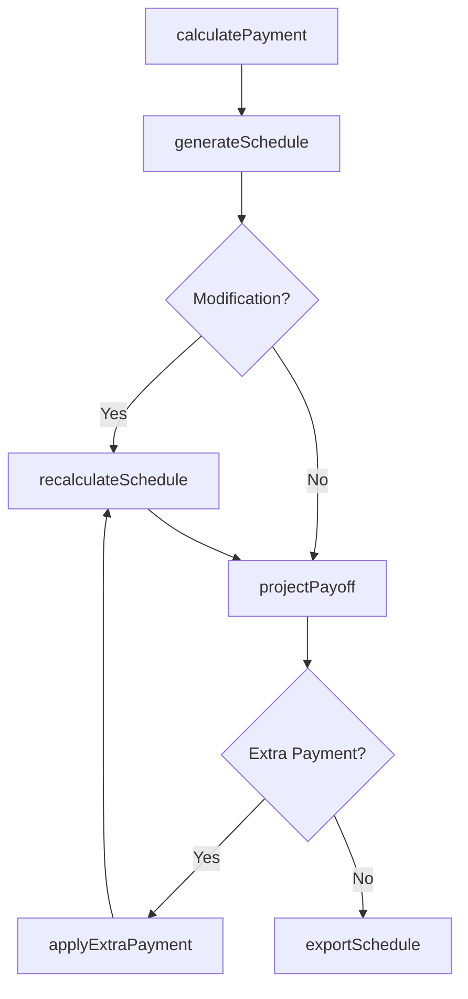
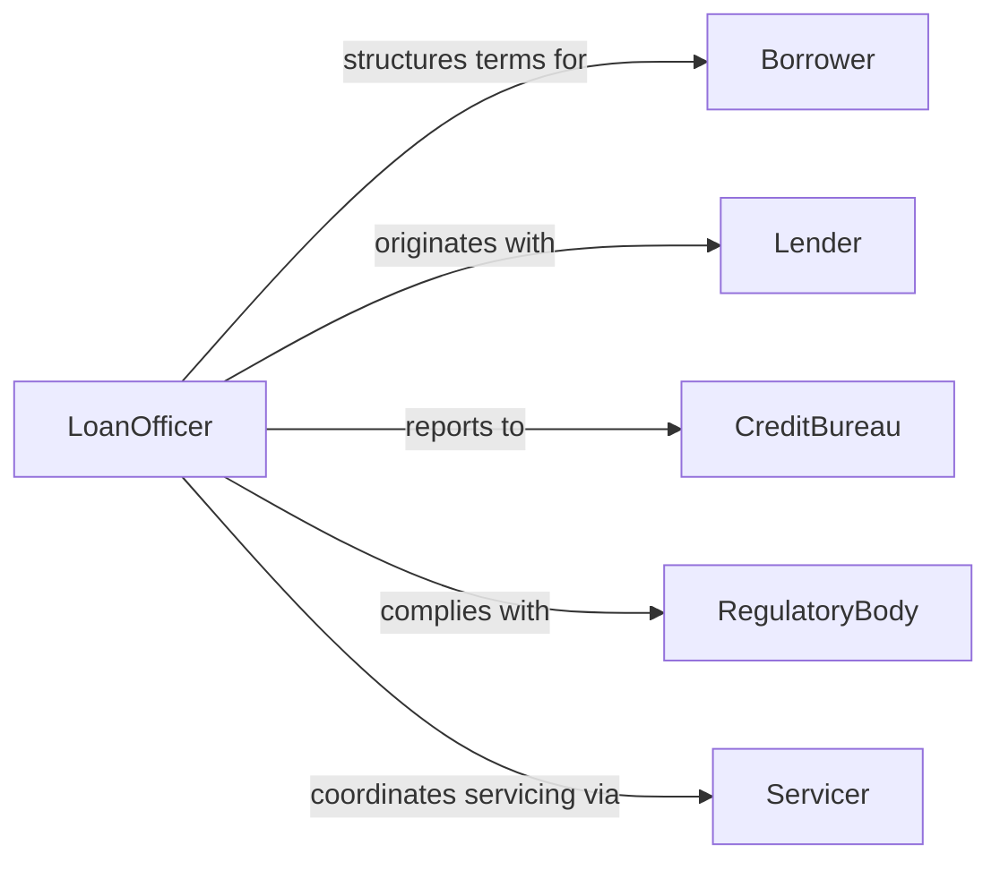

# Compute Debt Repayment Schedules

> Business-as-Code definition for computing debt repayment schedules. Models the complete amortization lifecycle from loan origination through payment scheduling, interest calculation, and payoff projection.

## Overview

Computing debt repayment schedules involves generating amortization tables that break down periodic payments into principal and interest components across the life of a loan or credit obligation. This definition exposes actions for creating and modifying repayment schedules, events for tracking payment milestones, and searches for retrieving schedule details and outstanding balance data.

## Actors

| Actor | Description |
|-------|-------------|
| Borrower | Individual or organization obligated to repay the debt |
| Lender | Financial institution or creditor providing the loan |
| CreditBureau | Agency that tracks borrower repayment history and creditworthiness |
| RegulatoryBody | Enforces lending disclosure and repayment calculation standards |
| Servicer | Third-party entity managing payment collection on behalf of the lender |

## Roles

| Role | Description |
|------|-------------|
| LoanOfficer | Structures loan terms and initiates repayment schedule creation |
| FinancialAnalyst | Computes amortization tables and models repayment scenarios |
| CollectionsSpecialist | Manages delinquent accounts and recalculates modified schedules |
| ComplianceReviewer | Verifies repayment calculations meet truth-in-lending requirements |

## Entities

| Entity | Description |
|--------|-------------|
| Loan | A debt obligation with principal, interest rate, and term |
| AmortizationSchedule | A table of periodic payments broken into principal and interest |
| Payment | A single scheduled or actual payment against the loan balance |
| InterestRate | The rate applied to compute interest on the outstanding balance |
| PayoffProjection | A forecast of the date and amount needed to fully retire the debt |
| Modification | An adjustment to loan terms that triggers schedule recalculation |

## Actions

| Action | Description |
|--------|-------------|
| generateSchedule | Create an amortization table for a loan based on its terms |
| calculatePayment | Compute the periodic payment amount for a given loan structure |
| applyExtraPayment | Model the impact of an additional principal payment on the schedule |
| recalculateSchedule | Regenerate the schedule after a rate change or loan modification |
| projectPayoff | Forecast the payoff date and total interest under current terms |
| compareScenarios | Evaluate multiple repayment strategies side by side |
| exportSchedule | Output the amortization table in a specified format for disclosure |

## Events

| Event | Description |
|-------|-------------|
| scheduleGenerated | An amortization schedule has been created for a loan |
| paymentCalculated | A periodic payment amount has been computed |
| extraPaymentApplied | An additional principal payment has been modeled |
| scheduleRecalculated | The repayment schedule has been regenerated after a modification |
| payoffProjected | A payoff date and total interest forecast has been produced |
| scenariosCompared | Multiple repayment strategies have been evaluated |
| scheduleExported | The amortization table has been output for borrower disclosure |

## Searches

| Search | Description |
|--------|-------------|
| findSchedules | List amortization schedules by loan, borrower, or status |
| getPaymentBreakdown | Retrieve principal and interest split for a specific payment period |
| getOutstandingBalance | Get the remaining principal balance at any point in the schedule |
| findUpcomingPayments | List payments due within a specified date range |

## Workflow



## Actor Relationships



## Usage

### Calling Actions

```typescript
import { computeDebtRepaymentSchedules } from '@headlessly/compute-debt-repayment-schedules'

const repayment = computeDebtRepaymentSchedules()

// Generate a standard amortization schedule
const schedule = await repayment.generateSchedule({
  loanId: 'loan-5501',
  principal: 250000,
  annualRate: 0.065,
  termMonths: 360,
  startDate: '2026-04-01'
})

// Calculate the monthly payment
const payment = await repayment.calculatePayment({
  principal: 250000,
  annualRate: 0.065,
  termMonths: 360
})

// Model an extra payment scenario
await repayment.applyExtraPayment({
  scheduleId: schedule.id,
  additionalPrincipal: 10000,
  applyDate: '2026-10-01'
})

// Project payoff timeline
const payoff = await repayment.projectPayoff({ scheduleId: schedule.id })
```

### Event-Driven Automation

```typescript
// Notify borrower when schedule is ready
repayment.scheduleGenerated(async ({ scheduleId, loanId, borrowerId }) => {
  await notify({
    to: borrowerId,
    message: `Your repayment schedule for loan ${loanId} is ready for review`
  })
})

// Auto-recalculate on rate adjustment
repayment.scheduleRecalculated(async ({ scheduleId, newRate, previousRate }) => {
  const payoff = await repayment.projectPayoff({ scheduleId })
  await notify({
    to: 'loan-servicing',
    message: `Rate changed from ${previousRate} to ${newRate}. New payoff date: ${payoff.date}`
  })
})
```
