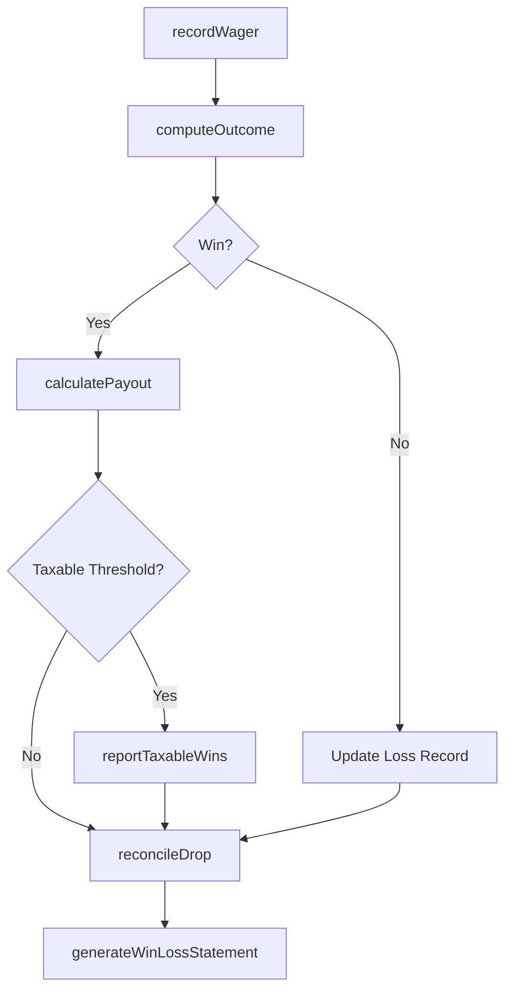
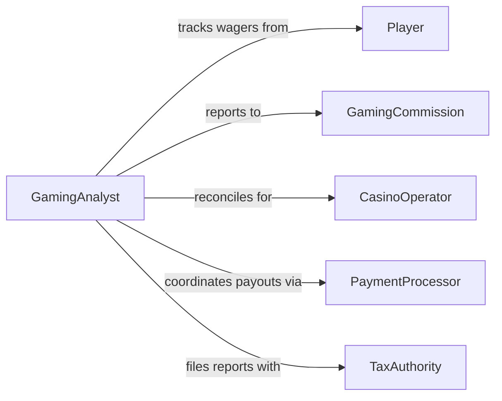

# Compute Gaming Wins Losses

> Business-as-Code definition for computing gaming wins and losses. Models the complete gaming financial computation lifecycle from wager recording through payout calculation and regulatory reporting.

## Overview

Computing gaming wins and losses involves tracking wagers, determining outcomes, calculating payouts, and reconciling the house position across table games, slot machines, and sports betting operations. This definition exposes actions for recording and computing gaming financial results, events for real-time outcome tracking, and searches for retrieving player and table performance data.

## Actors

| Actor | Description |
|-------|-------------|
| Player | Individual placing wagers and receiving payouts |
| GamingCommission | Regulatory body overseeing gaming operations and compliance |
| CasinoOperator | Organization running the gaming establishment |
| PaymentProcessor | Handles financial transactions for deposits and withdrawals |
| TaxAuthority | Requires reporting of gaming wins above regulatory thresholds |

## Roles

| Role | Description |
|------|-------------|
| PitBoss | Oversees table game operations and verifies large payouts |
| CageManager | Manages the cashier cage and reconciles daily gaming revenues |
| ComplianceOfficer | Ensures gaming calculations meet regulatory standards |
| GamingAnalyst | Analyzes win/loss trends and monitors house performance |

## Entities

| Entity | Description |
|--------|-------------|
| Wager | A bet placed by a player on a specific game or event |
| Payout | The amount paid to a player for a winning wager |
| GameSession | A period of play for a player at a specific game or table |
| HouseEdge | The calculated statistical advantage held by the gaming operator |
| WinLossStatement | A summary of a player's net gains or losses over a period |
| DropBox | The record of total money collected at a table or machine |

## Actions

| Action | Description |
|--------|-------------|
| recordWager | Log a bet placed by a player with amount and game details |
| computeOutcome | Determine the win or loss result for a completed wager |
| calculatePayout | Compute the payout amount based on odds and wager size |
| reconcileDrop | Compare money collected against payouts for a table or machine |
| generateWinLossStatement | Produce a net win/loss report for a player or period |
| reportTaxableWins | Flag and report wins exceeding regulatory tax thresholds |
| auditGameIntegrity | Verify that game outcomes align with expected statistical models |

## Events

| Event | Description |
|-------|-------------|
| wagerRecorded | A bet has been logged in the gaming system |
| outcomeComputed | The win or loss result for a wager has been determined |
| payoutCalculated | The payout amount for a winning wager has been computed |
| dropReconciled | Table or machine revenue has been reconciled against payouts |
| winLossStatementGenerated | A player or period win/loss report has been produced |
| taxableWinReported | A win exceeding tax thresholds has been flagged for reporting |
| gameIntegrityAudited | Game outcome statistics have been verified against expected models |

## Searches

| Search | Description |
|--------|-------------|
| findWagers | List wagers by player, game, date, or outcome status |
| getPlayerWinLoss | Retrieve net win/loss totals for a specific player and period |
| getTablePerformance | Get revenue and payout metrics for a specific table or machine |
| findTaxableEvents | Identify wins that require regulatory tax reporting |

## Workflow



## Actor Relationships



## Usage

### Calling Actions

```typescript
import { computeGamingWinsLosses } from '@headlessly/compute-gaming-wins-losses'

const gaming = computeGamingWinsLosses()

// Record a wager and compute outcome
const wager = await gaming.recordWager({
  playerId: 'player-8842',
  game: 'blackjack',
  tableId: 'table-14',
  amount: 500,
  timestamp: '2026-06-20T22:15:00Z'
})

const outcome = await gaming.computeOutcome({
  wagerId: wager.id,
  result: 'win',
  multiplier: 1.5
})

// Calculate payout for the winning wager
await gaming.calculatePayout({
  wagerId: wager.id,
  baseAmount: 500,
  multiplier: 1.5
})

// Generate daily win/loss statement
await gaming.generateWinLossStatement({
  playerId: 'player-8842',
  period: { start: '2026-06-20', end: '2026-06-20' }
})
```

### Event-Driven Automation

```typescript
// Auto-report taxable wins to compliance
gaming.taxableWinReported(async ({ playerId, amount, game }) => {
  await submitW2G({
    playerId,
    amount,
    game,
    filingDate: new Date().toISOString()
  })
})

// Alert pit boss on large payouts
gaming.payoutCalculated(async ({ wagerId, amount, tableId }) => {
  if (amount > 10000) {
    await notify({
      to: 'pit-boss',
      message: `Large payout of $${amount} at ${tableId} for wager ${wagerId}`
    })
  }
})
```
