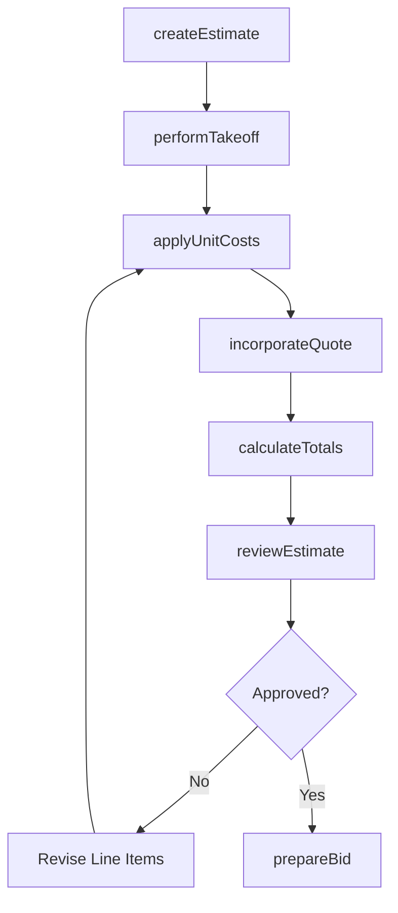
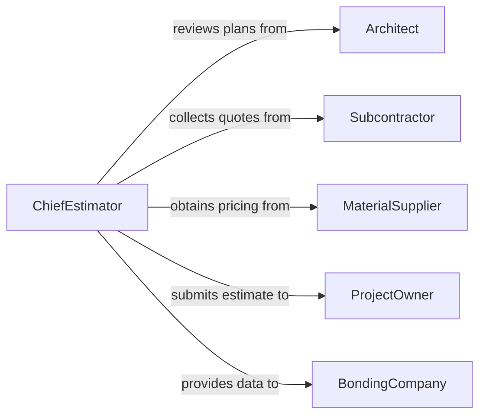

# Estimate Construction Project Costs

> Business-as-Code definition for estimating construction project costs. Models the complete cost estimation lifecycle from scope review through quantity takeoff, pricing, and bid preparation.

## Overview

Construction cost estimation involves analyzing project plans and specifications to determine the total cost of labor, materials, equipment, subcontractors, and overhead required to complete a building or infrastructure project. This definition exposes actions for performing quantity takeoffs, applying unit costs, assembling bid packages, and tracking estimate revisions. Events support automated variance alerts and searches provide access to historical cost data for benchmarking.

## Actors

| Actor | Description |
|-------|-------------|
| ProjectOwner | Commissions the project and reviews cost estimates |
| Architect | Provides design documents and specifications |
| Subcontractor | Submits pricing for specialized trade work |
| MaterialSupplier | Provides current pricing for construction materials |
| BondingCompany | Evaluates estimate accuracy for surety bond issuance |

## Roles

| Role | Description |
|------|-------------|
| ChiefEstimator | Oversees the estimation process and certifies final figures |
| QuantitySurveyor | Performs takeoffs and measures quantities from plans |
| CostAnalyst | Researches pricing and applies unit costs to quantities |
| BidCoordinator | Assembles subcontractor quotes and prepares bid packages |
| ProjectManager | Reviews estimates against project scope and schedule |

## Entities

| Entity | Description |
|--------|-------------|
| CostEstimate | A comprehensive projection of total project costs |
| QuantityTakeoff | A measured list of materials and labor quantities from plans |
| LineItem | An individual cost element within the estimate |
| UnitCost | A rate for a specific material, labor type, or equipment |
| BidPackage | A compiled set of estimates and quotes for submission |
| CostRevision | A tracked change to a previous estimate version |

## Actions

| Action | Description |
|--------|-------------|
| createEstimate | Initialize a new cost estimate for a construction project |
| performTakeoff | Measure and quantify materials and labor from project plans |
| applyUnitCosts | Assign current rates to each line item in the takeoff |
| incorporateQuote | Add a subcontractor or supplier quote to the estimate |
| calculateTotals | Compute subtotals, contingencies, overhead, and grand total |
| reviewEstimate | Submit the estimate for internal review and approval |
| prepareBid | Package the estimate into a formal bid submission |

## Events

| Event | Description |
|-------|-------------|
| estimateCreated | A new cost estimate has been initialized |
| takeoffCompleted | Quantity takeoff from project plans is finished |
| unitCostsApplied | Rates have been assigned to all line items |
| quoteIncorporated | A subcontractor or supplier quote has been added |
| totalsCalculated | Final cost totals have been computed |
| estimateReviewed | The estimate has been reviewed and approved or returned |
| bidPrepared | A formal bid package has been assembled for submission |

## Searches

| Search | Description |
|--------|-------------|
| findEstimates | List cost estimates by project, status, or date range |
| getLineItems | Retrieve individual cost elements for an estimate |
| getHistoricalCosts | Look up past project costs for benchmarking |
| getSubcontractorQuotes | Find quotes by trade, project, or supplier |

## Workflow



## Actor Relationships



## Usage

### Calling Actions

```typescript
import { estimateConstructionProjectCosts } from '@headlessly/estimate-construction-project-costs'

const estimator = estimateConstructionProjectCosts()

// Create a new estimate
const estimate = await estimator.createEstimate({
  projectName: 'Downtown Office Tower',
  projectId: 'proj-2026-001',
  planSetVersion: 'CD-Rev3',
  estimateType: 'detailed'
})

// Perform quantity takeoff
await estimator.performTakeoff({
  estimateId: estimate.id,
  division: 'concrete',
  items: [
    { description: 'Foundation footings', quantity: 450, unit: 'CY' },
    { description: 'Slab on grade', quantity: 12000, unit: 'SF' }
  ]
})

// Calculate final totals
const totals = await estimator.calculateTotals({
  estimateId: estimate.id,
  contingency: 0.10,
  overheadRate: 0.08,
  profitMargin: 0.05
})
```

### Event-Driven Automation

```typescript
// Alert when estimate exceeds budget threshold
estimator.totalsCalculated(async ({ estimateId, grandTotal, budgetLimit }) => {
  if (grandTotal > budgetLimit) {
    await notify({
      to: 'project-owner',
      message: `Estimate ${estimateId} at $${grandTotal.toLocaleString()} exceeds budget of $${budgetLimit.toLocaleString()}`
    })
  }
})

// Auto-update estimate when new subcontractor quote arrives
estimator.quoteIncorporated(async ({ estimateId, trade, amount }) => {
  await estimator.calculateTotals({ estimateId })
})
```
