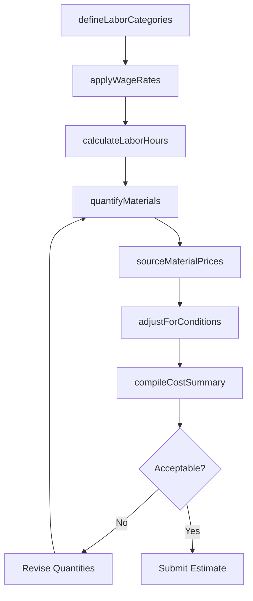
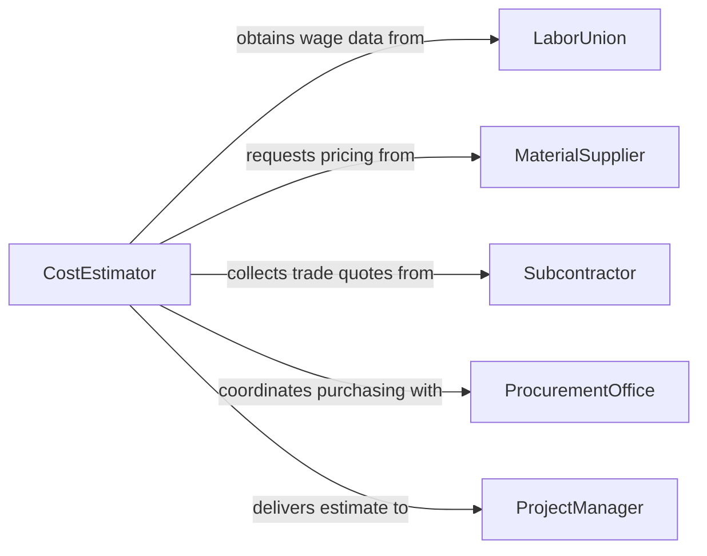

# Estimate Costs Labor Materials

> Business-as-Code definition for estimating costs for labor and materials. Models the process of projecting workforce expenses and material procurement costs from rate analysis through quantity calculation and total cost compilation.

## Overview

Estimating labor and material costs involves analyzing workforce requirements, wage rates, productivity factors, material quantities, and supplier pricing to produce accurate cost projections for projects, products, or operations. This definition exposes actions for defining labor categories, sourcing material prices, calculating quantities, and assembling cost summaries. Events track pricing updates and quantity changes, and searches provide access to wage rate databases and material price indices.

## Actors

| Actor | Description |
|-------|-------------|
| ProjectManager | Requests labor and material cost estimates for project planning |
| LaborUnion | Provides prevailing wage rates and labor agreements |
| MaterialSupplier | Supplies current pricing and availability for materials |
| Subcontractor | Provides bundled labor and material pricing for trade work |
| ProcurementOffice | Manages supplier relationships and purchase agreements |

## Roles

| Role | Description |
|------|-------------|
| CostEstimator | Develops comprehensive labor and material cost projections |
| LaborAnalyst | Researches wage rates, productivity factors, and crew compositions |
| MaterialTakeoffSpecialist | Quantifies material requirements from plans and specifications |
| PricingSpecialist | Sources and validates current material pricing |

## Entities

| Entity | Description |
|--------|-------------|
| LaborCostEstimate | A projection of workforce expenses by trade and duration |
| MaterialCostEstimate | A projection of material procurement expenses |
| WageRate | The hourly or daily cost for a specific labor category |
| MaterialQuantity | The measured amount of a material needed for the work |
| UnitPrice | The cost per unit of a specific material from a supplier |
| CostSummary | A consolidated view of total labor and material expenses |

## Actions

| Action | Description |
|--------|-------------|
| defineLaborCategories | Establish the trades and skill levels required for the work |
| applyWageRates | Assign current wage rates including burden and benefits |
| calculateLaborHours | Project the total hours needed by trade and phase |
| quantifyMaterials | Determine the quantities of each material from specifications |
| sourceMaterialPrices | Obtain current unit prices from suppliers |
| compileCostSummary | Aggregate labor and material costs into a total estimate |
| adjustForConditions | Apply factors for location, market conditions, or complexity |

## Events

| Event | Description |
|-------|-------------|
| laborCategoriesDefined | Required trades and skill levels have been established |
| wageRatesApplied | Current wage rates have been assigned to labor categories |
| laborHoursCalculated | Total projected hours by trade are complete |
| materialsQuantified | Material quantities have been determined from specifications |
| materialPricesSourced | Current unit prices from suppliers have been obtained |
| costSummaryCompiled | The total labor and material estimate has been assembled |
| conditionsAdjusted | Market or location factors have been applied to the estimate |

## Searches

| Search | Description |
|--------|-------------|
| findCostEstimates | List labor and material estimates by project or status |
| getWageRates | Look up prevailing wage rates by trade and location |
| getMaterialPrices | Retrieve current material pricing by item or supplier |
| getLaborProductivity | Find productivity factors by trade and work type |

## Workflow



## Actor Relationships



## Usage

### Calling Actions

```typescript
import { estimateCostsLaborMaterials } from '@headlessly/estimate-costs-labor-materials'

const estimator = estimateCostsLaborMaterials()

// Define labor categories and apply rates
await estimator.defineLaborCategories({
  projectId: 'proj-2026-045',
  categories: [
    { trade: 'Electrician', level: 'journeyman' },
    { trade: 'Plumber', level: 'journeyman' },
    { trade: 'General Laborer', level: 'standard' }
  ]
})

await estimator.applyWageRates({
  projectId: 'proj-2026-045',
  rates: [
    { trade: 'Electrician', rate: 78.50, burden: 1.35 },
    { trade: 'Plumber', rate: 72.00, burden: 1.35 },
    { trade: 'General Laborer', rate: 42.00, burden: 1.25 }
  ]
})

// Quantify materials and source prices
await estimator.quantifyMaterials({
  projectId: 'proj-2026-045',
  materials: [
    { item: 'Copper pipe 3/4"', quantity: 2400, unit: 'LF' },
    { item: '12/2 Romex wire', quantity: 5000, unit: 'LF' },
    { item: 'Concrete mix', quantity: 150, unit: 'CY' }
  ]
})

// Compile the final cost summary
const summary = await estimator.compileCostSummary({ projectId: 'proj-2026-045' })
```

### Event-Driven Automation

```typescript
// Notify when material prices change significantly
estimator.materialPricesSourced(async ({ projectId, priceChanges }) => {
  const significant = priceChanges.filter(c => Math.abs(c.percentChange) > 10)
  if (significant.length > 0) {
    await notify({
      to: 'cost-estimator',
      message: `${significant.length} materials on project ${projectId} have price changes exceeding 10%`
    })
  }
})

// Auto-recompile when labor hours are updated
estimator.laborHoursCalculated(async ({ projectId }) => {
  await estimator.compileCostSummary({ projectId })
})
```
