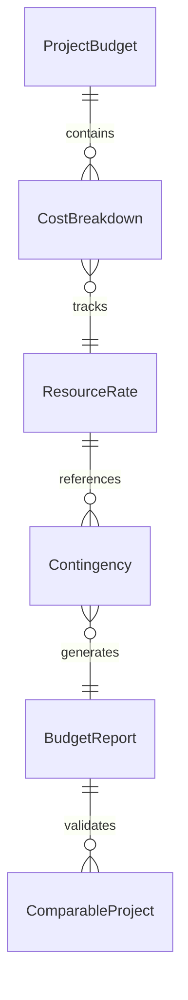
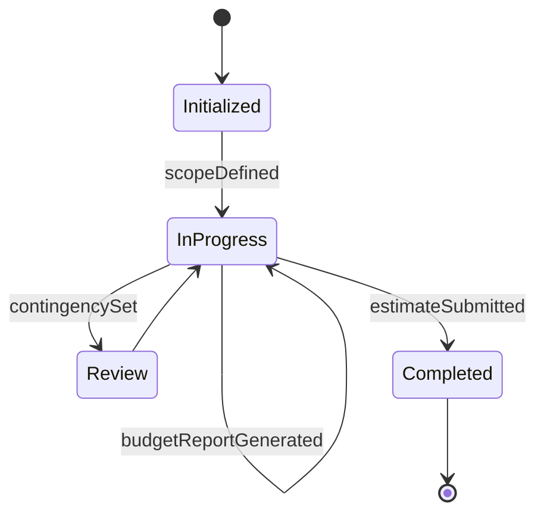
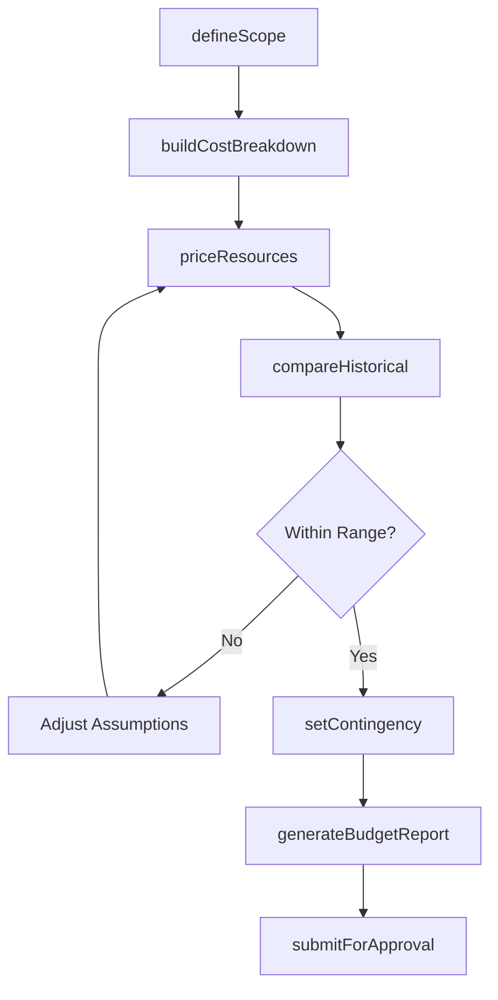
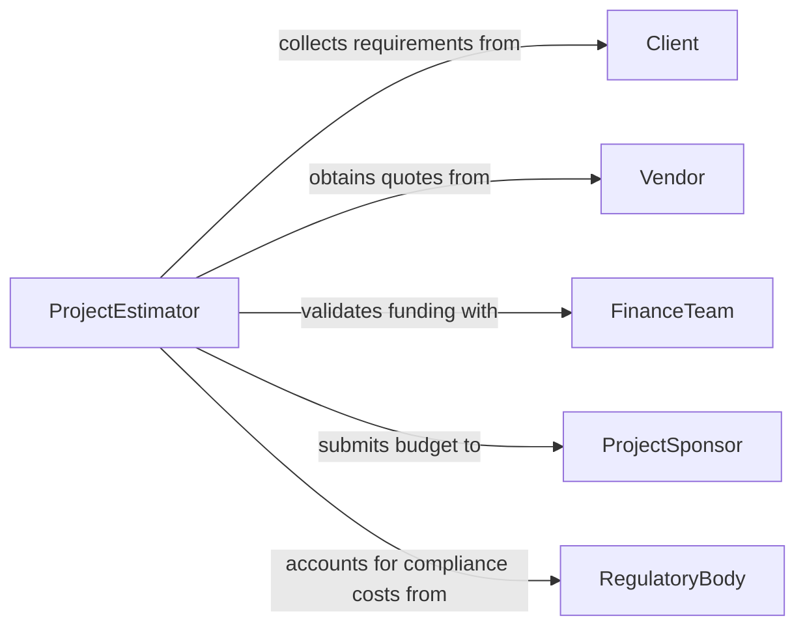

# Estimate Costs Projects Productions

> Business-as-Code definition for estimating costs for projects or productions. Models the budgeting lifecycle from scope definition through cost breakdown, resource allocation, and budget approval.

## Overview

Estimating costs for projects or productions involves analyzing the scope, duration, and resource requirements of a project or production to develop an accurate financial projection. This applies across industries including film, media, software, events, and manufacturing. This definition exposes actions for building cost breakdowns, pricing resources, managing contingencies, and producing budget reports. Events drive automated tracking when estimates are revised, and searches provide access to comparable project cost data.

## Actors

| Actor | Description |
|-------|-------------|
| ProjectSponsor | Funds the project and approves the budget |
| Vendor | Provides pricing for goods, services, or equipment rentals |
| Client | Commissions the project and sets financial constraints |
| FinanceTeam | Validates cost assumptions and funding availability |
| RegulatoryBody | Imposes compliance costs such as permits and insurance |

## Roles

| Role | Description |
|------|-------------|
| ProjectEstimator | Develops the comprehensive cost breakdown |
| ProductionManager | Defines resource needs and scheduling for production phases |
| BudgetAnalyst | Reviews cost assumptions and performs variance analysis |
| ProcurementLead | Sources vendor quotes and negotiates pricing |

## Entities

| Entity | Description |
|--------|-------------|
| ProjectBudget | A complete financial plan for a project or production |
| CostBreakdown | A hierarchical decomposition of costs by category |
| ResourceRate | The cost per unit of a labor, equipment, or material resource |
| Contingency | A reserve amount for unforeseen expenses |
| BudgetReport | A formatted summary of the estimated costs |
| ComparableProject | A historical project used as a benchmarking reference |

## Actions

| Action | Description |
|--------|-------------|
| defineScope | Establish the project scope and deliverables for estimation |
| buildCostBreakdown | Create a hierarchical cost structure by category and phase |
| priceResources | Apply current rates to labor, materials, and equipment |
| setContingency | Define reserve amounts for risk and unforeseen costs |
| compareHistorical | Benchmark against comparable past projects |
| generateBudgetReport | Produce a formatted budget summary for stakeholders |
| submitForApproval | Send the completed estimate for sponsor or client sign-off |

## Events

| Event | Description |
|-------|-------------|
| scopeDefined | Project scope and deliverables have been established |
| costBreakdownBuilt | The hierarchical cost structure has been assembled |
| resourcesPriced | Current rates have been applied to all resources |
| contingencySet | Reserve amounts for risk have been defined |
| historicalCompared | Benchmarking against past projects is complete |
| budgetReportGenerated | A formatted budget summary has been produced |
| estimateSubmitted | The estimate has been sent for approval |

## Searches

| Search | Description |
|--------|-------------|
| findProjectBudgets | List project budgets by client, status, or date range |
| getCostBreakdown | Retrieve the hierarchical cost structure for a project |
| getResourceRates | Look up current rates for specific resource types |
| getComparableProjects | Find past projects with similar scope for benchmarking |


## Entity Relationships



## State Diagram


## Workflow



## Actor Relationships



## Usage

### Calling Actions

```typescript
import { estimateCostsProjectsProductions } from '@headlessly/estimate-costs-projects-productions'

const estimator = estimateCostsProjectsProductions()

// Define the project scope
const scope = await estimator.defineScope({
  projectName: 'Product Launch Video Series',
  phases: ['pre-production', 'production', 'post-production'],
  duration: { value: 8, unit: 'weeks' },
  deliverables: ['6 videos', 'social media cuts', 'behind-the-scenes']
})

// Build the cost breakdown
await estimator.buildCostBreakdown({
  projectId: scope.id,
  categories: [
    { name: 'Talent', items: ['Director', 'Crew', 'On-screen talent'] },
    { name: 'Equipment', items: ['Camera rental', 'Lighting', 'Audio'] },
    { name: 'Post-Production', items: ['Editing', 'Color grading', 'Sound mix'] }
  ]
})

// Generate the budget report
const report = await estimator.generateBudgetReport({
  projectId: scope.id,
  format: 'detailed',
  includeComparables: true
})
```

### Event-Driven Automation

```typescript
// Notify sponsor when estimate is ready for approval
estimator.budgetReportGenerated(async ({ projectId, totalCost }) => {
  await notify({
    to: 'project-sponsor',
    message: `Budget report ready for ${projectId}: total estimated cost $${totalCost.toLocaleString()}`
  })
})

// Flag estimates that deviate significantly from historical benchmarks
estimator.historicalCompared(async ({ projectId, deviation }) => {
  if (Math.abs(deviation) > 0.25) {
    await notify({
      to: 'budget-analyst',
      message: `Project ${projectId} deviates ${(deviation * 100).toFixed(0)}% from comparable projects`
    })
  }
})
```
