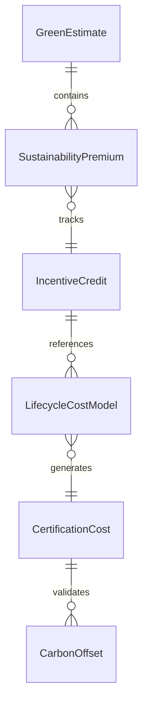
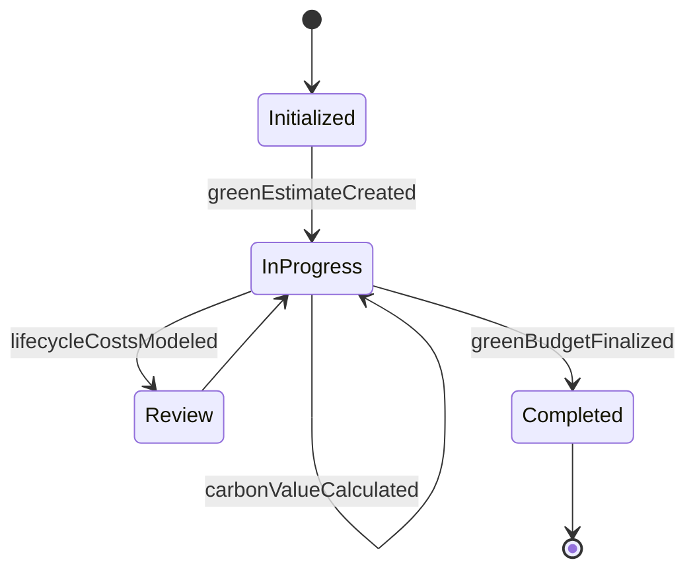
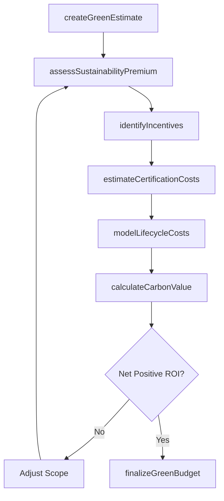
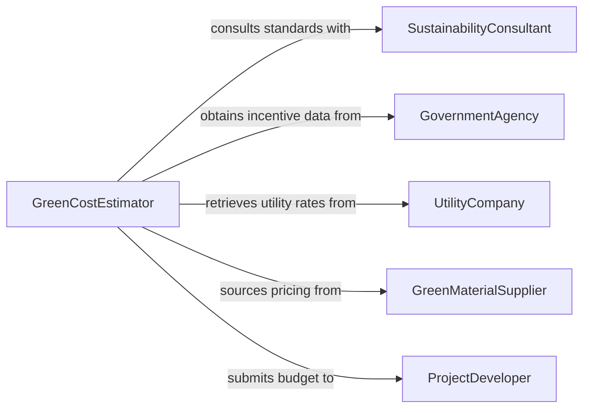

# Estimate Green Project Costs

> Business-as-Code definition for estimating green project costs. Models the cost estimation lifecycle for environmentally sustainable projects including renewable energy, energy efficiency, and green building initiatives.

## Overview

Green project cost estimation involves analyzing the financial requirements of environmentally sustainable projects such as renewable energy installations, LEED-certified construction, energy retrofits, and carbon reduction initiatives. This definition exposes actions for evaluating sustainability premiums, calculating incentive offsets, projecting lifecycle savings, and preparing green-specific budget analyses. Events track estimate milestones and searches provide access to green cost benchmarks and incentive databases.

## Actors

| Actor | Description |
|-------|-------------|
| ProjectDeveloper | Initiates and funds the green project |
| SustainabilityConsultant | Advises on green standards and certification requirements |
| UtilityCompany | Provides incentive programs and interconnection cost data |
| GovernmentAgency | Administers tax credits, grants, and regulatory compliance |
| GreenMaterialSupplier | Provides pricing for sustainable materials and equipment |

## Roles

| Role | Description |
|------|-------------|
| GreenCostEstimator | Develops cost projections specific to sustainable projects |
| EnergyAnalyst | Models energy production, savings, and payback periods |
| IncentiveSpecialist | Identifies and quantifies available grants, credits, and rebates |
| LifecycleAnalyst | Evaluates total cost of ownership including long-term savings |

## Entities

| Entity | Description |
|--------|-------------|
| GreenEstimate | A cost projection for a sustainability-focused project |
| SustainabilityPremium | The additional cost above conventional construction methods |
| IncentiveCredit | A financial offset from tax credits, grants, or rebates |
| LifecycleCostModel | A projection of costs and savings over the asset lifetime |
| CertificationCost | Expenses related to achieving green certifications like LEED |
| CarbonOffset | A quantified reduction in carbon emissions with monetary value |

## Actions

| Action | Description |
|--------|-------------|
| createGreenEstimate | Initialize a cost estimate for a sustainable project |
| assessSustainabilityPremium | Calculate the cost difference versus conventional methods |
| identifyIncentives | Find applicable tax credits, grants, and rebate programs |
| modelLifecycleCosts | Project total ownership costs including energy savings |
| estimateCertificationCosts | Calculate expenses for achieving green certifications |
| calculateCarbonValue | Quantify the monetary value of carbon emission reductions |
| finalizeGreenBudget | Compile all green-specific costs and offsets into a final budget |

## Events

| Event | Description |
|-------|-------------|
| greenEstimateCreated | A new green project cost estimate has been initialized |
| sustainabilityPremiumAssessed | The cost premium for green methods has been calculated |
| incentivesIdentified | Applicable financial incentives have been cataloged |
| lifecycleCostsModeled | Long-term cost and savings projections are complete |
| certificationCostsEstimated | Green certification expenses have been determined |
| carbonValueCalculated | The monetary value of carbon reductions has been computed |
| greenBudgetFinalized | The complete green project budget has been assembled |

## Searches

| Search | Description |
|--------|-------------|
| findGreenEstimates | List green project estimates by type, status, or date |
| getIncentivePrograms | Look up available incentives by jurisdiction and project type |
| getGreenBenchmarks | Retrieve cost benchmarks for comparable green projects |
| getLifecycleModels | Find lifecycle cost models by project category |


## Entity Relationships



## State Diagram


## Workflow



## Actor Relationships



## Usage

### Calling Actions

```typescript
import { estimateGreenProjectCosts } from '@headlessly/estimate-green-project-costs'

const green = estimateGreenProjectCosts()

// Create a green project estimate
const estimate = await green.createGreenEstimate({
  projectName: 'Solar Rooftop Installation - Building A',
  type: 'renewable-energy',
  capacity: { value: 500, unit: 'kW' },
  location: 'Austin, TX'
})

// Identify available incentives
const incentives = await green.identifyIncentives({
  estimateId: estimate.id,
  jurisdiction: 'TX',
  projectType: 'solar',
  federalCredits: true
})

// Model lifecycle costs and savings
const lifecycle = await green.modelLifecycleCosts({
  estimateId: estimate.id,
  horizon: 25,
  energyRate: 0.12,
  degradationRate: 0.005,
  discountRate: 0.04
})
```

### Event-Driven Automation

```typescript
// Notify developer when lifecycle model shows positive ROI
green.lifecycleCostsModeled(async ({ estimateId, paybackYears, netSavings }) => {
  if (paybackYears <= 7) {
    await notify({
      to: 'project-developer',
      message: `Green project ${estimateId} achieves payback in ${paybackYears} years with $${netSavings.toLocaleString()} net savings`
    })
  }
})

// Auto-update budget when new incentives are identified
green.incentivesIdentified(async ({ estimateId, totalCredits }) => {
  await green.finalizeGreenBudget({ estimateId })
})
```
