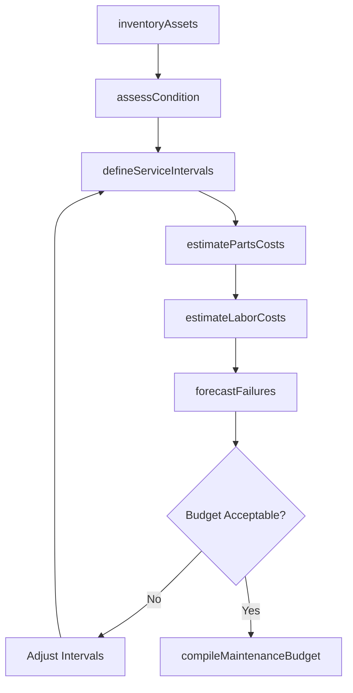
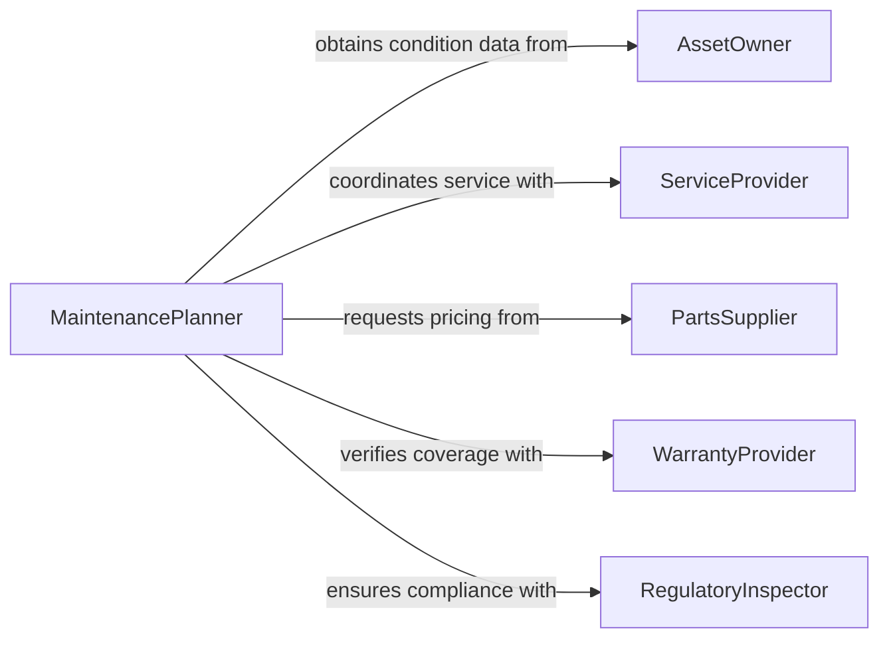

# Estimate Maintenance Service Requirements Costs

> Business-as-Code definition for estimating maintenance service requirements and costs. Models the process of projecting preventive, corrective, and predictive maintenance needs along with their associated labor, parts, and service expenses.

## Overview

Estimating maintenance service requirements and costs involves assessing equipment condition, usage patterns, and maintenance history to project future service needs and their financial impact. This covers preventive maintenance schedules, corrective repair forecasts, and predictive maintenance investments. This definition exposes actions for inventorying assets, assessing condition, scheduling service intervals, and pricing maintenance plans. Events enable automated alerts for cost overruns, and searches provide access to maintenance history and parts pricing data.

## Actors

| Actor | Description |
|-------|-------------|
| AssetOwner | Owns the equipment or facility requiring maintenance |
| ServiceProvider | Delivers maintenance labor and expertise |
| PartsSupplier | Provides replacement parts and consumables pricing |
| WarrantyProvider | Covers certain maintenance costs under warranty terms |
| RegulatoryInspector | Mandates maintenance standards and inspection schedules |

## Roles

| Role | Description |
|------|-------------|
| MaintenancePlanner | Develops maintenance schedules and cost estimates |
| ReliabilityEngineer | Analyzes failure patterns and recommends maintenance strategies |
| CostEstimator | Prices labor, parts, and service contracts |
| FacilitiesManager | Oversees maintenance execution across all assets |

## Entities

| Entity | Description |
|--------|-------------|
| MaintenancePlan | A schedule and budget for servicing a set of assets |
| AssetRecord | Equipment or facility data including age, condition, and history |
| ServiceInterval | A defined frequency for preventive maintenance activities |
| PartsCost | The price of replacement components and consumables |
| LaborEstimate | The projected hours and cost for maintenance work |
| FailureForecast | A prediction of likely equipment failures and repair costs |

## Actions

| Action | Description |
|--------|-------------|
| inventoryAssets | Catalog equipment and facilities requiring maintenance |
| assessCondition | Evaluate the current state and remaining useful life of assets |
| defineServiceIntervals | Establish preventive maintenance frequencies for each asset |
| estimatePartsCosts | Price the replacement parts and consumables needed |
| estimateLaborCosts | Project the labor hours and rates for maintenance activities |
| forecastFailures | Predict corrective maintenance needs based on reliability data |
| compileMaintenanceBudget | Aggregate all maintenance costs into a comprehensive budget |

## Events

| Event | Description |
|-------|-------------|
| assetsInventoried | Equipment and facilities have been cataloged |
| conditionAssessed | Asset condition evaluations are complete |
| serviceIntervalsDefined | Preventive maintenance schedules have been established |
| partsCostsEstimated | Replacement parts pricing has been determined |
| laborCostsEstimated | Maintenance labor projections are complete |
| failuresForecasted | Corrective maintenance predictions have been generated |
| maintenanceBudgetCompiled | The complete maintenance budget has been assembled |

## Searches

| Search | Description |
|--------|-------------|
| findMaintenancePlans | List maintenance plans by asset type, location, or period |
| getAssetHistory | Retrieve maintenance history for a specific asset |
| getPartsPricing | Look up current pricing for replacement parts |
| getFailureRates | Find historical failure rates by asset type or manufacturer |

## Workflow



## Actor Relationships



## Usage

### Calling Actions

```typescript
import { estimateMaintenanceServiceRequirementsCosts } from '@headlessly/estimate-maintenance-service-requirements-costs'

const maintenance = estimateMaintenanceServiceRequirementsCosts()

// Inventory assets to maintain
const assets = await maintenance.inventoryAssets({
  facilityId: 'plant-west-001',
  assetTypes: ['HVAC', 'electrical', 'plumbing', 'production-equipment'],
  includeAge: true
})

// Assess condition of critical equipment
const condition = await maintenance.assessCondition({
  assetId: 'compressor-unit-12',
  inspectionDate: '2026-01-15',
  metrics: { vibration: 2.1, temperature: 185, runtime: 12500 }
})

// Compile the annual maintenance budget
const budget = await maintenance.compileMaintenanceBudget({
  facilityId: 'plant-west-001',
  period: { start: '2026-01-01', end: '2026-12-31' },
  includePreventive: true,
  includeCorrective: true,
  contingency: 0.15
})
```

### Event-Driven Automation

```typescript
// Alert when failure forecast indicates high-risk equipment
maintenance.failuresForecasted(async ({ assetId, failureProbability, estimatedCost }) => {
  if (failureProbability > 0.7) {
    await notify({
      to: 'reliability-engineer',
      message: `Asset ${assetId} has ${(failureProbability * 100).toFixed(0)}% failure probability - estimated repair cost $${estimatedCost.toLocaleString()}`
    })
  }
})

// Auto-recompile budget when parts costs change
maintenance.partsCostsEstimated(async ({ planId, totalPartsCost }) => {
  await maintenance.compileMaintenanceBudget({ planId })
})
```
