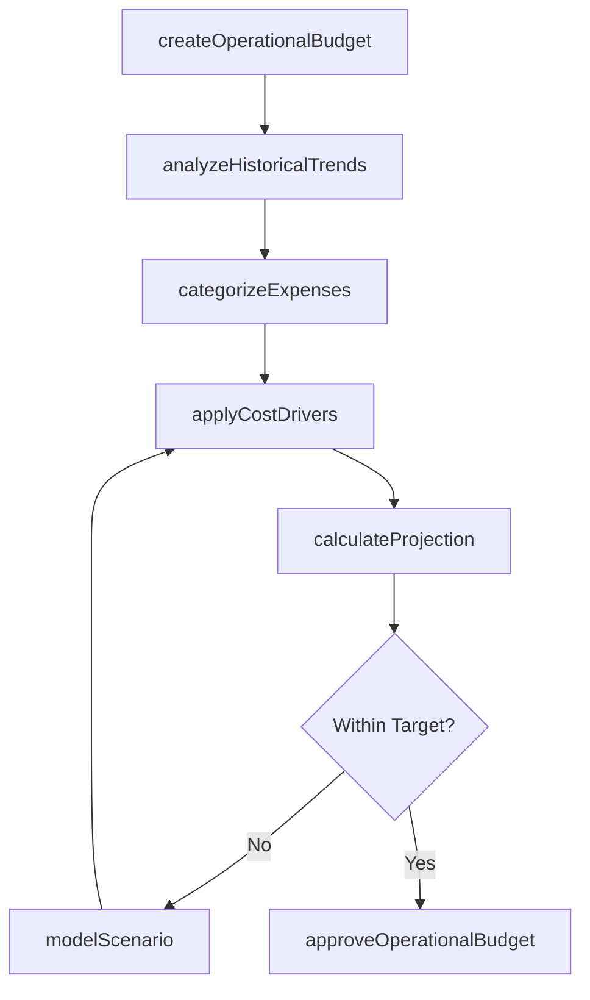
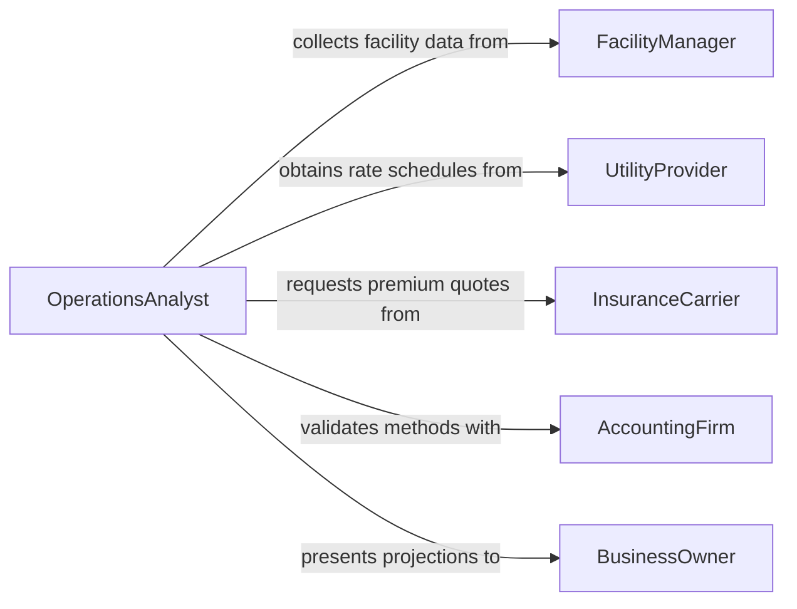

# Estimate Operational Costs

> Business-as-Code definition for estimating operational costs. Models the process of projecting ongoing expenses for running a business, facility, or system including labor, utilities, maintenance, and overhead.

## Overview

Operational cost estimation involves forecasting the recurring expenses required to run day-to-day business activities, facilities, or systems. This includes labor costs, utilities, consumables, maintenance, insurance, and administrative overhead. This definition exposes actions for categorizing expenses, applying cost drivers, modeling scenarios, and producing operational budgets. Events enable automated alerts when projections exceed thresholds, and searches provide historical cost trend data for accurate forecasting.

## Actors

| Actor | Description |
|-------|-------------|
| BusinessOwner | Requires operational cost projections for financial planning |
| FacilityManager | Provides data on building and infrastructure running costs |
| UtilityProvider | Supplies rate schedules and consumption projections |
| InsuranceCarrier | Provides premium quotes for operational risk coverage |
| AccountingFirm | Validates cost categorization and allocation methods |

## Roles

| Role | Description |
|------|-------------|
| OperationsAnalyst | Develops operational cost models and projections |
| FinancialController | Reviews and approves operational budget estimates |
| CostAccountant | Categorizes and allocates expenses to cost centers |
| ForecastingSpecialist | Models scenarios and sensitivities for cost projections |

## Entities

| Entity | Description |
|--------|-------------|
| OperationalBudget | A projection of recurring expenses for a defined period |
| CostCategory | A classification grouping such as labor, utilities, or supplies |
| CostDriver | A variable that influences the magnitude of an expense |
| ScenarioModel | A what-if projection based on varying assumptions |
| CostCenter | An organizational unit to which expenses are allocated |
| TrendAnalysis | A historical pattern of cost changes over time |

## Actions

| Action | Description |
|--------|-------------|
| createOperationalBudget | Initialize a new operational cost projection for a period |
| categorizeExpenses | Classify costs into defined categories and cost centers |
| applyCostDrivers | Assign volume, rate, or usage factors to cost categories |
| modelScenario | Create a what-if projection with adjusted assumptions |
| analyzeHistoricalTrends | Review past cost data to inform future projections |
| calculateProjection | Compute the total operational cost estimate |
| approveOperationalBudget | Finalize and approve the operational cost projection |

## Events

| Event | Description |
|-------|-------------|
| operationalBudgetCreated | A new operational cost projection has been initialized |
| expensesCategorized | Costs have been classified into categories and cost centers |
| costDriversApplied | Volume and rate factors have been assigned |
| scenarioModeled | A what-if cost projection has been generated |
| historicalTrendsAnalyzed | Past cost patterns have been reviewed |
| projectionCalculated | The total operational cost estimate has been computed |
| operationalBudgetApproved | The operational budget has been finalized |

## Searches

| Search | Description |
|--------|-------------|
| findOperationalBudgets | List operational budgets by period, department, or status |
| getCostsByCategory | Retrieve expenses grouped by cost category |
| getCostTrends | Look up historical cost trends by category or cost center |
| getScenarioComparisons | Compare multiple what-if projections side by side |

## Workflow



## Actor Relationships



## Usage

### Calling Actions

```typescript
import { estimateOperationalCosts } from '@headlessly/estimate-operational-costs'

const ops = estimateOperationalCosts()

// Create an operational budget
const budget = await ops.createOperationalBudget({
  name: 'FY2026 Warehouse Operations',
  period: { start: '2026-01-01', end: '2026-12-31' },
  costCenter: 'warehouse-east'
})

// Categorize and apply cost drivers
await ops.categorizeExpenses({
  budgetId: budget.id,
  categories: [
    { name: 'Labor', baseAmount: 1200000 },
    { name: 'Utilities', baseAmount: 180000 },
    { name: 'Maintenance', baseAmount: 95000 },
    { name: 'Insurance', baseAmount: 45000 }
  ]
})

await ops.applyCostDrivers({
  budgetId: budget.id,
  drivers: [
    { category: 'Labor', factor: 'headcount', value: 45 },
    { category: 'Utilities', factor: 'squareFootage', value: 50000 }
  ]
})

// Calculate the projection
const projection = await ops.calculateProjection({ budgetId: budget.id })
```

### Event-Driven Automation

```typescript
// Alert when projection exceeds target
ops.projectionCalculated(async ({ budgetId, totalCost, targetBudget }) => {
  if (totalCost > targetBudget * 1.1) {
    await notify({
      to: 'financial-controller',
      message: `Operational budget ${budgetId} projects $${totalCost.toLocaleString()}, exceeding target by ${((totalCost / targetBudget - 1) * 100).toFixed(1)}%`
    })
  }
})

// Auto-generate scenario when costs exceed threshold
ops.costDriversApplied(async ({ budgetId, category, factor }) => {
  await ops.modelScenario({
    budgetId,
    name: `Reduced ${category}`,
    adjustments: [{ category, factorMultiplier: 0.9 }]
  })
})
```
