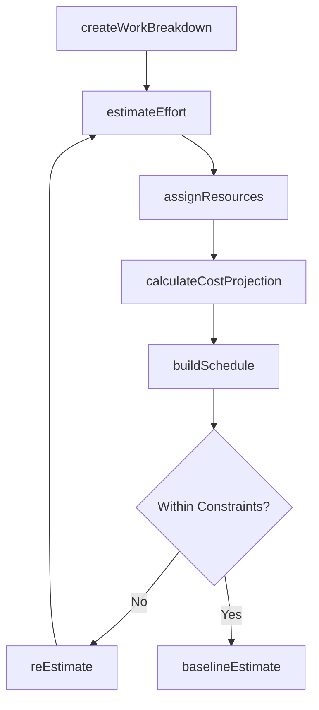
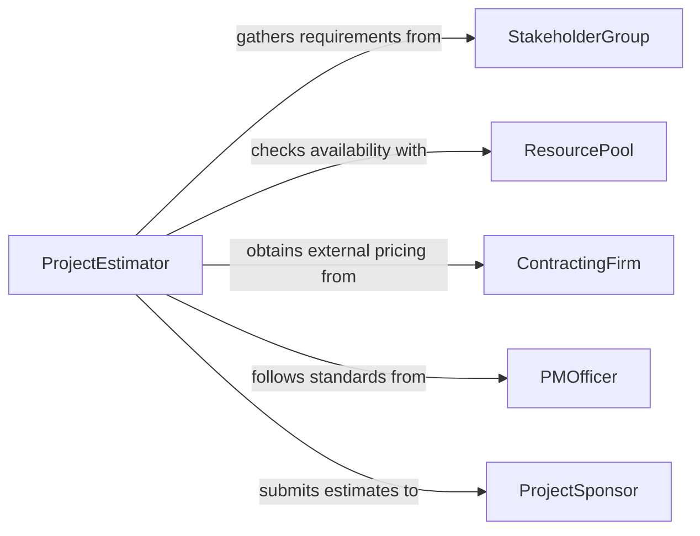

# Estimate Time Monetary Resources Needed

> Business-as-Code definition for estimating time and monetary resources needed to complete projects. Models the resource estimation lifecycle from work breakdown through effort sizing, cost projection, and schedule development.

## Overview

Estimating time and monetary resources for project completion involves decomposing work into manageable components, sizing the effort required for each, applying resource rates, and developing a schedule and budget. This definition exposes actions for creating work breakdown structures, estimating durations, pricing resource needs, and consolidating into project plans. Events support automated re-estimation triggers, and searches provide access to historical effort data and resource rate benchmarks.

## Actors

| Actor | Description |
|-------|-------------|
| ProjectSponsor | Approves the time and budget estimates for project funding |
| StakeholderGroup | Provides requirements that influence scope and resource needs |
| ResourcePool | Supplies available personnel, equipment, and materials |
| ContractingFirm | Provides external resource pricing and availability |
| PMOfficer | Enforces estimation standards and methodology compliance |

## Roles

| Role | Description |
|------|-------------|
| ProjectEstimator | Develops time and cost projections for the project |
| SchedulePlanner | Sequences activities and builds the project timeline |
| ResourcePlanner | Identifies and allocates resources to project tasks |
| SeniorReviewer | Validates estimates against organizational benchmarks |

## Entities

| Entity | Description |
|--------|-------------|
| WorkBreakdownStructure | A hierarchical decomposition of project deliverables into tasks |
| EffortEstimate | A projection of hours or days required for a task |
| ResourceAssignment | A mapping of personnel or equipment to project tasks |
| CostProjection | A monetary estimate derived from resource rates and effort |
| ProjectSchedule | A timeline showing task sequences, durations, and milestones |
| EstimationBaseline | An approved snapshot of time and cost estimates for tracking |

## Actions

| Action | Description |
|--------|-------------|
| createWorkBreakdown | Decompose the project scope into a hierarchical task structure |
| estimateEffort | Project the hours or duration required for each task |
| assignResources | Map available personnel and equipment to tasks |
| calculateCostProjection | Compute monetary estimates from effort and resource rates |
| buildSchedule | Sequence tasks and develop the project timeline |
| baselineEstimate | Lock the current estimates as the approved baseline |
| reEstimate | Update projections based on new information or scope changes |

## Events

| Event | Description |
|-------|-------------|
| workBreakdownCreated | The project scope has been decomposed into tasks |
| effortEstimated | Duration projections for tasks have been completed |
| resourcesAssigned | Personnel and equipment have been mapped to tasks |
| costProjectionCalculated | Monetary estimates have been computed |
| scheduleBuilt | The project timeline has been developed |
| estimateBaselined | The approved baseline has been established |
| reEstimationTriggered | A scope change has triggered updated projections |

## Searches

| Search | Description |
|--------|-------------|
| findProjectEstimates | List time and cost estimates by project, status, or date |
| getEffortByTask | Retrieve effort projections for specific tasks or phases |
| getResourceAvailability | Look up available resources by skill, role, or period |
| getHistoricalEffort | Find past project effort data for benchmarking |
| getScheduleMilestones | Retrieve key milestones and deadlines from the schedule |

## Workflow



## Actor Relationships



## Usage

### Calling Actions

```typescript
import { estimateTimeMonetaryResourcesNeeded } from '@headlessly/estimate-time-monetary-resources-needed'

const estimator = estimateTimeMonetaryResourcesNeeded()

// Create a work breakdown structure
const wbs = await estimator.createWorkBreakdown({
  projectName: 'ERP System Migration',
  phases: ['Discovery', 'Design', 'Development', 'Testing', 'Deployment'],
  deliverables: ['Requirements doc', 'System design', 'Migrated data', 'Test results', 'Go-live']
})

// Estimate effort for each phase
await estimator.estimateEffort({
  projectId: wbs.id,
  estimates: [
    { phase: 'Discovery', effort: 320, unit: 'hours' },
    { phase: 'Design', effort: 480, unit: 'hours' },
    { phase: 'Development', effort: 1600, unit: 'hours' },
    { phase: 'Testing', effort: 640, unit: 'hours' },
    { phase: 'Deployment', effort: 240, unit: 'hours' }
  ]
})

// Calculate cost projection
const costs = await estimator.calculateCostProjection({
  projectId: wbs.id,
  rates: [
    { role: 'Business Analyst', rate: 125, unit: 'per-hour' },
    { role: 'Developer', rate: 150, unit: 'per-hour' },
    { role: 'QA Engineer', rate: 110, unit: 'per-hour' }
  ]
})
```

### Event-Driven Automation

```typescript
// Alert sponsor when estimates are baselined
estimator.estimateBaselined(async ({ projectId, totalCost, totalDuration }) => {
  await notify({
    to: 'project-sponsor',
    message: `Project ${projectId} baselined: $${totalCost.toLocaleString()} over ${totalDuration} weeks`
  })
})

// Trigger re-estimation when scope changes
estimator.workBreakdownCreated(async ({ projectId, taskCount }) => {
  const baseline = await estimator.findProjectEstimates({ projectId, status: 'baselined' })
  if (baseline.length > 0) {
    await estimator.reEstimate({ projectId, reason: 'Work breakdown updated' })
  }
})
```
