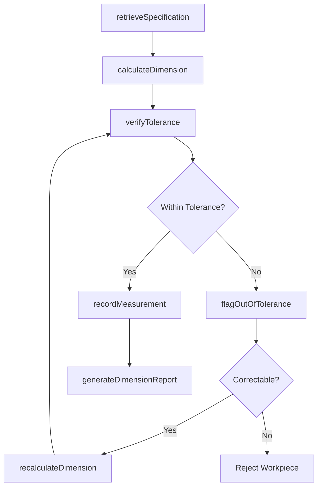
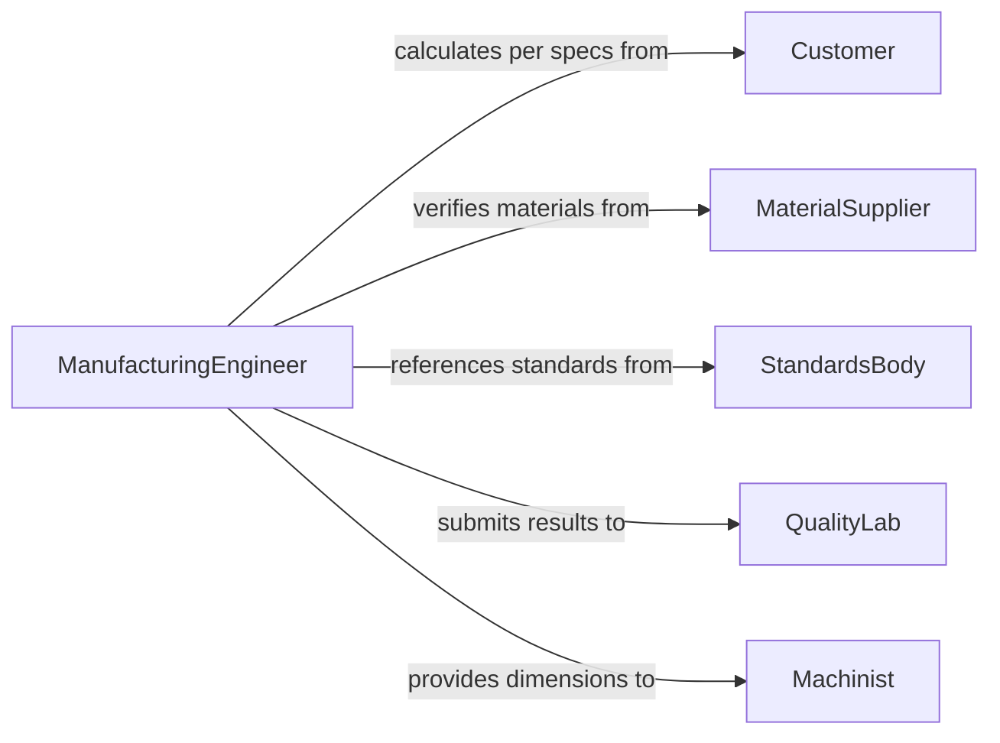

# Calculate Dimensions Workpieces Products Equipment

> Business-as-Code definition for calculating dimensions of workpieces, products, or equipment. Models the complete dimensional calculation lifecycle from specification review through measurement, computation, and tolerance verification.

## Overview

Calculating dimensions of workpieces, products, or equipment involves determining lengths, widths, heights, diameters, angles, and other geometric properties required for manufacturing, assembly, and quality assurance. This definition exposes actions for performing dimensional calculations, events for tracking measurement outcomes, and searches for retrieving specification and measurement data.

## Actors

| Actor | Description |
|-------|-------------|
| Customer | Provides product requirements and dimensional specifications |
| MaterialSupplier | Delivers raw materials with certified dimensional properties |
| EquipmentManufacturer | Produces machinery with known dimensional parameters |
| QualityLab | Performs independent dimensional verification and certification |
| StandardsBody | Publishes dimensional tolerancing standards such as ASME Y14.5 |

## Roles

| Role | Description |
|------|-------------|
| ManufacturingEngineer | Calculates dimensions required for production processes |
| QualityInspector | Verifies that calculated dimensions meet specification tolerances |
| Machinist | Uses calculated dimensions to set up and operate production equipment |
| DesignEngineer | Defines nominal dimensions and tolerance ranges in product drawings |

## Entities

| Entity | Description |
|--------|-------------|
| Workpiece | A raw or in-process item whose dimensions are being calculated |
| Dimension | A specific measurement value such as length, width, or diameter |
| Tolerance | The allowable variation range for a given dimension |
| Specification | The drawing or document defining required dimensions and tolerances |
| MeasurementRecord | A log of calculated or verified dimensional values |
| CalibrationCertificate | Documentation proving measurement instrument accuracy |

## Actions

| Action | Description |
|--------|-------------|
| retrieveSpecification | Load the drawing or spec document with target dimensions |
| calculateDimension | Compute a specific dimensional value from inputs and formulas |
| verifyTolerance | Check that a calculated dimension falls within the specified range |
| recordMeasurement | Log a dimensional calculation result with timestamp and method |
| flagOutOfTolerance | Mark a dimension that exceeds the allowable tolerance range |
| recalculateDimension | Recompute a dimension after input correction or specification change |
| generateDimensionReport | Produce a summary of all calculated dimensions for a workpiece |

## Events

| Event | Description |
|-------|-------------|
| specificationRetrieved | The target dimension specifications have been loaded |
| dimensionCalculated | A specific dimensional value has been computed |
| toleranceVerified | A calculated dimension has been confirmed within tolerance |
| measurementRecorded | A dimensional result has been logged in the measurement system |
| outOfToleranceFlagged | A dimension has been found outside the allowable range |
| dimensionRecalculated | A dimension has been recomputed after an input correction |
| dimensionReportGenerated | A comprehensive dimensional report has been produced |

## Searches

| Search | Description |
|--------|-------------|
| findMeasurements | List measurement records by workpiece, dimension type, or date |
| getSpecificationDimensions | Retrieve target dimensions and tolerances from a specification |
| findOutOfToleranceItems | Identify workpieces with dimensions outside allowable ranges |
| getDimensionHistory | Get historical measurement values for a specific dimension |

## Workflow



## Actor Relationships



## Usage

### Calling Actions

```typescript
import { calculateDimensionsWorkpiecesProductsEquipment } from '@headlessly/calculate-dimensions-workpieces-products-equipment'

const dimensions = calculateDimensionsWorkpiecesProductsEquipment()

// Retrieve specification and calculate a dimension
const spec = await dimensions.retrieveSpecification({
  drawingId: 'DWG-4021',
  revision: 'C',
  workpieceType: 'shaft-housing'
})

const result = await dimensions.calculateDimension({
  workpieceId: 'wp-8830',
  dimensionType: 'outer-diameter',
  inputs: { rawDiameter: 50.2, machiningAllowance: 0.15 },
  formula: 'rawDiameter - machiningAllowance'
})

// Verify tolerance and record
await dimensions.verifyTolerance({
  calculatedValue: result.value,
  nominal: 50.0,
  toleranceUpper: 0.10,
  toleranceLower: -0.05
})

await dimensions.recordMeasurement({
  workpieceId: 'wp-8830',
  dimensionType: 'outer-diameter',
  value: result.value,
  method: 'calculated'
})
```

### Event-Driven Automation

```typescript
// Alert quality team on out-of-tolerance dimensions
dimensions.outOfToleranceFlagged(async ({ workpieceId, dimensionType, deviation }) => {
  await notify({
    to: 'quality-inspection',
    message: `Workpiece ${workpieceId} dimension ${dimensionType} out of tolerance by ${deviation}`
  })
})

// Auto-generate reports on batch completion
dimensions.dimensionReportGenerated(async ({ workpieceId, reportId }) => {
  await archiveReport({ reportId, category: 'dimensional-inspection' })
})
```
