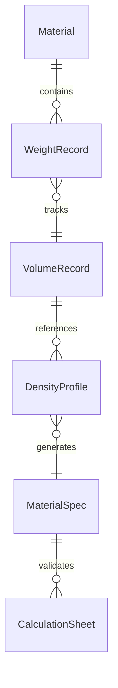
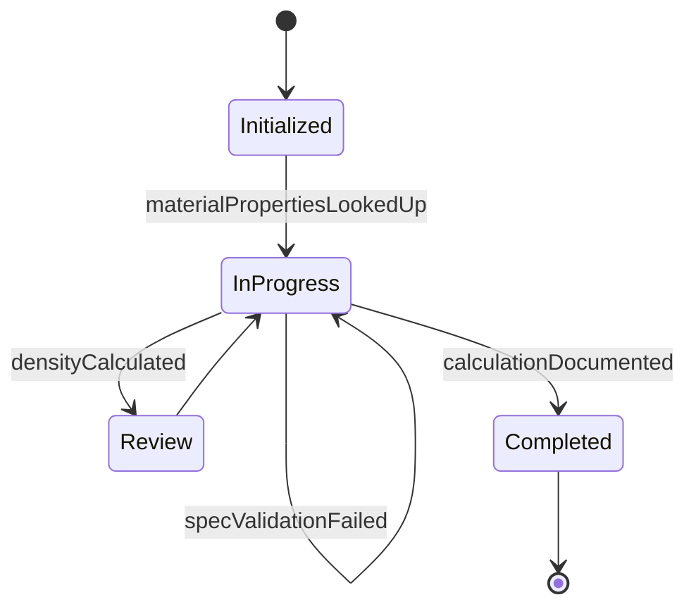
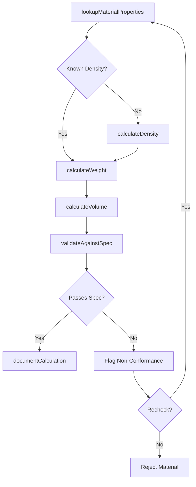
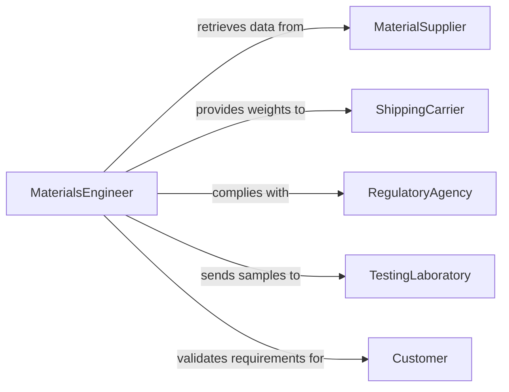

# Calculate Weights Volumes Characteristics Materials

> Business-as-Code definition for calculating weights, volumes, or other characteristics of materials. Models the complete material characterization lifecycle from property lookup through computation, validation, and documentation.

## Overview

Calculating weights, volumes, or other characteristics of materials involves determining physical properties such as mass, volume, density, and load capacity for raw materials, components, and finished goods. This definition exposes actions for performing material property calculations, events for tracking measurement outcomes, and searches for retrieving material data and calculation history.

## Actors

| Actor | Description |
|-------|-------------|
| MaterialSupplier | Provides raw materials with certified physical property data sheets |
| ShippingCarrier | Requires weight and volume data for freight classification |
| RegulatoryAgency | Enforces standards for material property declarations and labeling |
| TestingLaboratory | Performs independent verification of material characteristics |
| Customer | Specifies material property requirements for orders |

## Roles

| Role | Description |
|------|-------------|
| MaterialsEngineer | Calculates and validates material physical properties |
| WarehouseOperator | Uses weight and volume data for storage and handling decisions |
| QualityAnalyst | Verifies calculated material properties against specifications |
| ProductionPlanner | Uses material characteristics to plan batch sizes and processes |

## Entities

| Entity | Description |
|--------|-------------|
| Material | A raw material, compound, or substance with measurable properties |
| WeightRecord | A documented mass measurement for a specific material quantity |
| VolumeRecord | A documented volume measurement for a specific material quantity |
| DensityProfile | The mass-per-unit-volume characteristic of a material |
| MaterialSpec | The specification defining required physical property ranges |
| CalculationSheet | A worksheet documenting formulas, inputs, and computed results |

## Actions

| Action | Description |
|--------|-------------|
| lookupMaterialProperties | Retrieve known physical properties from the material database |
| calculateWeight | Compute the mass of a material given volume and density |
| calculateVolume | Compute the volume of a material given mass and density |
| calculateDensity | Derive density from measured mass and volume |
| validateAgainstSpec | Compare calculated properties against specification requirements |
| convertUnits | Transform property values between measurement unit systems |
| documentCalculation | Record the calculation method, inputs, and results |

## Events

| Event | Description |
|-------|-------------|
| materialPropertiesLookedUp | Known physical properties have been retrieved for a material |
| weightCalculated | The mass of a material quantity has been computed |
| volumeCalculated | The volume of a material quantity has been computed |
| densityCalculated | The density of a material has been derived |
| specValidationPassed | Calculated properties meet specification requirements |
| specValidationFailed | Calculated properties do not meet specification requirements |
| calculationDocumented | The calculation has been recorded with full audit trail |

## Searches

| Search | Description |
|--------|-------------|
| findMaterialProperties | Look up physical properties by material type, grade, or identifier |
| getCalculationHistory | Retrieve past calculations for a material or batch |
| findOutOfSpecMaterials | Identify materials whose calculated properties failed validation |
| getUnitConversions | Retrieve conversion factors for material property units |


## Entity Relationships



## State Diagram


## Workflow



## Actor Relationships



## Usage

### Calling Actions

```typescript
import { calculateWeightsVolumesCharacteristicsMaterials } from '@headlessly/calculate-weights-volumes-characteristics-materials'

const materials = calculateWeightsVolumesCharacteristicsMaterials()

// Look up material properties and calculate weight
const properties = await materials.lookupMaterialProperties({
  materialId: 'steel-304L',
  grade: 'austenitic-stainless'
})

const weight = await materials.calculateWeight({
  materialId: 'steel-304L',
  volume: 0.025,
  volumeUnit: 'cubic-meters',
  density: properties.density
})

// Calculate volume for a known mass
const volume = await materials.calculateVolume({
  materialId: 'steel-304L',
  mass: 196.25,
  massUnit: 'kg',
  density: properties.density
})

// Validate against specification
await materials.validateAgainstSpec({
  materialId: 'steel-304L',
  batchId: 'batch-7742',
  calculatedWeight: weight.value,
  specId: 'SPEC-2210'
})
```

### Event-Driven Automation

```typescript
// Alert warehouse when weight exceeds handling limits
materials.weightCalculated(async ({ materialId, weight, unit }) => {
  if (weight > 2000 && unit === 'kg') {
    await notify({
      to: 'warehouse-ops',
      message: `Material ${materialId} weighs ${weight}kg - requires heavy equipment for handling`
    })
  }
})

// Auto-flag non-conforming materials
materials.specValidationFailed(async ({ materialId, batchId, deviation }) => {
  await createNonConformanceReport({
    materialId,
    batchId,
    deviation,
    priority: 'high'
  })
})
```
