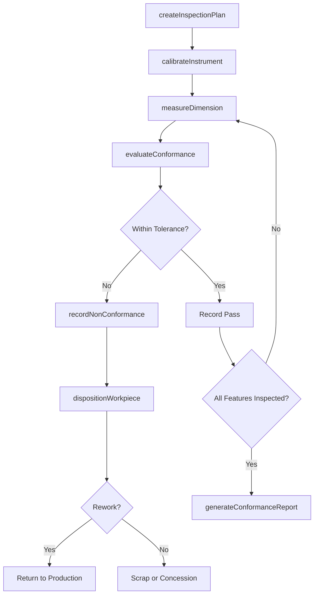
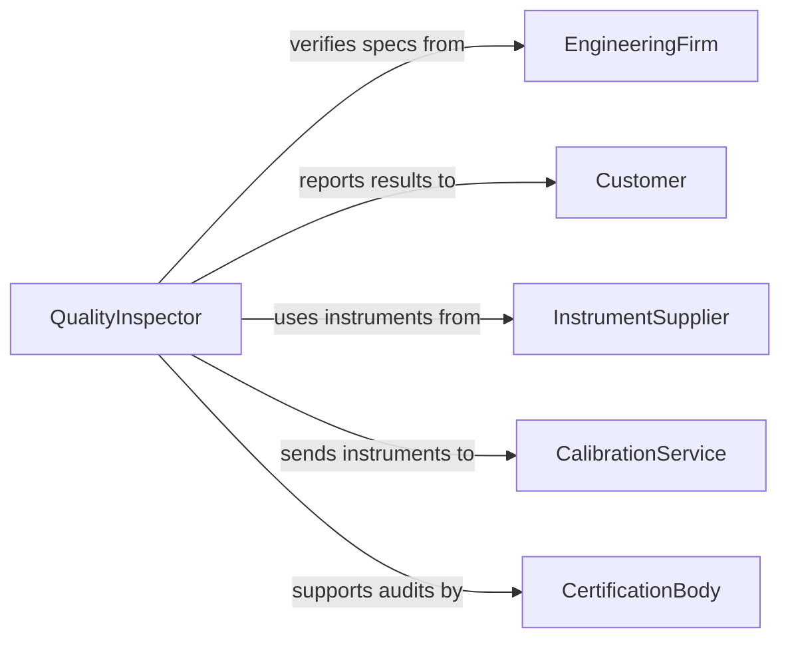

# Measure Dimensions Completed Products Workpieces

> Business-as-Code definition for measuring dimensions of completed products or workpieces to verify conformance to specifications. Models dimensional inspection workflows from measurement capture through conformance reporting.

## Overview

Dimensional measurement of completed products and workpieces is a core quality assurance activity in manufacturing. This definition exposes actions for capturing linear, angular, and geometric measurements using precision instruments, comparing results against engineering tolerances, and documenting conformance. Events enable automated routing of non-conforming parts and statistical process control integration.

## Actors

| Actor | Description |
|-------|-------------|
| Customer | Specifies dimensional requirements and accepts finished products |
| InstrumentSupplier | Provides calipers, micrometers, CMMs, and gauging systems |
| CalibrationService | Certifies measurement instrument accuracy to traceable standards |
| EngineeringFirm | Produces drawings and specifications with dimensional tolerances |
| CertificationBody | Audits dimensional quality systems for industry compliance |

## Roles

| Role | Description |
|------|-------------|
| QualityInspector | Performs dimensional measurements and records results |
| ManufacturingEngineer | Defines inspection plans and critical measurement points |
| MetrologySpecialist | Manages instrument calibration and measurement uncertainty |
| ProductionSupervisor | Coordinates inspection scheduling with production flow |
| QualityManager | Reviews conformance data and authorizes product disposition |

## Entities

| Entity | Description |
|--------|-------------|
| Workpiece | A completed product or part subject to dimensional inspection |
| DimensionalMeasurement | A recorded measurement value for a specific feature |
| InspectionPlan | A document specifying which dimensions to measure and how |
| Tolerance | The allowable deviation range for a measured dimension |
| GaugingInstrument | A precision tool used to capture dimensional measurements |
| ConformanceReport | Documentation of dimensional inspection results and disposition |

## Actions

| Action | Description |
|--------|-------------|
| measureDimension | Capture a specific dimensional measurement on a workpiece |
| createInspectionPlan | Define the measurement points and instruments for a product type |
| evaluateConformance | Compare measured dimensions against specified tolerances |
| recordNonConformance | Document a dimension that falls outside tolerance |
| dispositionWorkpiece | Decide whether to accept, rework, or scrap a non-conforming part |
| generateConformanceReport | Produce a dimensional inspection report for a batch or lot |
| calibrateInstrument | Verify gauging instrument accuracy against traceable standards |

## Events

| Event | Description |
|-------|-------------|
| dimensionMeasured | A dimensional measurement has been captured for a workpiece |
| conformanceEvaluated | A workpiece has been assessed against dimensional tolerances |
| nonConformanceRecorded | A dimension outside tolerance has been documented |
| workpieceDispositioned | A non-conforming workpiece has been assigned a disposition |
| conformanceReportGenerated | A dimensional inspection report has been produced |
| inspectionPlanCreated | A new inspection plan has been defined for a product type |
| instrumentCalibrated | A gauging instrument has been verified and adjusted |

## Searches

| Search | Description |
|--------|-------------|
| findMeasurements | Retrieve measurements by workpiece, feature, date, or value range |
| getNonConformances | Find workpieces with dimensions outside tolerance |
| getInspectionPlans | List inspection plans by product type or revision |
| getConformanceStatistics | Get pass/fail rates and Cpk values for a production run |

## Workflow



## Actor Relationships



## Usage

### Calling Actions

```typescript
import { measureDimensionsCompletedProductsWorkpieces } from '@headlessly/measure-dimensions-completed-products-workpieces'

const inspection = measureDimensionsCompletedProductsWorkpieces()

// Measure a critical dimension
const measurement = await inspection.measureDimension({
  workpieceId: 'WP-2026-0447',
  feature: 'bore-diameter',
  nominalValue: 25.000,
  measuredValue: 25.012,
  unit: 'mm',
  instrumentId: 'CMM-01'
})

// Evaluate conformance against tolerance
const result = await inspection.evaluateConformance({
  measurementId: measurement.id,
  toleranceId: 'TOL-BORE-25H7'
})

// Generate report for the production lot
await inspection.generateConformanceReport({
  lotId: 'LOT-2026-0447',
  includeStatistics: true
})
```

### Event-Driven Automation

```typescript
// Route non-conforming parts for disposition
inspection.nonConformanceRecorded(async ({ workpieceId, feature, deviation }) => {
  await notify({
    to: 'quality-engineering',
    message: `Workpiece ${workpieceId}: ${feature} deviates by ${deviation}mm`
  })
})

// Track process capability
inspection.conformanceReportGenerated(async ({ lotId, cpk }) => {
  if (cpk < 1.33) {
    await notify({
      to: 'manufacturing-engineering',
      message: `Lot ${lotId} Cpk is ${cpk}, below 1.33 threshold - process review required`
    })
  }
})
```
