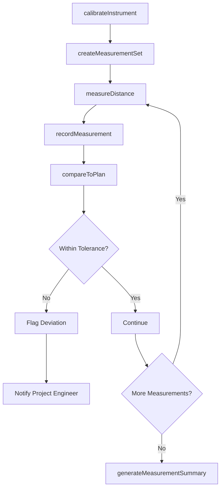
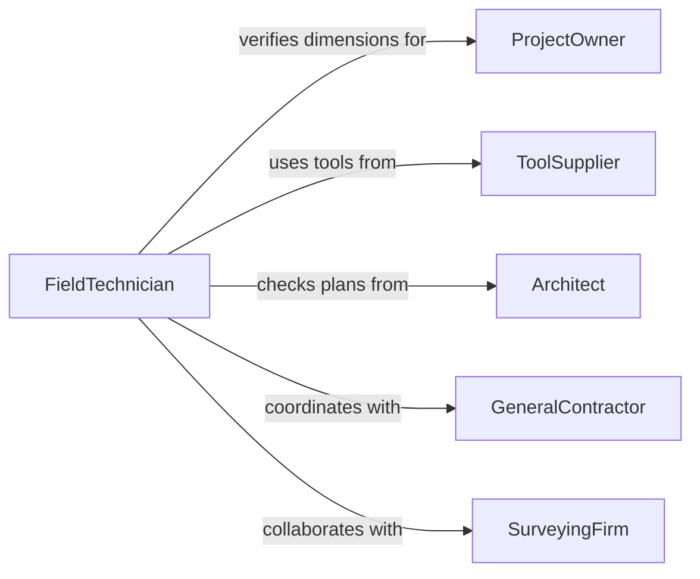

# Measure Distances Dimensions

> Business-as-Code definition for measuring distances or dimensions. Models general-purpose spatial measurement workflows used across construction, engineering, surveying, and field operations.

## Overview

Measuring distances and dimensions is a broadly applicable activity that spans construction layout, facility management, field surveying, and equipment installation. This definition exposes actions for capturing linear and spatial measurements using laser, tape, and digital tools, recording measurements with context, and generating measurement summaries. Events support automated plan verification and as-built documentation workflows.

## Actors

| Actor | Description |
|-------|-------------|
| ProjectOwner | Commissions work requiring dimensional verification |
| ToolSupplier | Provides laser measurers, tape measures, and digital instruments |
| Architect | Produces plans and drawings with specified dimensions |
| GeneralContractor | Coordinates construction activities requiring dimensional accuracy |
| SurveyingFirm | Performs precision distance measurements for land and structures |

## Roles

| Role | Description |
|------|-------------|
| FieldTechnician | Performs on-site distance and dimension measurements |
| ProjectEngineer | Specifies required measurements and reviews collected data |
| DataRecorder | Logs measurement values and maintains documentation |
| SiteSupervisor | Coordinates measurement activities within the work schedule |

## Entities

| Entity | Description |
|--------|-------------|
| Measurement | A recorded distance or dimension value with location context |
| MeasurementPoint | A defined location from which or to which distances are measured |
| ReferencePlan | A drawing or specification defining expected dimensions |
| MeasuringInstrument | A tool used to capture distance or dimension data |
| MeasurementSet | A grouped collection of related measurements for an area or task |
| Deviation | The difference between a measured value and the planned dimension |

## Actions

| Action | Description |
|--------|-------------|
| measureDistance | Capture the distance between two defined points |
| measureDimension | Record the size of an object, space, or structural element |
| compareToPlan | Check a measured value against the reference plan dimension |
| recordMeasurement | Log a measurement with location, instrument, and operator data |
| createMeasurementSet | Group related measurements for a specific task or area |
| generateMeasurementSummary | Produce a report of all measurements and deviations for a set |
| calibrateInstrument | Verify and adjust a measuring instrument against a known reference |

## Events

| Event | Description |
|-------|-------------|
| distanceMeasured | A distance between two points has been captured |
| dimensionMeasured | A size measurement has been recorded |
| comparedToPlan | A measurement has been checked against the reference plan |
| measurementRecorded | A measurement has been logged with full metadata |
| measurementSetCreated | A collection of related measurements has been grouped |
| measurementSummaryGenerated | A report of measurements and deviations has been produced |
| instrumentCalibrated | A measuring instrument has been verified and adjusted |

## Searches

| Search | Description |
|--------|-------------|
| findMeasurements | Retrieve measurements by location, date, instrument, or value range |
| getMeasurementSets | List measurement sets by project, area, or status |
| getDeviations | Find measurements that differ from plan dimensions beyond tolerance |
| getInstrumentHistory | Retrieve calibration and usage history for a specific instrument |

## Workflow



## Actor Relationships



## Usage

### Calling Actions

```typescript
import { measureDistancesDimensions } from '@headlessly/measure-distances-dimensions'

const measurements = measureDistancesDimensions()

// Create a measurement set for a room
const set = await measurements.createMeasurementSet({
  projectId: 'PRJ-OFFICE-RENO-2026',
  area: 'conference-room-b',
  referencePlanId: 'DWG-FLOOR-02-REV-C'
})

// Measure room width
const width = await measurements.measureDistance({
  measurementSetId: set.id,
  fromPoint: 'wall-north',
  toPoint: 'wall-south',
  measuredValue: 7.32,
  unit: 'm',
  instrumentId: 'laser-measure-04'
})

// Compare to plan
await measurements.compareToPlan({
  measurementId: width.id,
  plannedValue: 7.30,
  tolerance: 0.05,
  unit: 'm'
})
```

### Event-Driven Automation

```typescript
// Alert on deviations from plan
measurements.comparedToPlan(async ({ measurementId, deviation, tolerance, area }) => {
  if (Math.abs(deviation) > tolerance) {
    await notify({
      to: 'project-engineering',
      message: `Deviation of ${deviation}m in ${area} exceeds tolerance of ${tolerance}m`
    })
  }
})

// Auto-generate summary when set is complete
measurements.measurementRecorded(async ({ measurementSetId }) => {
  const set = await measurements.getMeasurementSets({ id: measurementSetId })
  if (set.status === 'complete') {
    await measurements.generateMeasurementSummary({ measurementSetId })
  }
})
```
