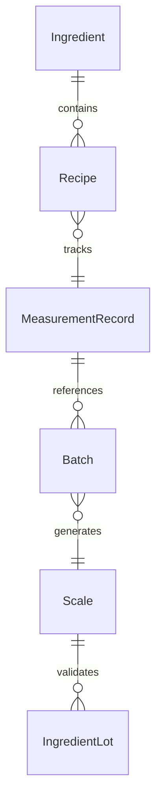
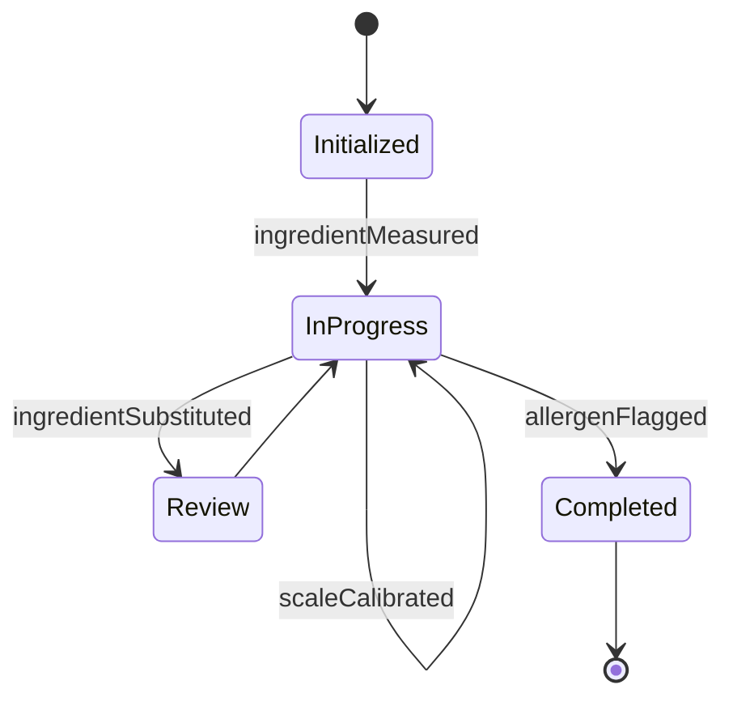
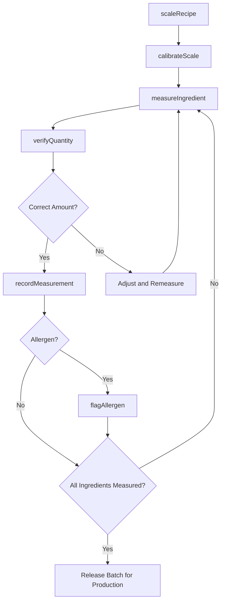
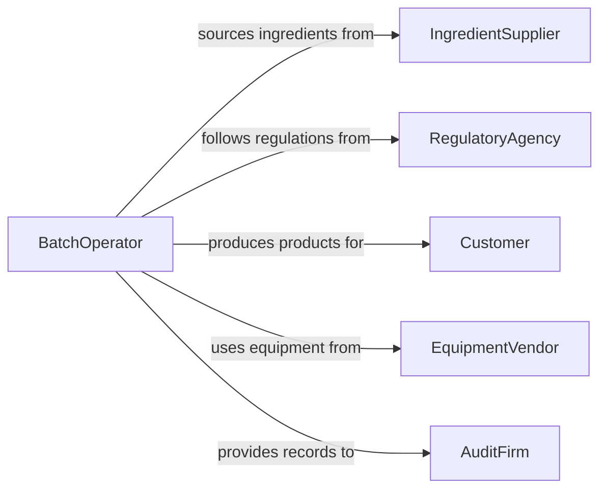

# Measure Ingredients

> Business-as-Code definition for measuring ingredients. Models the precision measurement of raw components for food production, pharmaceutical compounding, and chemical manufacturing.

## Overview

Measuring ingredients is a critical step in any formulation-based production process, ensuring that recipes, formulas, and batch specifications are followed accurately. This definition exposes actions for weighing and volumetrically measuring ingredients, verifying quantities against recipes, and logging measurement data for traceability. Events support automated batch tracking and allergen management workflows.

## Actors

| Actor | Description |
|-------|-------------|
| IngredientSupplier | Provides raw ingredients with certificates of analysis |
| RegulatoryAgency | Enforces labeling, dosage, and ingredient composition requirements |
| Customer | Consumes finished products and expects consistent formulation |
| EquipmentVendor | Supplies scales, dispensers, and volumetric measurement tools |
| AuditFirm | Inspects ingredient measurement practices for compliance |

## Roles

| Role | Description |
|------|-------------|
| BatchOperator | Measures and dispenses ingredients per recipe instructions |
| Formulator | Designs recipes and specifies ingredient quantities |
| QualityAssuranceTechnician | Verifies measurement accuracy and ingredient identity |
| ProductionManager | Schedules batches and ensures ingredient availability |

## Entities

| Entity | Description |
|--------|-------------|
| Ingredient | A raw material to be measured for use in a batch |
| Recipe | A formula specifying ingredient types and quantities |
| MeasurementRecord | A log entry documenting the quantity of an ingredient dispensed |
| Batch | A production run requiring a specific set of measured ingredients |
| Scale | A calibrated instrument used for weighing ingredients |
| IngredientLot | A traceable supply lot of a specific ingredient |

## Actions

| Action | Description |
|--------|-------------|
| measureIngredient | Weigh or volumetrically measure an ingredient for a batch |
| verifyQuantity | Confirm that the measured amount matches the recipe specification |
| recordMeasurement | Log the measured quantity with operator, timestamp, and lot info |
| substituteIngredient | Replace an ingredient with an approved alternative and adjust quantity |
| scaleRecipe | Adjust all ingredient quantities proportionally for a different batch size |
| calibrateScale | Verify and adjust scale accuracy with certified reference weights |
| flagAllergen | Mark an ingredient measurement involving a known allergen |

## Events

| Event | Description |
|-------|-------------|
| ingredientMeasured | An ingredient quantity has been captured for a batch |
| quantityVerified | A measured quantity has been confirmed against the recipe |
| measurementRecorded | An ingredient measurement has been logged with traceability data |
| ingredientSubstituted | An alternative ingredient has been used in place of the original |
| recipeScaled | Ingredient quantities have been adjusted for a different batch size |
| scaleCalibrated | A measurement scale has been verified and adjusted |
| allergenFlagged | An allergen-containing ingredient measurement has been marked |

## Searches

| Search | Description |
|--------|-------------|
| findMeasurements | Retrieve measurement records by batch, ingredient, operator, or date |
| getRecipeIngredients | List required ingredients and quantities for a specific recipe |
| getLotUsage | Track which batches consumed ingredients from a specific lot |
| getAllergenMeasurements | Find measurements involving allergen-containing ingredients |


## Entity Relationships



## State Diagram


## Workflow



## Actor Relationships



## Usage

### Calling Actions

```typescript
import { measureIngredients } from '@headlessly/measure-ingredients'

const ingredients = measureIngredients()

// Scale recipe for batch size
const scaled = await ingredients.scaleRecipe({
  recipeId: 'RCP-SOURDOUGH-001',
  targetBatchSize: 50,
  unit: 'kg'
})

// Measure flour ingredient
const measurement = await ingredients.measureIngredient({
  batchId: 'BATCH-2026-0312',
  ingredientId: 'ING-FLOUR-BREAD',
  lotId: 'LOT-FL-2026-044',
  targetQuantity: 30.0,
  measuredQuantity: 30.05,
  unit: 'kg',
  scaleId: 'scale-bakery-01'
})

// Verify against recipe
await ingredients.verifyQuantity({
  measurementId: measurement.id,
  recipeId: 'RCP-SOURDOUGH-001',
  tolerance: 0.5
})
```

### Event-Driven Automation

```typescript
// Track allergen measurements
ingredients.allergenFlagged(async ({ batchId, ingredientId, allergenType }) => {
  await notify({
    to: 'quality-assurance',
    message: `Batch ${batchId} contains allergen: ${allergenType} from ingredient ${ingredientId}`
  })
})

// Auto-verify all measurements when batch is complete
ingredients.measurementRecorded(async ({ batchId }) => {
  const pending = await ingredients.findMeasurements({ batchId, status: 'unverified' })
  if (pending.length === 0) {
    await notify({
      to: 'production-manager',
      message: `All ingredients for batch ${batchId} measured and verified`
    })
  }
})
```
