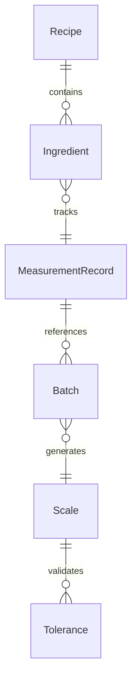
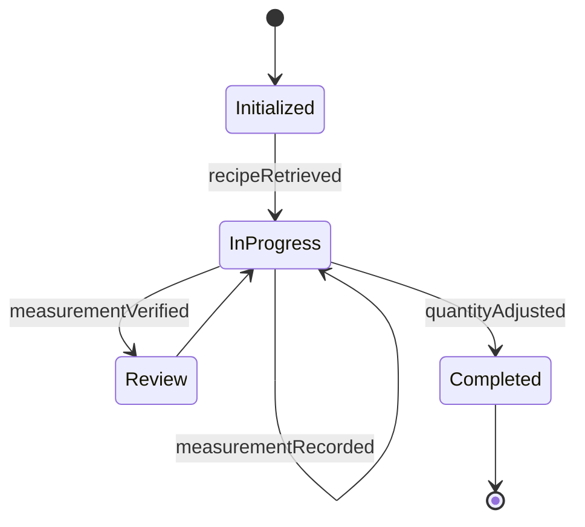
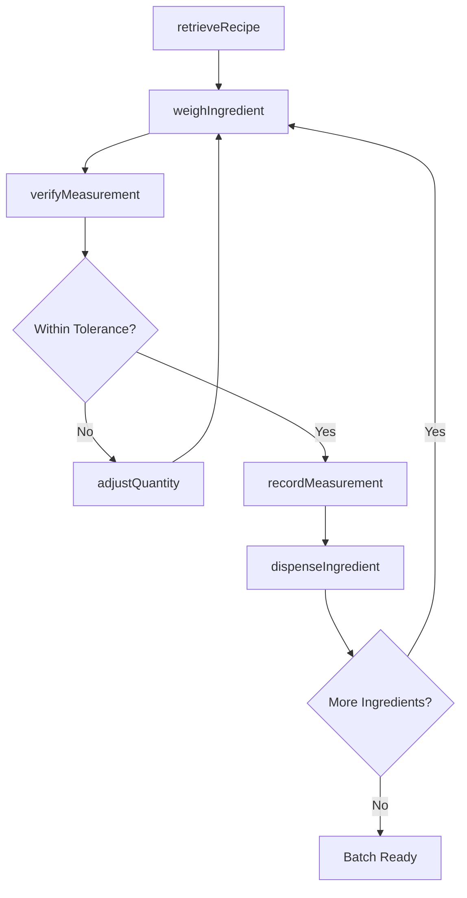
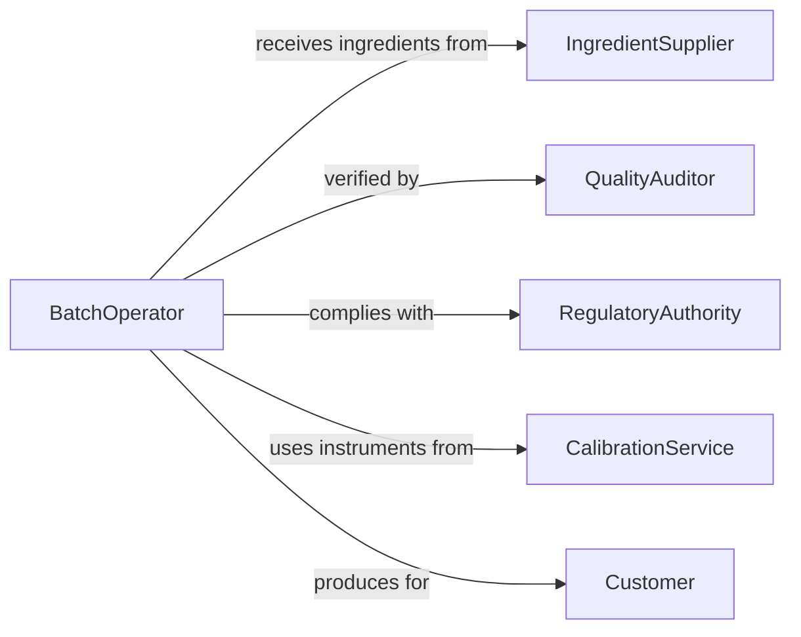

# Measure Ingredients Substances Be Used

> Business-as-Code definition for measuring ingredients or substances to be used in production processes. Models the complete ingredient measurement lifecycle from recipe retrieval through weighing, dispensing, verification, and batch documentation.

## Overview

Measuring ingredients or substances to be used in production processes involves precisely weighing, volumetrically measuring, or counting raw materials and chemical compounds according to formulas, recipes, or batch instructions. This definition exposes actions for dispensing and verifying ingredient quantities, events for tracking measurement accuracy, and searches for retrieving recipe and batch measurement data.

## Actors

| Actor | Description |
|-------|-------------|
| IngredientSupplier | Provides raw materials and substances with certified purity and specifications |
| QualityAuditor | Inspects measurement practices and verifies batch compliance |
| RegulatoryAuthority | Enforces measurement accuracy standards in food, pharmaceutical, or chemical production |
| Customer | Receives finished products that depend on precise ingredient measurement |
| CalibrationService | Certifies and maintains measurement instruments to required standards |

## Roles

| Role | Description |
|------|-------------|
| BatchOperator | Weighs and measures ingredients according to batch formulas |
| FormulationChemist | Defines ingredient quantities and acceptable measurement tolerances |
| QualityController | Verifies that measured quantities match formula specifications |
| WarehouseAttendant | Stages and issues ingredients from storage for measurement |
| ProductionSupervisor | Oversees the measurement and dispensing process for accuracy |

## Entities

| Entity | Description |
|--------|-------------|
| Recipe | A formula specifying ingredient types and quantities for a batch |
| Ingredient | A raw material or substance to be measured and added to a batch |
| MeasurementRecord | A documented weight or volume observation for a specific ingredient |
| Batch | A production run requiring a defined set of measured ingredients |
| Scale | A calibrated weighing instrument used to measure ingredient mass |
| Tolerance | The acceptable deviation range for an ingredient measurement |

## Actions

| Action | Description |
|--------|-------------|
| retrieveRecipe | Load the formula specifying ingredients and their required quantities |
| weighIngredient | Measure the mass of an ingredient using a calibrated scale |
| measureVolume | Determine the volume of a liquid ingredient using calibrated vessels |
| verifyMeasurement | Confirm that a measured quantity falls within the specified tolerance |
| dispenseIngredient | Release the measured ingredient into the production batch |
| recordMeasurement | Log the measured quantity with instrument, operator, and timestamp |
| adjustQuantity | Modify the measured amount to correct for deviations or formula changes |

## Events

| Event | Description |
|-------|-------------|
| recipeRetrieved | The batch formula and ingredient list have been loaded |
| ingredientWeighed | An ingredient mass has been measured on a calibrated scale |
| volumeMeasured | A liquid ingredient volume has been determined |
| measurementVerified | A measured quantity has been confirmed within tolerance |
| ingredientDispensed | A measured ingredient has been released into the batch |
| measurementRecorded | An ingredient measurement has been logged with full traceability |
| quantityAdjusted | An ingredient quantity has been corrected or modified |

## Searches

| Search | Description |
|--------|-------------|
| findRecipes | List recipes by product, ingredient, or batch type |
| getMeasurementHistory | Retrieve past measurements for an ingredient or batch |
| findOutOfToleranceMeasurements | Identify measurements that exceeded allowable deviation |
| getBatchIngredients | Get the complete list of measured ingredients for a specific batch |


## Entity Relationships



## State Diagram


## Workflow



## Actor Relationships



## Usage

### Calling Actions

```typescript
import { measureIngredientsSubstancesBeUsed } from '@headlessly/measure-ingredients-substances-be-used'

const ingredients = measureIngredientsSubstancesBeUsed()

// Retrieve recipe and weigh first ingredient
const recipe = await ingredients.retrieveRecipe({
  productId: 'product-A220',
  batchSize: 500,
  unit: 'kg'
})

const measurement = await ingredients.weighIngredient({
  batchId: 'batch-1140',
  ingredientId: 'sodium-bicarbonate',
  targetWeight: 12.5,
  unit: 'kg',
  scaleId: 'scale-lab-03'
})

// Verify and dispense
await ingredients.verifyMeasurement({
  measurementId: measurement.id,
  targetWeight: 12.5,
  tolerancePercent: 1.0
})

await ingredients.dispenseIngredient({
  measurementId: measurement.id,
  batchId: 'batch-1140',
  dispensedBy: 'operator-jones'
})
```

### Event-Driven Automation

```typescript
// Flag out-of-tolerance measurements for supervisor review
ingredients.measurementVerified(async ({ measurementId, ingredientId, withinTolerance }) => {
  if (!withinTolerance) {
    await notify({
      to: 'production-supervisor',
      message: `Measurement ${measurementId} for ${ingredientId} is out of tolerance - requires correction`
    })
  }
})

// Auto-log batch completion when all ingredients dispensed
ingredients.ingredientDispensed(async ({ batchId }) => {
  const remaining = await ingredients.getBatchIngredients({ batchId, status: 'pending' })
  if (remaining.length === 0) {
    await completeBatchPrep({ batchId, timestamp: new Date().toISOString() })
  }
})
```
