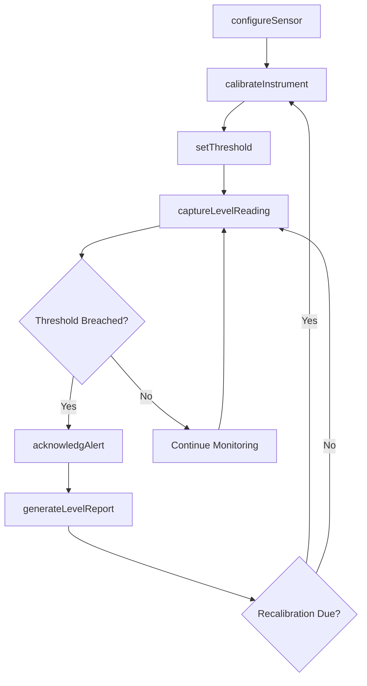
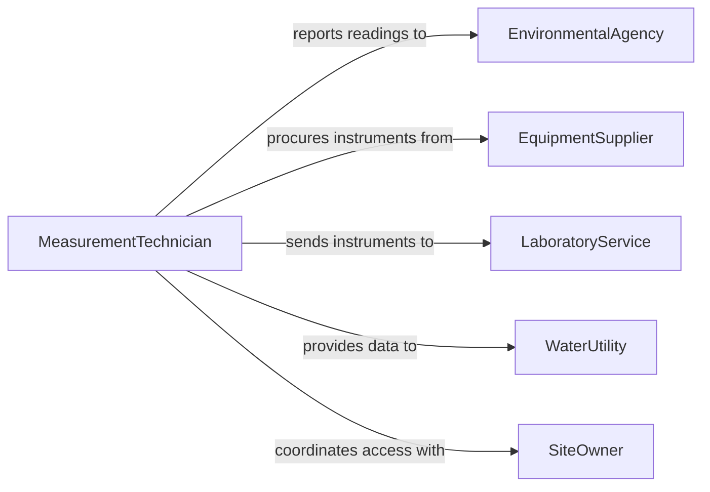

# Measure Level Depth Water Liquids

> Business-as-Code definition for measuring the level or depth of water and other liquids. Models sensor-based and manual measurement workflows across industrial, environmental, and utility contexts.

## Overview

Measuring the level or depth of water and other liquids is critical for process control, environmental monitoring, and safety compliance. This definition exposes actions for capturing liquid measurements from tanks, reservoirs, wells, and pipelines, events for threshold-based alerting, and searches for historical measurement data retrieval.

## Actors

| Actor | Description |
|-------|-------------|
| EnvironmentalAgency | Regulatory body requiring water level reporting |
| EquipmentSupplier | Provides level sensors, gauges, and monitoring hardware |
| LaboratoryService | Performs calibration and verification of measurement instruments |
| WaterUtility | Consumes level data for distribution and treatment operations |
| SiteOwner | Property or facility owner responsible for liquid storage |

## Roles

| Role | Description |
|------|-------------|
| MeasurementTechnician | Performs manual and automated liquid level readings |
| ProcessEngineer | Designs measurement protocols and threshold parameters |
| QualityInspector | Verifies measurement accuracy against calibration standards |
| OperationsManager | Oversees measurement schedules and response procedures |

## Entities

| Entity | Description |
|--------|-------------|
| LevelReading | A single measurement of liquid level or depth at a specific point |
| MeasurementPoint | A designated location where liquid levels are monitored |
| Sensor | An instrument configured to detect and report liquid levels |
| Threshold | A defined limit that triggers alerts when breached |
| CalibrationRecord | Documentation of sensor accuracy verification |
| MeasurementLog | Chronological record of all readings at a measurement point |

## Actions

| Action | Description |
|--------|-------------|
| captureLevelReading | Record the current liquid level at a measurement point |
| configureSensor | Set up or adjust a sensor for a specific measurement point |
| setThreshold | Define alert boundaries for minimum and maximum levels |
| calibrateInstrument | Verify and adjust instrument accuracy against a known standard |
| generateLevelReport | Produce a summary of level readings over a specified period |
| acknowledgAlert | Confirm receipt and handling of a threshold breach notification |
| scheduleMeasurement | Set up recurring measurement intervals for a point |

## Events

| Event | Description |
|-------|-------------|
| levelReadingCaptured | A new liquid level measurement has been recorded |
| thresholdBreached | A reading has exceeded the defined minimum or maximum level |
| sensorConfigured | A sensor has been set up or reconfigured at a measurement point |
| instrumentCalibrated | An instrument calibration has been completed and documented |
| levelReportGenerated | A periodic level summary report has been produced |
| alertAcknowledged | A threshold breach alert has been confirmed and handled |
| measurementScheduled | A recurring measurement interval has been established |

## Searches

| Search | Description |
|--------|-------------|
| findLevelReadings | Retrieve readings by measurement point, date range, or value range |
| getMeasurementPoints | List measurement points by location, sensor type, or status |
| getThresholdBreaches | Find readings that exceeded configured thresholds |
| getCalibrationHistory | Retrieve calibration records for a specific instrument |

## Workflow



## Actor Relationships



## Usage

### Calling Actions

```typescript
import { measureLevelDepthWaterLiquids } from '@headlessly/measure-level-depth-water-liquids'

const levels = measureLevelDepthWaterLiquids()

// Configure a sensor at a reservoir measurement point
await levels.configureSensor({
  measurementPointId: 'reservoir-north-01',
  sensorType: 'ultrasonic',
  unit: 'meters',
  samplingInterval: 300
})

// Set alert thresholds
await levels.setThreshold({
  measurementPointId: 'reservoir-north-01',
  minLevel: 2.5,
  maxLevel: 18.0,
  unit: 'meters'
})

// Capture a level reading
const reading = await levels.captureLevelReading({
  measurementPointId: 'reservoir-north-01',
  value: 14.3,
  unit: 'meters',
  method: 'automated'
})
```

### Event-Driven Automation

```typescript
// Alert on threshold breach
levels.thresholdBreached(async ({ measurementPointId, value, threshold }) => {
  await notify({
    to: 'operations-team',
    message: `Level at ${measurementPointId} is ${value}m, outside range ${threshold.min}-${threshold.max}m`
  })
})

// Auto-generate weekly reports
levels.levelReadingCaptured(async ({ measurementPointId, timestamp }) => {
  if (isEndOfWeek(timestamp)) {
    await levels.generateLevelReport({
      measurementPointId,
      period: 'weekly'
    })
  }
})
```
