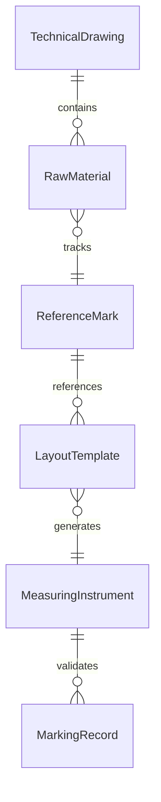
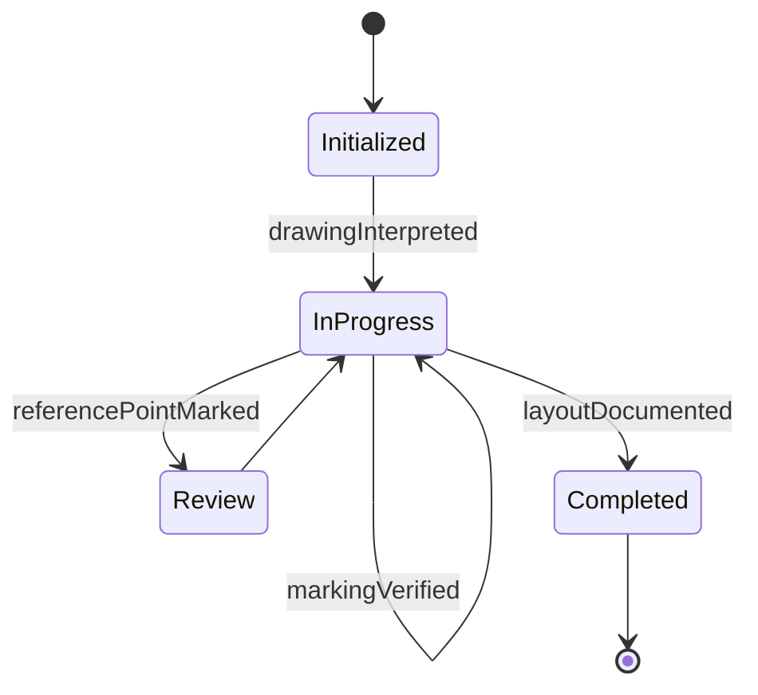
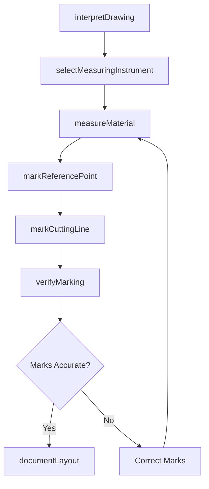
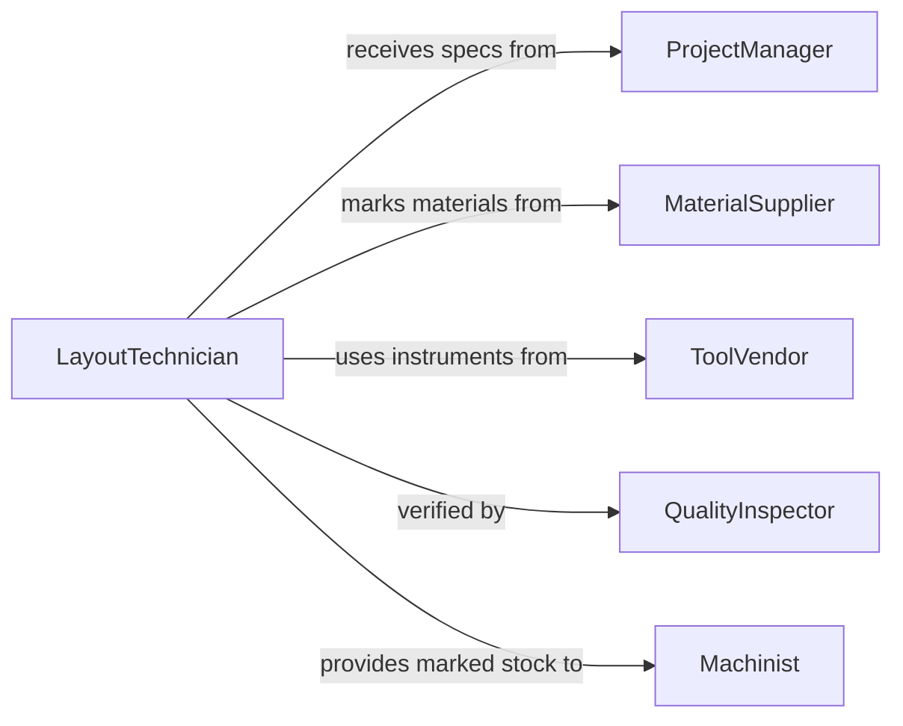

# Measure Materials Mark Reference Points

> Business-as-Code definition for measuring materials to mark reference points, cutting lines, or other indicators. Models the complete layout and marking lifecycle from drawing interpretation through measurement, marking, and verification.

## Overview

Measuring materials to mark reference points, cutting lines, or other indicators involves interpreting technical drawings, using precision instruments to transfer dimensions onto raw materials, and marking layout lines that guide subsequent cutting, drilling, or assembly operations. This definition exposes actions for performing layout measurements and marking operations, events for tracking marking accuracy, and searches for retrieving layout data and job specifications.

## Actors

| Actor | Description |
|-------|-------------|
| ProjectManager | Assigns layout work and provides job specifications and priorities |
| MaterialSupplier | Delivers raw stock that requires measurement and marking before fabrication |
| ToolVendor | Provides measuring and marking instruments such as calipers and scribers |
| QualityInspector | Verifies that marked reference points match drawing specifications |
| Customer | Specifies the product requirements that drive layout dimensions |

## Roles

| Role | Description |
|------|-------------|
| LayoutTechnician | Measures materials and marks reference points per technical drawings |
| Machinist | Uses marked reference points to guide cutting and machining operations |
| ShopForeman | Coordinates workflow and prioritizes layout tasks across the shop |
| DraftsPerson | Creates and maintains the technical drawings referenced during layout |

## Entities

| Entity | Description |
|--------|-------------|
| TechnicalDrawing | A dimensioned plan showing required reference points and cut lines |
| RawMaterial | An unprocessed piece of stock to be measured and marked |
| ReferenceMark | A point, line, or indicator transferred onto the material surface |
| LayoutTemplate | A reusable pattern for transferring common marking configurations |
| MeasuringInstrument | A calibrated tool such as a tape, rule, caliper, or square |
| MarkingRecord | Documentation of marked reference points with measurements and tolerances |

## Actions

| Action | Description |
|--------|-------------|
| interpretDrawing | Review a technical drawing to identify required reference points and lines |
| selectMeasuringInstrument | Choose the appropriate instrument for the required measurement precision |
| measureMaterial | Take a physical measurement on the raw material surface |
| markReferencePoint | Transfer a measured dimension onto the material as a visible indicator |
| markCuttingLine | Scribe or draw a line on the material surface to guide cutting |
| verifyMarking | Confirm that all marked points and lines match drawing specifications |
| documentLayout | Record the completed layout with measurements, marks, and deviations |

## Events

| Event | Description |
|-------|-------------|
| drawingInterpreted | The technical drawing has been reviewed and dimensions identified |
| instrumentSelected | A measuring instrument has been chosen for the task |
| materialMeasured | A physical measurement has been taken on the material surface |
| referencePointMarked | A reference point has been transferred onto the material |
| cuttingLineMarked | A cutting guide line has been scribed onto the material surface |
| markingVerified | All marks have been confirmed to match drawing specifications |
| layoutDocumented | The completed layout has been recorded with full traceability |

## Searches

| Search | Description |
|--------|-------------|
| findLayoutRecords | List layout records by job, material type, or date |
| getDrawingDimensions | Retrieve required dimensions and reference points from a drawing |
| findVerificationResults | Identify layouts that passed or failed marking verification |
| getInstrumentCalibrationStatus | Check calibration currency for measuring instruments |


## Entity Relationships



## State Diagram


## Workflow



## Actor Relationships



## Usage

### Calling Actions

```typescript
import { measureMaterialsMarkReferencePoints } from '@headlessly/measure-materials-mark-reference-points'

const layout = measureMaterialsMarkReferencePoints()

// Interpret drawing and begin layout
const drawing = await layout.interpretDrawing({
  drawingId: 'DWG-7810',
  revision: 'B',
  referencePointCount: 8,
  cuttingLineCount: 4
})

await layout.selectMeasuringInstrument({
  requiredPrecision: 0.01,
  unit: 'inches',
  instrumentType: 'vernier-caliper'
})

// Measure and mark the material
const measurement = await layout.measureMaterial({
  materialId: 'plate-steel-2240',
  dimension: 'length',
  value: 48.125,
  unit: 'inches'
})

await layout.markReferencePoint({
  materialId: 'plate-steel-2240',
  pointId: 'ref-A1',
  xOffset: 2.0,
  yOffset: 3.5
})

await layout.markCuttingLine({
  materialId: 'plate-steel-2240',
  lineId: 'cut-1',
  startPoint: 'ref-A1',
  endPoint: 'ref-A2',
  method: 'scribe'
})
```

### Event-Driven Automation

```typescript
// Notify machinist when layout is verified and ready for cutting
layout.markingVerified(async ({ materialId, jobId }) => {
  await notify({
    to: 'machine-shop',
    message: `Material ${materialId} for job ${jobId} is marked and ready for cutting`
  })
})

// Flag failed verifications for rework
layout.markingVerified(async ({ materialId, passed, deviations }) => {
  if (!passed) {
    await createReworkOrder({
      materialId,
      reason: 'Layout marking verification failed',
      deviations
    })
  }
})
```
