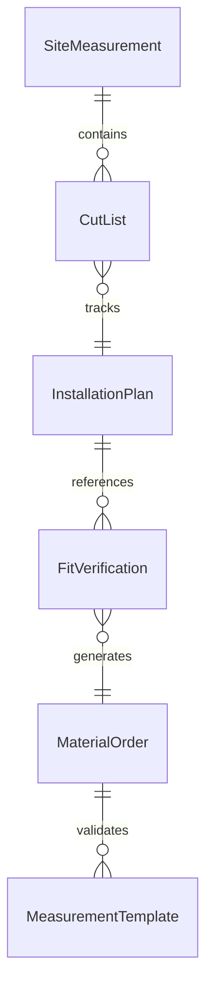
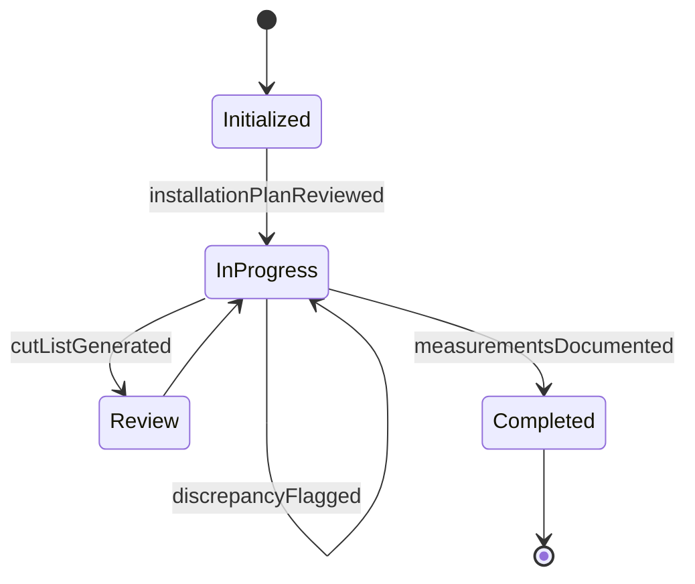
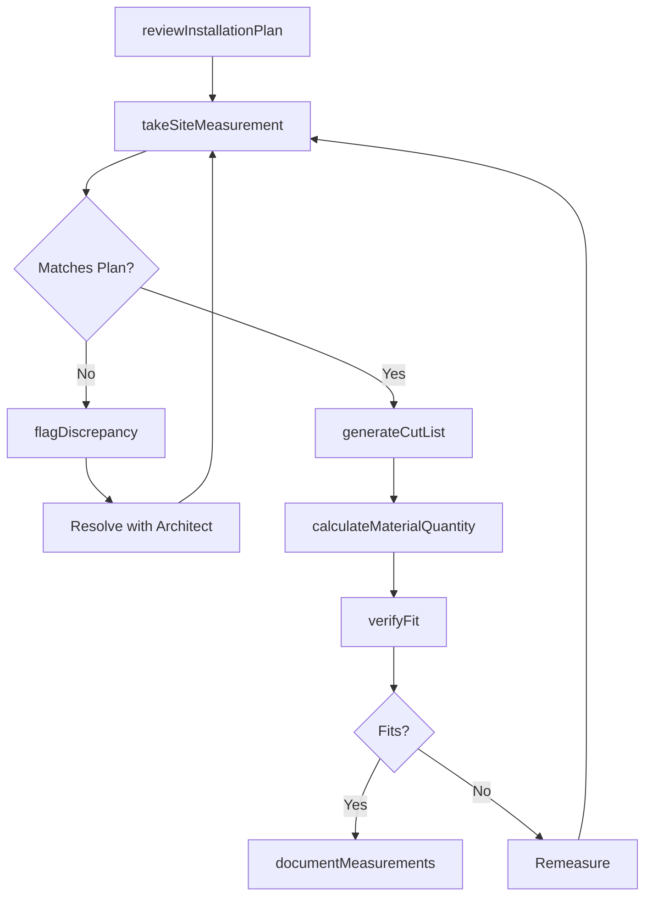
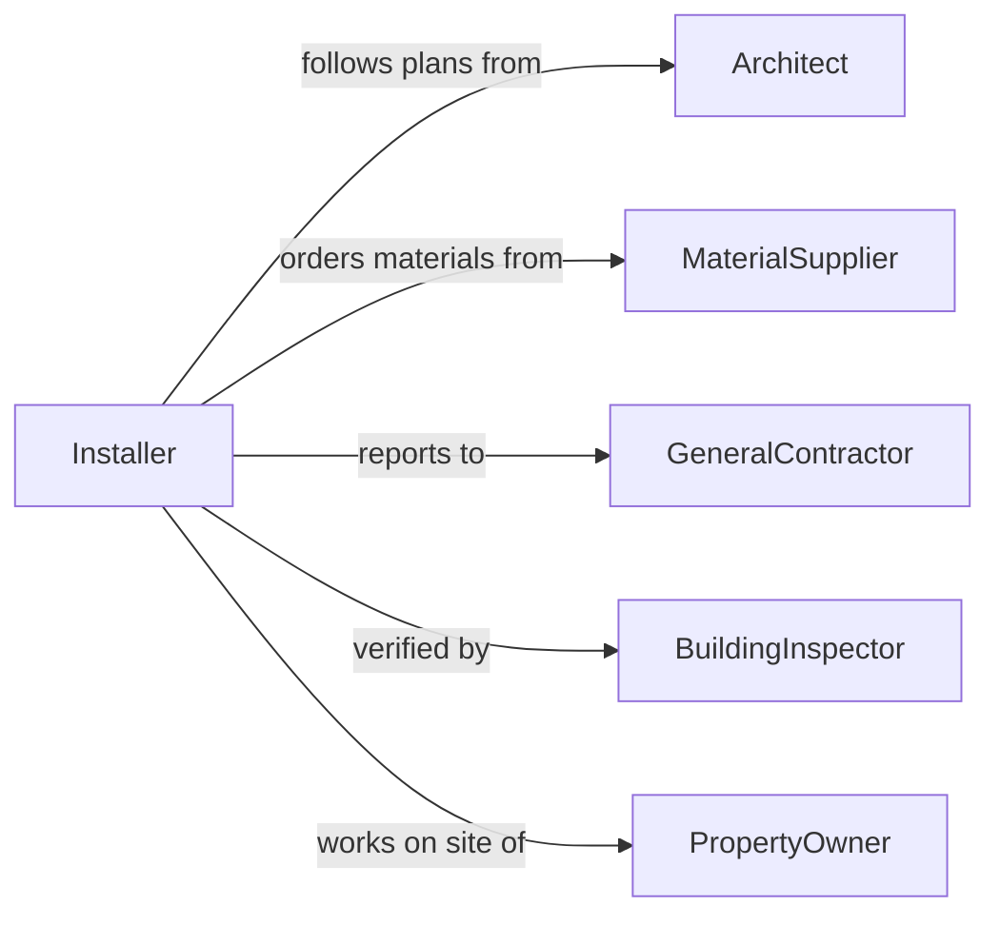

# Measure Materials Objects Installation Assembly

> Business-as-Code definition for measuring materials or objects for installation or assembly. Models the complete measurement lifecycle from plan review through field measurement, fit verification, and cut-list generation.

## Overview

Measuring materials or objects for installation or assembly involves taking precise dimensions of components, openings, surfaces, and spaces to ensure proper fit during construction, manufacturing, or installation. This definition exposes actions for conducting site measurements and verifying fit, events for tracking measurement and installation readiness, and searches for retrieving measurement data and project specifications.

## Actors

| Actor | Description |
|-------|-------------|
| GeneralContractor | Oversees the construction or installation project and coordinates trades |
| MaterialSupplier | Provides materials that must be measured and cut to specification |
| Architect | Creates plans and drawings that define required dimensions |
| BuildingInspector | Verifies that installed components meet code dimensional requirements |
| PropertyOwner | Owns the site where materials will be installed |

## Roles

| Role | Description |
|------|-------------|
| Installer | Takes field measurements and fits materials into place |
| Estimator | Uses measurements to calculate material quantities and costs |
| ProjectSupervisor | Coordinates measurement activities across trades and schedules |
| Fabricator | Produces custom components based on field measurement data |

## Entities

| Entity | Description |
|--------|-------------|
| SiteMeasurement | A recorded dimension taken at the installation location |
| CutList | A document specifying exact dimensions for material cutting |
| InstallationPlan | The drawing or specification defining where and how materials are installed |
| FitVerification | A check confirming that a component fits the measured opening or space |
| MaterialOrder | A purchase order for materials sized to measurement specifications |
| MeasurementTemplate | A reusable pattern for capturing standard measurement sets |

## Actions

| Action | Description |
|--------|-------------|
| reviewInstallationPlan | Load the plans defining required dimensions and placement |
| takeSiteMeasurement | Record a dimension at the physical installation location |
| verifyFit | Confirm that a material or component matches the measured space |
| generateCutList | Produce a list of precise cutting dimensions from site measurements |
| calculateMaterialQuantity | Determine how much material is needed based on measurements |
| flagDiscrepancy | Report a mismatch between plan dimensions and site measurements |
| documentMeasurements | Record all measurements with location references and timestamps |

## Events

| Event | Description |
|-------|-------------|
| installationPlanReviewed | The plans and specifications have been loaded and examined |
| siteMeasurementTaken | A dimension has been recorded at the installation site |
| fitVerified | A component has been confirmed to match the measured space |
| cutListGenerated | A cutting dimension list has been produced from site measurements |
| materialQuantityCalculated | Required material amounts have been determined |
| discrepancyFlagged | A mismatch between planned and actual dimensions has been reported |
| measurementsDocumented | All site measurements have been recorded and filed |

## Searches

| Search | Description |
|--------|-------------|
| findSiteMeasurements | List measurements by project, location, or date |
| getCutList | Retrieve the cutting dimensions for a specific installation area |
| findDiscrepancies | Identify locations where plan and site dimensions differ |
| getMaterialRequirements | Get calculated material quantities for a project or zone |


## Entity Relationships



## State Diagram


## Workflow



## Actor Relationships



## Usage

### Calling Actions

```typescript
import { measureMaterialsObjectsInstallationAssembly } from '@headlessly/measure-materials-objects-installation-assembly'

const installation = measureMaterialsObjectsInstallationAssembly()

// Review plans and take site measurements
await installation.reviewInstallationPlan({
  projectId: 'proj-4410',
  drawingId: 'floor-plan-2B',
  area: 'kitchen-cabinets'
})

const measurement = await installation.takeSiteMeasurement({
  projectId: 'proj-4410',
  location: 'upper-cabinet-wall-A',
  dimension: 'width',
  value: 36.25,
  unit: 'inches'
})

// Generate cut list and calculate materials
const cutList = await installation.generateCutList({
  projectId: 'proj-4410',
  area: 'kitchen-cabinets',
  measurements: [measurement.id]
})

await installation.calculateMaterialQuantity({
  cutListId: cutList.id,
  materialType: 'plywood-3/4',
  wasteAllowance: 0.10
})
```

### Event-Driven Automation

```typescript
// Alert project supervisor on plan-vs-site discrepancies
installation.discrepancyFlagged(async ({ projectId, location, planValue, siteValue }) => {
  await notify({
    to: 'project-supervisor',
    message: `Discrepancy at ${location} in project ${projectId}: plan=${planValue}, site=${siteValue}`
  })
})

// Auto-order materials when cut list is finalized
installation.cutListGenerated(async ({ projectId, cutListId }) => {
  const quantities = await installation.getMaterialRequirements({ projectId })
  await createPurchaseOrder({ projectId, items: quantities })
})
```
