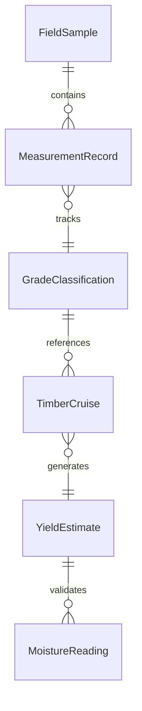
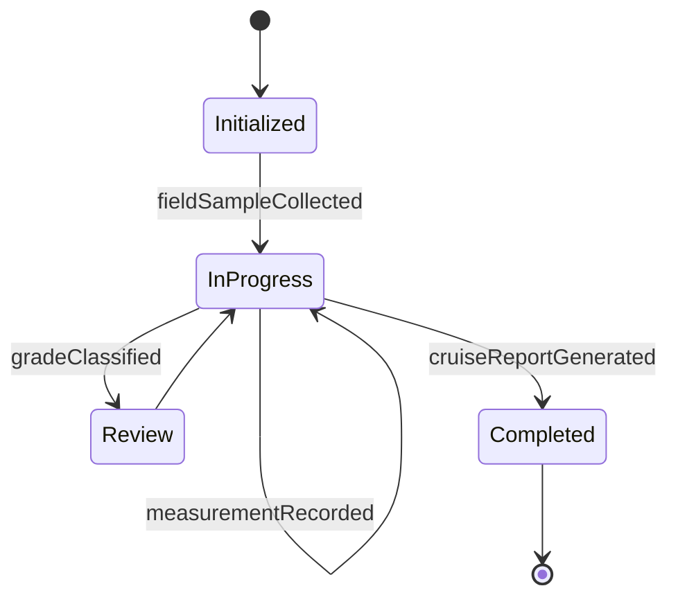
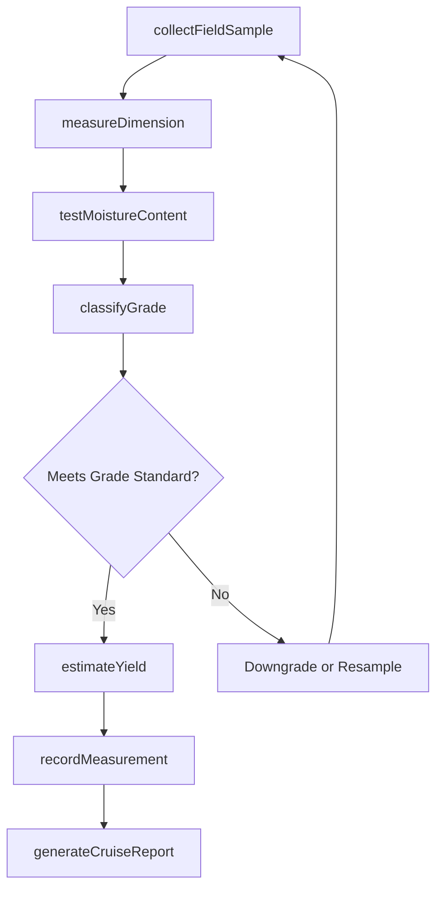
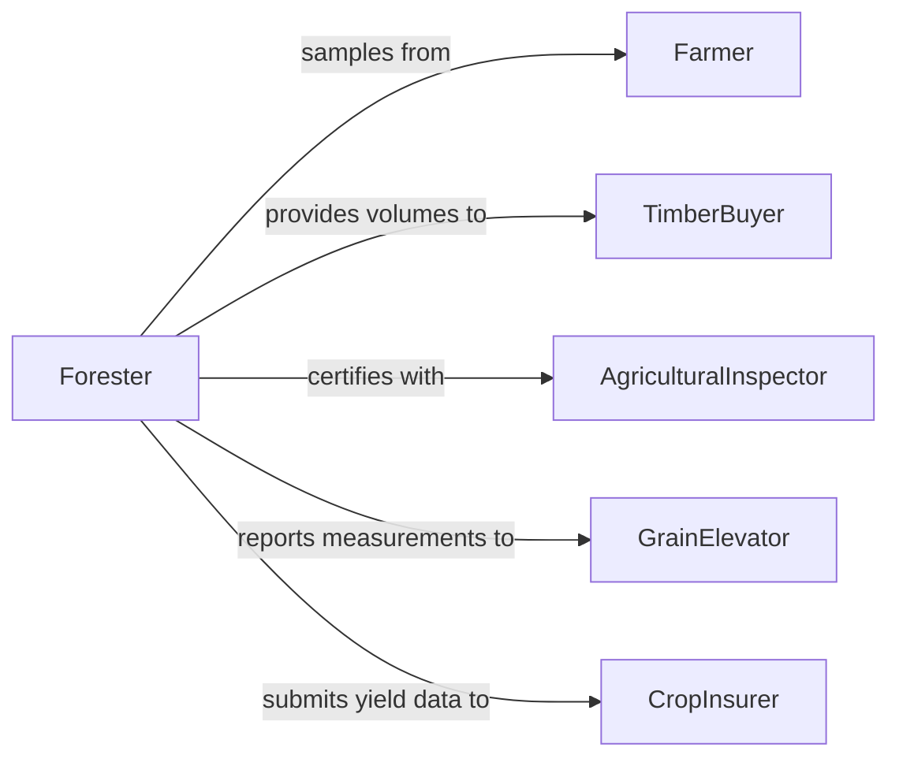

# Measure Physical Characteristics Forestry Agricultural

> Business-as-Code definition for measuring physical characteristics of forestry or agricultural products. Models the complete measurement lifecycle from field sampling through physical assessment, grading, and yield estimation.

## Overview

Measuring physical characteristics of forestry or agricultural products involves determining properties such as tree diameter, timber volume, crop yield, grain moisture content, fruit size, and soil composition. This definition exposes actions for conducting field measurements and laboratory analyses, events for tracking measurement outcomes, and searches for retrieving historical measurement and grading data.

## Actors

| Actor | Description |
|-------|-------------|
| Farmer | Produces agricultural products and provides field access for measurement |
| TimberBuyer | Purchases timber based on measured volume and grade |
| GrainElevator | Receives harvested grain and requires moisture and weight measurements |
| AgriculturalInspector | Certifies product measurements for regulatory and trade compliance |
| CropInsurer | Uses measurement data to assess crop yields and process claims |

## Roles

| Role | Description |
|------|-------------|
| Forester | Measures tree dimensions and estimates timber stand volumes |
| AgronomistTechnician | Conducts crop measurements and soil sampling in the field |
| GradeInspector | Evaluates product physical characteristics against grading standards |
| YieldAnalyst | Calculates estimated yields from field measurement samples |
| LabTechnician | Performs moisture, density, and composition testing on samples |

## Entities

| Entity | Description |
|--------|-------------|
| FieldSample | A representative portion of a crop or timber stand selected for measurement |
| MeasurementRecord | A documented observation of a physical characteristic value |
| GradeClassification | The quality category assigned based on measured characteristics |
| TimberCruise | A systematic survey of a forest stand recording tree dimensions |
| YieldEstimate | A calculated projection of total production from sample measurements |
| MoistureReading | A measurement of water content in grain, wood, or soil |

## Actions

| Action | Description |
|--------|-------------|
| collectFieldSample | Select and gather representative samples from the field or stand |
| measureDimension | Record a physical dimension such as diameter, height, or length |
| testMoistureContent | Determine the water content of a sample using appropriate methods |
| classifyGrade | Assign a quality grade based on measured physical characteristics |
| estimateYield | Calculate projected total production from sample measurements |
| recordMeasurement | Log a measurement observation with location, method, and value |
| generateCruiseReport | Produce a timber cruise or crop assessment summary report |

## Events

| Event | Description |
|-------|-------------|
| fieldSampleCollected | A representative sample has been gathered from the field |
| dimensionMeasured | A physical dimension has been recorded for a product sample |
| moistureContentTested | Water content has been determined for a sample |
| gradeClassified | A quality grade has been assigned based on measurements |
| yieldEstimated | A production yield projection has been calculated |
| measurementRecorded | A measurement observation has been logged |
| cruiseReportGenerated | A timber cruise or crop assessment report has been produced |

## Searches

| Search | Description |
|--------|-------------|
| findMeasurements | List measurements by field, crop type, date, or measurement type |
| getYieldHistory | Retrieve historical yield estimates for a field or stand |
| findByGrade | Identify products or lots assigned a specific grade classification |
| getMoistureReadings | Retrieve moisture content measurements by sample or batch |


## Entity Relationships



## State Diagram


## Workflow



## Actor Relationships



## Usage

### Calling Actions

```typescript
import { measurePhysicalCharacteristicsForestryAgricultural } from '@headlessly/measure-physical-characteristics-forestry-agricultural'

const forestryAg = measurePhysicalCharacteristicsForestryAgricultural()

// Collect a field sample and measure dimensions
const sample = await forestryAg.collectFieldSample({
  fieldId: 'field-north-40',
  cropType: 'white-oak',
  plotNumber: 12,
  samplingMethod: 'random-point'
})

const dimension = await forestryAg.measureDimension({
  sampleId: sample.id,
  dimensionType: 'diameter-at-breast-height',
  value: 18.5,
  unit: 'inches'
})

// Test moisture and classify grade
const moisture = await forestryAg.testMoistureContent({
  sampleId: sample.id,
  method: 'oven-dry',
  result: 12.3,
  unit: 'percent'
})

await forestryAg.classifyGrade({
  sampleId: sample.id,
  standard: 'NHLA-hardwood',
  grade: 'FAS'
})
```

### Event-Driven Automation

```typescript
// Notify buyer when timber cruise report is ready
forestryAg.cruiseReportGenerated(async ({ reportId, standId, totalVolume }) => {
  await notify({
    to: 'timber-purchasing',
    message: `Cruise report ${reportId} ready for stand ${standId}: ${totalVolume} board feet estimated`
  })
})

// Flag high-moisture samples for drying
forestryAg.moistureContentTested(async ({ sampleId, result, cropType }) => {
  const threshold = cropType === 'grain' ? 14.0 : 20.0
  if (result > threshold) {
    await scheduleAction({ action: 'dry', sampleId, currentMoisture: result })
  }
})
```
