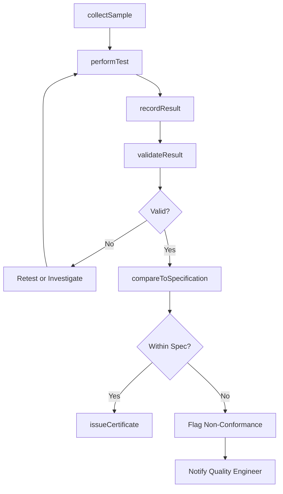
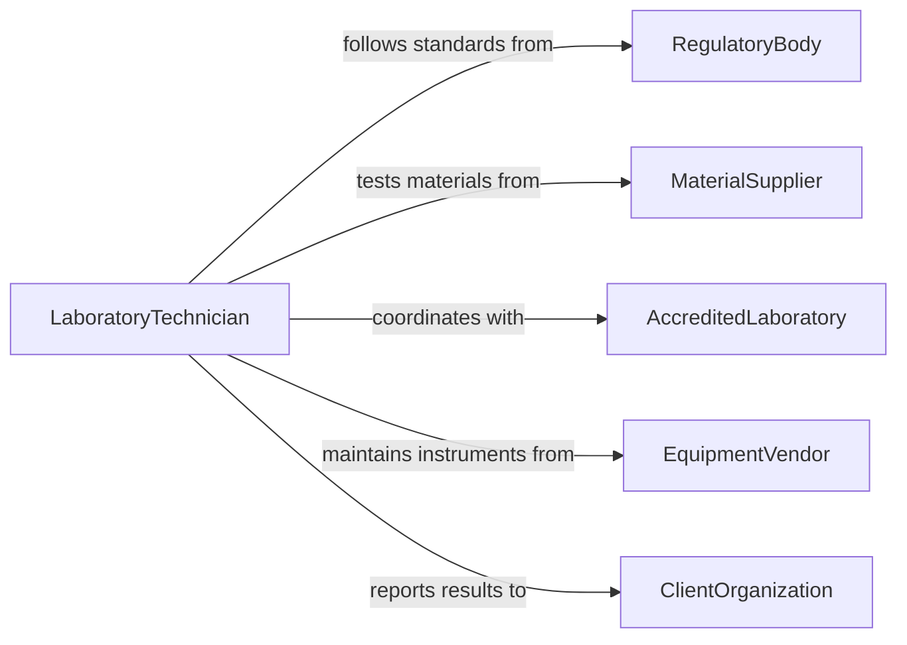

# Measure Physical Chemical Properties Materials

> Business-as-Code definition for measuring physical or chemical properties of materials or objects. Models laboratory and field testing workflows from sample collection through analysis and reporting.

## Overview

Measuring physical or chemical properties of materials is essential for quality assurance, research, and regulatory compliance across manufacturing, construction, and scientific industries. This definition exposes actions for conducting material property tests such as density, viscosity, pH, tensile strength, and chemical composition. Events enable automated compliance checks and integration with laboratory information management systems.

## Actors

| Actor | Description |
|-------|-------------|
| RegulatoryBody | Sets standards for acceptable material property ranges |
| MaterialSupplier | Provides raw materials with declared property specifications |
| AccreditedLaboratory | Performs certified testing and issues official results |
| EquipmentVendor | Supplies and maintains testing instruments and reagents |
| ClientOrganization | Requests material testing for procurement or compliance purposes |
| StandardsBody | Publishes testing methods and reference standards |

## Roles

| Role | Description |
|------|-------------|
| LaboratoryTechnician | Conducts physical and chemical property measurements |
| QualityEngineer | Defines testing requirements and interprets results |
| LabManager | Oversees testing operations, schedules, and accreditation |
| MaterialScientist | Designs testing protocols for new or complex materials |

## Entities

| Entity | Description |
|--------|-------------|
| Sample | A material specimen collected for property measurement |
| TestResult | The measured value of a specific property for a sample |
| TestMethod | A standardized procedure for measuring a particular property |
| Instrument | A piece of equipment used to perform measurements |
| Specification | Acceptable ranges for material properties |
| CertificateOfAnalysis | Formal documentation of test results for a material batch |

## Actions

| Action | Description |
|--------|-------------|
| collectSample | Register and prepare a material specimen for testing |
| performTest | Execute a standardized test method on a sample |
| recordResult | Capture the measured property value and associated metadata |
| validateResult | Check a measurement against method acceptance criteria |
| compareToSpecification | Evaluate results against defined property specifications |
| issueCertificate | Generate a certificate of analysis for a tested material batch |
| calibrateInstrument | Verify and adjust instrument accuracy against reference standards |

## Events

| Event | Description |
|-------|-------------|
| sampleCollected | A material sample has been registered for testing |
| testPerformed | A property measurement has been completed on a sample |
| resultRecorded | A test result has been captured in the system |
| resultValidated | A measurement has passed method acceptance criteria |
| specificationFailed | A measurement fell outside acceptable property ranges |
| certificateIssued | A certificate of analysis has been generated |
| instrumentCalibrated | A testing instrument has been verified and adjusted |

## Searches

| Search | Description |
|--------|-------------|
| findTestResults | Retrieve results by sample, material type, property, or date range |
| getSamples | List samples by status, material type, or origin |
| getSpecificationFailures | Find results that did not meet defined specifications |
| getCalibrationRecords | Retrieve calibration history for a specific instrument |
| getCertificates | Look up certificates of analysis by material batch or date |

## Workflow



## Actor Relationships



## Usage

### Calling Actions

```typescript
import { measurePhysicalChemicalPropertiesMaterials } from '@headlessly/measure-physical-chemical-properties-materials'

const materials = measurePhysicalChemicalPropertiesMaterials()

// Collect a sample for testing
const sample = await materials.collectSample({
  materialType: 'steel-alloy-304',
  batchId: 'BATCH-2026-1147',
  source: 'supplier-midwest-metals',
  quantity: '500g'
})

// Perform a tensile strength test
const result = await materials.performTest({
  sampleId: sample.id,
  testMethod: 'ASTM-E8',
  property: 'tensileStrength',
  instrument: 'instron-5982'
})

// Compare result against specification
const compliance = await materials.compareToSpecification({
  resultId: result.id,
  specificationId: 'SPEC-304-TENSILE'
})
```

### Event-Driven Automation

```typescript
// Alert on specification failure
materials.specificationFailed(async ({ sampleId, property, measuredValue, specRange }) => {
  await notify({
    to: 'quality-engineering',
    message: `Sample ${sampleId}: ${property} measured ${measuredValue}, outside spec ${specRange.min}-${specRange.max}`
  })
})

// Auto-issue certificate when all tests pass
materials.resultValidated(async ({ sampleId }) => {
  const allResults = await materials.findTestResults({ sampleId, status: 'validated' })
  const pending = await materials.findTestResults({ sampleId, status: 'pending' })
  if (pending.length === 0 && allResults.length > 0) {
    await materials.issueCertificate({ sampleId })
  }
})
```
