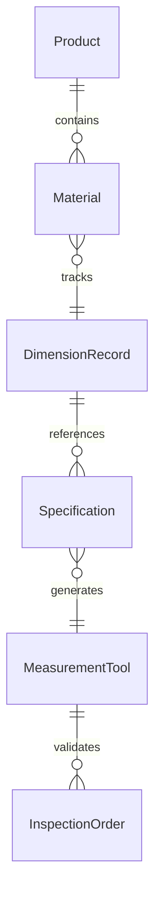
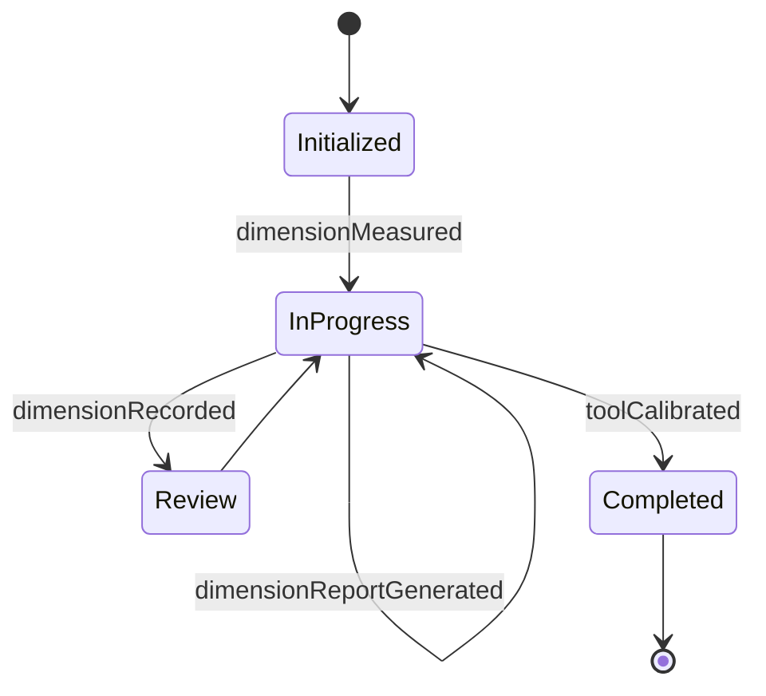
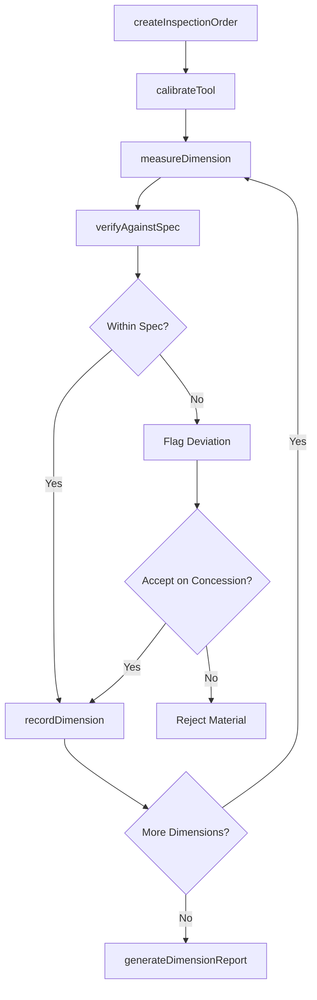
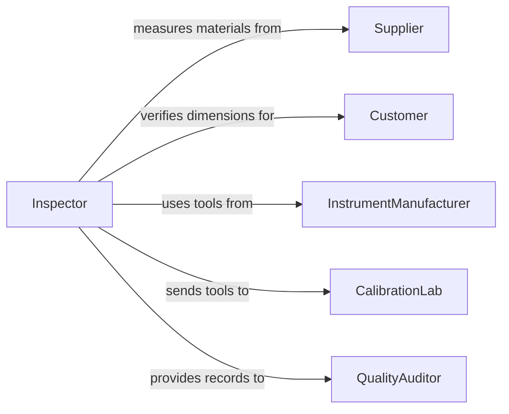

# Measure Product Material Dimensions

> Business-as-Code definition for measuring product or material dimensions. Models dimensional measurement workflows across incoming inspection, in-process checks, and material receiving.

## Overview

Measuring product or material dimensions is a general-purpose quality activity used throughout manufacturing, construction, and procurement to verify that parts and materials meet dimensional requirements. This definition exposes actions for capturing length, width, height, thickness, and diameter measurements, recording them against specifications, and tracking measurement history. Events enable automated acceptance or rejection of incoming materials and in-process parts.

## Actors

| Actor | Description |
|-------|-------------|
| Supplier | Delivers products or materials that require dimensional verification |
| Customer | Defines dimensional requirements and receives measured products |
| InstrumentManufacturer | Provides measurement tools such as calipers, gauges, and tape measures |
| CalibrationLab | Certifies measurement instruments against traceable standards |
| QualityAuditor | Reviews dimensional measurement practices and records |

## Roles

| Role | Description |
|------|-------------|
| Inspector | Performs dimensional measurements on products and materials |
| ReceivingClerk | Measures incoming materials during goods receipt |
| DesignEngineer | Specifies required dimensions and acceptable tolerances |
| QualityCoordinator | Manages inspection schedules and measurement data |

## Entities

| Entity | Description |
|--------|-------------|
| Product | An item whose dimensions are being measured |
| Material | A raw or semi-finished material subject to dimensional check |
| DimensionRecord | A captured measurement value for a specific dimension |
| Specification | The target dimension and tolerance for a product or material |
| MeasurementTool | An instrument used to capture dimensional data |
| InspectionOrder | A request to perform dimensional measurements on a batch |

## Actions

| Action | Description |
|--------|-------------|
| measureDimension | Capture a specific dimensional value for a product or material |
| createInspectionOrder | Generate a request for dimensional inspection of a batch |
| verifyAgainstSpec | Compare a measured dimension against its specification |
| recordDimension | Log a dimensional measurement with metadata and traceability |
| batchMeasure | Perform dimensional measurements across a sample of items |
| generateDimensionReport | Produce a summary of dimensional measurements for a batch |
| calibrateTool | Verify and adjust a measurement tool against known references |

## Events

| Event | Description |
|-------|-------------|
| dimensionMeasured | A dimensional value has been captured for a product or material |
| inspectionOrderCreated | A dimensional inspection request has been generated |
| specVerified | A measurement has been compared against its specification |
| dimensionRecorded | A measurement record has been logged in the system |
| batchMeasured | Dimensional measurements for a sample batch have been completed |
| dimensionReportGenerated | A dimensional summary report has been produced |
| toolCalibrated | A measurement tool has been verified and adjusted |

## Searches

| Search | Description |
|--------|-------------|
| findDimensionRecords | Retrieve measurements by product, material, dimension type, or date |
| getInspectionOrders | List inspection orders by status, product type, or batch |
| getOutOfSpecDimensions | Find measurements that fall outside specification tolerances |
| getToolCalibrations | Retrieve calibration history for a specific measurement tool |


## Entity Relationships



## State Diagram


## Workflow



## Actor Relationships



## Usage

### Calling Actions

```typescript
import { measureProductMaterialDimensions } from '@headlessly/measure-product-material-dimensions'

const dimensions = measureProductMaterialDimensions()

// Create an inspection order for incoming material
const order = await dimensions.createInspectionOrder({
  batchId: 'RCV-2026-0891',
  materialType: 'aluminum-sheet-6061',
  sampleSize: 5,
  dimensions: ['thickness', 'width', 'length']
})

// Measure thickness of a sheet
const record = await dimensions.measureDimension({
  inspectionOrderId: order.id,
  itemId: 'SHEET-001',
  dimension: 'thickness',
  measuredValue: 3.18,
  unit: 'mm',
  toolId: 'micrometer-02'
})

// Verify against specification
await dimensions.verifyAgainstSpec({
  recordId: record.id,
  specificationId: 'SPEC-AL6061-SHEET-3MM'
})
```

### Event-Driven Automation

```typescript
// Auto-reject out-of-spec materials
dimensions.specVerified(async ({ recordId, conforming, dimension, deviation }) => {
  if (!conforming) {
    await notify({
      to: 'receiving-supervisor',
      message: `Material ${dimension} out of spec by ${deviation}mm - review required`
    })
  }
})

// Generate report when inspection order completes
dimensions.batchMeasured(async ({ inspectionOrderId }) => {
  await dimensions.generateDimensionReport({ inspectionOrderId })
})
```
